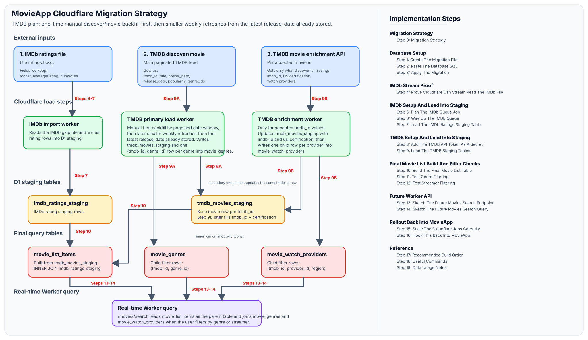
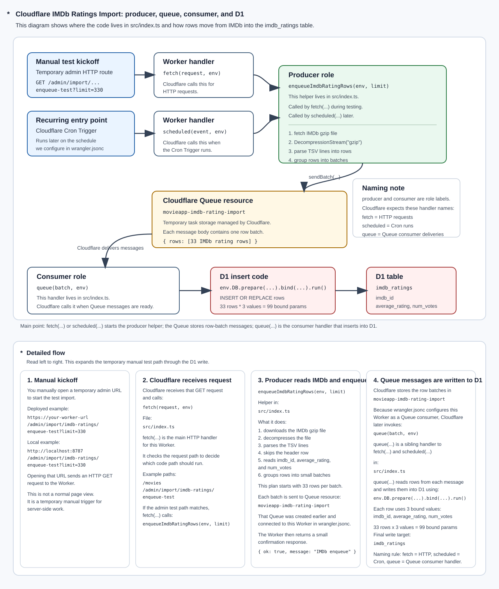

# MovieApp On Cloudflare

## Table Of Contents

- [Summary](#summary)
- [Current Repos](#current-repos)
- [Important Data Sources](#important-data-sources)
- [Target Database Design](#target-database-design)
- [Data Model Table Inventory](#data-model-table-inventory)
- [Search Page Field Audit](#search-page-field-audit)
- [Implementation Steps](#implementation-steps)
  - Migration Strategy
    - [X] [Step 0: Migration Strategy](#step-0-migration-strategy) - <span class="diagram">DIAGRAM</span>
  - Database Setup
    - [X] [Step 1: Create The Migration File](#step-1-create-the-migration-file)
    - [X] [Step 2: Paste The Database SQL](#step-2-paste-the-database-sql)
    - [X] [Step 3: Apply The Migration](#step-3-apply-the-migration)
  - IMDb Stream Proof
    - [X] [Step 4: Prove Cloudflare Can Stream Read The IMDb File](#step-4-prove-cloudflare-can-stream-read-the-imdb-file)
  - IMDb Setup And Load Into Staging
    - [X] [Step 5: DB Workflow IMDb Queue Job](#step-5-db-workflow-imdb-queue-job) - <span class="diagram">DIAGRAM</span>
    - [X] [Step 6: Wire Up The IMDb Queue](#step-6-wire-up-the-imdb-queue)
    - [X] [Step 7: Load The IMDb Ratings Staging Table](#step-7-load-the-imdb-ratings-staging-table)
  - TMDB Setup And Load Into Staging
    - [ ] [Step 8: Add The TMDB API Key As A Secret](#step-8-add-the-tmdb-api-key-as-a-secret)
    - [ ] [Step 9: Load The TMDB Staging Tables](#step-9-load-the-tmdb-staging-tables)
  - Final Movie List Build And Filter Checks
    - [ ] [Step 10: Build The Final Movie List Table](#step-10-build-the-final-movie-list-table)
    - [ ] [Step 11: Test Genre Filtering](#step-11-test-genre-filtering)
    - [ ] [Step 12: Test Streamer Filtering](#step-12-test-streamer-filtering)
  - Future Worker API
    - [ ] [Step 13: Sketch The Future Movies Search Endpoint](#step-13-sketch-the-future-movies-search-endpoint)
    - [ ] [Step 14: Sketch The Future Movies Search Query](#step-14-sketch-the-future-movies-search-query)
  - Production Rollout And App Integration
    - [ ] [Step 15: Production Backfill And Scale-Up Plan](#step-15-production-backfill-and-scale-up-plan)
    - [ ] [Step 16: MovieApp Integration Handoff](#step-16-movieapp-integration-handoff)
  - Production Jobs And Safety
    - [ ] [Step 17: Production Job Summary](#step-17-production-job-summary)
      - Production Job Run Sequence
        - [ ] [Step 17-1: IMDb Ratings Job](#step-17-1-imdb-ratings-job)
        - [ ] [Step 17-2: TMDB Primary Job](#step-17-2-tmdb-primary-job)
        - [ ] [Step 17-3: TMDB New Movie Details Job](#step-17-3-tmdb-new-movie-details-job)
        - [ ] [Step 17-4: TMDB Provider Refresh Job](#step-17-4-tmdb-provider-refresh-job)
        - [ ] [Step 17-5: Movie List Build Job](#step-17-5-movie-list-build-job)
          - [ ] [Step 17-5-1: Movie List Potential-Load Safety Check](#step-17-5-1-movie-list-potential-load-safety-check)
          - [ ] [Step 17-5-2: Movie List Insert/Upsert And Live Genre/Provider Tables](#step-17-5-2-movie-list-insertupsert-and-live-genreprovider-tables)
          - [ ] [Step 17-5-3: Movie List Current-Count Snapshot](#step-17-5-3-movie-list-current-count-snapshot)
        - [ ] [Step 17-6: Search Cache Warm Job](#step-17-6-search-cache-warm-job)
      - Supporting Operations And References
        - [ ] [Step 17-7: Job Dependencies and Order](#step-17-7-job-dependencies-and-order)
        - [ ] [Step 17-8: Historical Job Info](#step-17-8-historical-job-info)
        - [ ] [Step 17-9: Manual-Only Jobs](#step-17-9-manual-only-jobs)
        - [ ] [Step 17-10: Job Completion Emails](#step-17-10-job-completion-emails)
    - [ ] [Step 18: Cron Schedule And Operations](#step-18-cron-schedule-and-operations)
      - [ ] [Step 18-1: Production Cron Schedule](#step-18-1-production-cron-schedule)
      - [ ] [Step 18-2: Scheduling Rationale And Buffers](#step-18-2-scheduling-rationale-and-buffers)
      - [ ] [Step 18-3: Cron Handler Routing](#step-18-3-cron-handler-routing)
      - [ ] [Step 18-4: Local Scheduled-Event Testing](#step-18-4-local-scheduled-event-testing)
      - [ ] [Step 18-5: Production Monitoring Checklist](#step-18-5-production-monitoring-checklist)
      - [ ] [Step 18-6: Pausing And Resuming Scheduled Jobs](#step-18-6-pausing-and-resuming-scheduled-jobs)
    - [ ] [Step 19: Import Job Runs Table](#step-19-import-job-runs-table)
    - [ ] [Step 20: Movie List Load Counts Safety Table](#step-20-movie-list-load-counts-safety-table)
  - Reference
    - [ ] [Step 21: Recommended Build Order](#step-21-recommended-build-order)
    - [ ] [Step 22: Useful Commands](#step-22-useful-commands)
    - [ ] [Step 23: Data Usage Notes](#step-23-data-usage-notes)
      - [ ] [Step 23-1: Cloudflare Queue Usage And Limits](#step-23-1-cloudflare-queue-usage-and-limits)
    - [ ] [Step 24: Caching](#step-24-caching)
    - [ ] [Step 25: MyD1 SQL Client](#step-25-myd1-sql-client)

## Summary

This plan builds a precomputed Cloudflare D1 movie list table for the MovieApp search page.

The data-loading pipeline does this ahead of normal app searches:

```text
TMDB primary catalog rows
+ TMDB new movie detail fields
+ TMDB US flatrate watch-provider rows
+ IMDb title.ratings.tsv rows
= prebuilt movie_list_items table in Cloudflare D1
```

The goal is to build search rows during scheduled jobs, before the app asks for them.

Cloudflare owns the recurring data-loading work:

```text
IMDb ratings load
TMDB primary new-movies load
TMDB new movie details load
TMDB US flatrate provider refresh
movie_list_items build
optional search cache warm
```

Important architecture rule:

```text
Recurring data refreshes must run on Cloudflare.
The user's laptop must not be part of the recurring production workflow.
```

Local commands are only allowed as quick development checks.

They are not the planned production import path.

TMDB scheduling rule:

```text
Initial TMDB backfill:
  one-time manual Cloudflare run
  historical load from configurable beginDate

Recurring TMDB refresh:
  much smaller weekly Cloudflare job
  only look for movies after the latest release_date already stored
  in tmdb_movies_staging
```

IMDb can stay simpler for now:

```text
Recurring IMDb refresh:
  re-read the full IMDb ratings file on Cloudflare
```

The important join key is:

```text
TMDB external id imdb_id = IMDb title.ratings tconst
```

Example:

```text
TMDB movie:
  tmdb_id: 603
  imdb_id: tt0133093

IMDb ratings row:
  tconst: tt0133093
  averageRating: 8.7
  numVotes: 2100000
```

The final search page only needs narrow list data, not full movie details.

The final app-facing table should only store fields needed for:

```text
1. displaying the movie list
2. filtering the movie list
3. sorting the movie list
4. opening the existing movie detail flow when the user taps a movie
```

Final app-facing fields:

```text
tmdb_id              -> needed when the user taps a movie and opens details
title                -> displayed in the movie list
poster_path          -> displayed in the movie list
release_date         -> used by the Released year range filter
us_certification     -> used by the Rating filter, such as G, PG, PG-13, R
imdb_rating          -> displayed and used by IMDb rating sort/filter
imdb_vote_count      -> displayed and used by IMDb vote-count threshold filters
popularity           -> used only if we keep the current Popularity sort option
movie_genres         -> separate filter table for genre ids
movie_watch_providers -> separate filter table for streamer/provider ids
```

When the user taps a poster, the app can still run the existing movie detail query separately. This D1 table is only for fast list/search/filter/sort behavior.

## Current Repos

Main React Native repo:

```text
/Users/croncallo/repo/MovieApp
```

Cloudflare Worker repo:

```text
/Users/croncallo/repo/movieapp-cloudflare
```

Current Cloudflare D1 database:

```text
database_name: movieapp-db
binding: DB
```

Current Cloudflare repo scripts already include:

```json
"db:migration:create": "wrangler d1 migrations create movieapp-db",
"db:migrate:local": "wrangler d1 migrations apply movieapp-db --local",
"db:seed:local": "wrangler d1 execute movieapp-db --local --file seed/seed-test-movies.sql",
"db:query:local": "wrangler d1 execute movieapp-db --local --command \"SELECT * FROM movies ORDER BY id LIMIT 5;\"",
"db:migrate:remote": "wrangler d1 migrations apply movieapp-db --remote",
"db:seed:remote": "wrangler d1 execute movieapp-db --remote --file seed/seed-test-movies.sql",
"db:query:remote": "wrangler d1 execute movieapp-db --remote --command \"SELECT * FROM movies ORDER BY id LIMIT 5;\""
```

## Important Data Sources

### 1. IMDb ratings file

```text
https://datasets.imdbws.com/title.ratings.tsv.gz
```

Columns:

```text
tconst          -> IMDb id
averageRating   -> IMDb rating
numVotes        -> IMDb vote count
```

Example row:

```text
tt0133093  8.7  2100000
```

This source gives us the IMDb rating data only.

### 2. TMDB discover/movie API

```text
https://api.themoviedb.org/3/discover/movie
```

This is the main TMDB feed for the Cloudflare load.

Use it the same way MovieApp already uses TMDB for the list/search page:

```text
same endpoint family
same basic list-style filters
same movie result shape
```

But for the Cloudflare backfill job:

```text
use paginated discover/movie
make beginDate configurable
default beginDate to 2000-01-01
```

This source gives us the main movie-list fields we need, including:

```text
tmdb_id
title
poster_path
release_date
popularity
genre_ids
```

### 3. TMDB movie enrichment API

This is the follow-up TMDB step for fields that `discover/movie` does not return in each movie result row.

This source is where we get:

```text
us_certification
watch providers / streamers
imdb_id
```

So the three-source picture is:

```text
1. IMDb file                -> imdb_rating, imdb_vote_count
2. TMDB discover/movie      -> core movie-list fields + genre_ids
3. TMDB enrichment API      -> imdb_id, us_certification, watch providers
```

## Database Design

Use staging tables first, then build an app-facing movie list table.

Why staging tables:

```text
1. keep raw/imported source data separate
2. make the final app query table cleaner
3. allow rebuilding the final movie list table without reimporting everything
4. make debugging easier
```

The final app will mostly query:

```text
movie_list_items
movie_genres
movie_watch_providers
```

## Tables

This is the current table map. Start here when you need to understand what each table is for before changing a job or writing a SQL check.

Rule of thumb:

```text
staging tables  -> jobs can change these before the app sees the data
live app tables -> the /movies/search endpoint reads these after safety checks pass
job tables      -> explain what ran, when it ran, and whether it passed
lookup tables   -> support manual SQL review and debugging
```

| Table | Purpose | Written By | Read By / Why It Matters |
| --- | --- | --- | --- |
| <span class="green">Source and staging tables</span> |  |  |  |
| `imdb_ratings_staging` | IMDb rating and vote-count staging table keyed by `imdb_id`. | IMDb ratings job from IMDb `title.ratings.tsv.gz`. | Movie-list build joins to it for `imdb_rating` and `imdb_vote_count`. |
| `tmdb_movies_staging` | Main TMDB movie staging table keyed by `tmdb_id`. Stores list fields plus static detail fields. | TMDB primary job and TMDB new movie details job. | Movie-list build reads it to create or update `movie_list_items`. |
| `tmdb_primary_new_movie_ids_for_new_movie_details_staging` | Handoff table containing only true-new TMDB IDs from the latest primary run. | TMDB primary job clears and rebuilds it. | TMDB new movie details job reads it so it enriches only newly inserted movies. |
| `movie_genres_staging` | Staged movie-to-genre links. | TMDB primary job. | Movie-list build copies approved staged genre rows into `movie_genres` after the safety check passes. |
| `tmdb_us_flatrate_movies_staging` | Staged set of TMDB IDs returned by TMDB Discover for US flatrate availability. | TMDB provider refresh job. | Provider refresh queue uses it to decide which movies need current provider lookups. |
| `movie_watch_providers_staging` | Staged US flatrate movie-to-provider links. May contain a `NULL` provider sentinel for checked movies with no current provider rows. | TMDB provider refresh job and manual enrichment paths. | Movie-list build copies approved staged provider rows into `movie_watch_providers` after the safety check passes. |
| <span class="green">Live app search tables</span> |  |  |  |
| `movie_list_items` | App-facing search/list table. One row per searchable movie. | Movie-list build job. | `/movies/search` reads this table for fast list results. |
| `movie_genres` | Live movie-to-genre filter table. | Movie-list build copies from `movie_genres_staging`. | `/movies/search` reads it when genre filters are used. |
| `movie_watch_providers` | Live US flatrate movie-to-provider filter table. | Movie-list build copies from `movie_watch_providers_staging`. | `/movies/search` reads it when streamer filters are used. |
| <span class="green">Safety and job operation tables</span> |  |  |  |
| `movie_list_load_counts` | Safety and audit table for current counts and potential-load counts. | Movie-list safety check and current-count snapshot. | Movie-list build uses it to stop if candidate counts drop beyond thresholds. |
| `import_job_runs` | Durable job status, progress, timing, errors, JSON result, and notification status table. | All import, build, lookup, and cache-warm jobs. | Admin monitor endpoint and SQL tasks read it to prove job state and whether the completion email sent. |
| `import_job_locks` | Runtime lock table that prevents duplicate job execution. | Jobs that need single-run protection. | Manual endpoints and cron handlers use it before starting long-running work. |
| <span class="green">Manual SQL lookup tables</span> |  |  |  |
| `tmdb_genre_lookup` | Manual SQL lookup table for TMDB genre IDs and names by language. | Manual-only TMDB genre lookup refresh. | Your SQL scripts can join to it for readable genre names. |
| `tmdb_watch_provider_lookup` | Manual SQL lookup table for US watch-provider IDs, names, logos, and display priority. | Manual-only TMDB watch-provider lookup refresh. | Your SQL scripts can join to it for readable provider names. |

## Search Page Field Audit

I checked the current MovieApp search page code before defining the final table:

```text
/Users/croncallo/repo/MovieApp/src/screens/MovieSearchScreen.tsx
/Users/croncallo/repo/MovieApp/src/components/header/SubHeaderMovieSearchFields.tsx
/Users/croncallo/repo/MovieApp/src/types/movieSearchParams.ts
/Users/croncallo/repo/MovieApp/src/api/tmdb/services/movieService.ts
/Users/croncallo/repo/MovieApp/src/components/ui/movieSearchFieldUtils.ts
```

The current search page has these filters:

```text
Released year range
Rating/certification, such as G, PG, PG-13, R
Genre
Streamer/provider
Sort option
```

The current TMDB query uses filters for:

```text
release date range
US certification
genre ids
watch provider ids
minimum user vote count
sort
```

For the Cloudflare/D1 version, TMDB user-rating filter/sort data is replaced by IMDb data:

```text
new IMDb filter/sort fields:
  imdb_rating
  imdb_vote_count
```

So the final app-facing table should not store:

```text
adult
video
second title column
overview
budget
revenue
runtime
credits
```

`adult` is a TMDB source flag for adult content. We should use that flag only during import to reject those records before they reach D1. We should not store it.

`video` is also a TMDB source flag on movie-list result objects, but it is not a trailer URL and it is not the same thing as the `/movie/{id}/videos` endpoint. The Cloudflare import should not store it, and it should not reject an otherwise valid movie only because `video` is true. Instead, the discover/movie request should explicitly ask TMDB not to include video-only results:

```text
include_video=false
```

TMDB's discover/movie API also defaults `include_adult` to false, and the existing MovieApp search code relies on that default. For the Cloudflare import, be explicit:

```text
include_adult=false
include_video=false
```

`popularity` is the only extra TMDB field kept in the final table for now because the current MovieApp sort control still has a Popularity option. If the MovieApp sort control later removes Popularity, remove this column too.

## Implementation Steps

Start here when you are ready to do the work.

The steps below are meant to be followed in order. Each step builds on the previous step.

Use this quick map before you start:

- Migration Strategy
  - Step 0 shows the full source-to-staging-to-final-table flow before you touch the schema.
- Database Setup
  - Steps 1-3 build the D1 tables and indexes.
- IMDb Stream Proof
  - Step 4 proves Cloudflare can read the IMDb gzip file before any D1 writes happen.
- IMDb Setup And Load Into Staging
  - Steps 5-7 plan the IMDb Queue job, wire it up, and then write small IMDb batches into D1.
- TMDB Setup And Load Into Staging
  - Steps 8-9 add the TMDB secret and then load the narrow TMDB data into the staging tables.
- Final Movie List Build And Filter Checks
  - Steps 10-12 build the final movie list table and test the same main filters the app already has.
- Future Worker API
  - Steps 13-14 sketch the future `/movies/search` endpoint and the SQL behind it.
- Production Rollout And App Integration
  - Step 15 explains the production backfill and scale-up path. Step 16 explains how the React Native app hands search over to Cloudflare.
- Production Jobs And Safety
  - Steps 17-20 are the first stop for current operations: job order, cron schedule, job history, and load-count safety.
- Reference
  - Steps 21-25 are supporting reference sections for build order, commands, data usage notes, caching, and MyD1.

<a id="phase-0-migration-strategy"></a>
## Step 0: Migration Strategy

This step is the mental model for the whole migration.

There are three external data inputs:

```text
1. IMDb ratings file
2. TMDB discover/movie API
3. TMDB movie enrichment API
```

The high-level flow is:

```text
IMDb ratings file
-> Cloudflare IMDb import
-> imdb_ratings_staging

TMDB discover/movie API
-> paginated primary TMDB load
-> tmdb_movies_staging
-> movie_genres_staging

TMDB new movie details API
-> follow-up detail enrichment for true-new tmdb_id values
-> updates tmdb_movies_staging with imdb_id and us_certification

TMDB watch-provider API
-> provider refresh for current US flatrate movie ids
-> movie_watch_providers_staging

Then:
tmdb_movies_staging
LEFT JOIN imdb_ratings_staging on imdb_id / tconst
-> movie_list_items

And:
movie_genres_staging
movie_watch_providers_staging
-> copied into live genre/provider tables during the movie-list build
```

The diagram below shows the full source-to-staging-to-final-table flow:




The TMDB side has two different execution modes:

```text
1. Initial TMDB backfill
   manual only
   starts from configurable beginDate, default 2000-01-01
   runs in date windows so the historical load stays manageable

2. Recurring TMDB refresh
   weekly Cron job
   starts from the latest release_date already stored in tmdb_movies_staging
   only pulls the newer tail of the catalog
```

Conceptually, the recurring TMDB refresh is:

```text
only movies after the highest release_date already in the table
```

Implementation note:

```text
use the current MAX(release_date) as the next discover/movie lower-bound
cursor, then let INSERT OR REPLACE refresh the boundary-date rows too
```

That is safer than trying to do a strict greater-than cut with no overlap, because multiple movies can share the same release date.

So the final real-time query surface is three end tables:

```text
1. movie_list_items
2. movie_genres
3. movie_watch_providers
```

`movie_list_items` is the parent movie row.

`movie_genres` and `movie_watch_providers` are the child filter tables that repeat `tmdb_id` when one movie has many genres or many providers.

<a id="phase-1-create-the-migration-file"></a>
## Step 1: Create The Migration File

Open a terminal in the Cloudflare repo.

```bash
cd /Users/croncallo/repo/MovieApp-Cloudflare
```

<div><span class="ooo">[</span> X  <span class="ooo">]</span> Create a new migration file.</div>

```bash
npm run db:migration:create -- create_movie_list_schema
```

Wrangler should create a file under:

```text
/Users/croncallo/repo/MovieApp-Cloudflare/migrations/
```

The file name will look similar to:

```text
0002_create_movie_list_schema.sql
```

Paste the SQL from the next section into that generated file.

<a id="phase-2-paste-the-database-sql"></a>
## Step 2: Paste The Database SQL

DDL means Data Definition Language.

In plain English:

```text
DDL is SQL that creates or changes the shape of the database.
```

Examples:

```text
CREATE TABLE
CREATE INDEX
ALTER TABLE
DROP TABLE
```

<div><span class="ooo">[</span>   <span class="ooo">]</span> Paste this SQL into the new migration file.</div>

```sql
-- IMDb ratings staging table.
--
-- This table stores rows from IMDb's title.ratings.tsv file.
--
-- imdb_id maps to IMDb's tconst column.
-- Example:
--   tt0133093
--
-- We keep this as a staging table because IMDb ratings can be refreshed
-- without changing the final app-facing movie_list_items table shape.
CREATE TABLE IF NOT EXISTS imdb_ratings_staging (
  imdb_id TEXT PRIMARY KEY,
  average_rating REAL,
  num_votes INTEGER,
  imported_at TEXT NOT NULL DEFAULT CURRENT_TIMESTAMP
);

-- TMDB movie staging table.
--
-- This table stores the narrow TMDB movie data needed to build the
-- final movie list table.
--
-- tmdb_id is the TMDB movie id.
-- imdb_id is the external IMDb id that lets us join to imdb_ratings_staging.
-- us_certification supports the current MovieApp Rating filter.
--
-- poster_path is preferred over storing the full image URL because TMDB
-- image base URLs and sizes can be selected later by the API/app.
--
-- imdb_id is an indexed join key here.
-- It is not a FOREIGN KEY to imdb_ratings_staging.
--
-- Why not:
--   1. some TMDB movies may not have an IMDb id
--   2. some TMDB movies may not have a matching IMDb ratings row yet
--   3. the TMDB load and IMDb load can run independently
--
-- The final movie_list_items build is made faster by indexes:
--   imdb_ratings_staging.imdb_id  -> already indexed by PRIMARY KEY
--   tmdb_movies_staging.imdb_id   -> indexed below
--
-- The foreign key constraint itself would not make the final join faster.
CREATE TABLE IF NOT EXISTS tmdb_movies_staging (
  tmdb_id INTEGER PRIMARY KEY,
  imdb_id TEXT,
  title TEXT NOT NULL,
  poster_path TEXT,
  release_date TEXT,
  us_certification TEXT,
  popularity REAL,
  imported_at TEXT NOT NULL DEFAULT CURRENT_TIMESTAMP
);

-- Movie-to-genre join table.
--
-- One movie can have many genres.
-- One genre can belong to many movies.
--
-- The MovieApp already has the genre labels in:
--   /Users/croncallo/repo/MovieApp/src/components/ui/movieSearchFieldUtils.ts
--
-- So this table only needs ids for filtering.
CREATE TABLE IF NOT EXISTS movie_genres (
  tmdb_id INTEGER NOT NULL,
  genre_id INTEGER NOT NULL,
  PRIMARY KEY (tmdb_id, genre_id)
);

-- Movie-to-watch-provider join table.
--
-- One movie can be on many providers.
-- One provider can have many movies.
-- TMDB calls streaming services "watch providers".
--
-- region lets us filter to the country we care about.
-- For now, this project will usually use:
--   US
--
-- This table does not store monetization_type yet.
--
-- TMDB can separate providers into:
--   flatrate
--   rent
--   buy
--   ads
--   free
--
-- For the MovieApp list page, the first useful filter is:
--   "show movies available on this streamer in this region"
--
-- So the starter implementation will only import TMDB's flatrate
-- providers for the US region.
--
-- The MovieApp already has the streamer labels and image assets in:
--   /Users/croncallo/repo/MovieApp/src/components/ui/movieSearchFieldUtils.ts
--
-- So this table only needs ids for filtering.
--
-- If the app later needs separate filters for Rent, Buy, Free, or Ads,
-- add monetization_type back as a real filter column.
CREATE TABLE IF NOT EXISTS movie_watch_providers (
  tmdb_id INTEGER NOT NULL,
  provider_id INTEGER NOT NULL,
  region TEXT NOT NULL,
  PRIMARY KEY (tmdb_id, provider_id, region)
);

-- Final app-facing movie search/list table.
--
-- This is the main table the Worker endpoint should query for the
-- MovieApp search/list page.
--
-- It is intentionally narrow.
-- It is not meant to replace the full movie detail query.
--
-- Only promote TMDB movies into this table when there is a matching row in
-- imdb_ratings_staging.
--
-- That means:
--   imdb_rating
--   imdb_vote_count
--
-- can still be nullable here.
--
-- poster_path and release_date are also nullable because TMDB can return
-- catalog rows that do not have those values yet.
CREATE TABLE IF NOT EXISTS movie_list_items (
  tmdb_id INTEGER PRIMARY KEY,
  title TEXT NOT NULL,
  poster_path TEXT,
  release_date TEXT,
  us_certification TEXT,
  imdb_rating REAL,
  imdb_vote_count INTEGER,
  popularity REAL NOT NULL DEFAULT 0,
  last_refreshed_at TEXT NOT NULL DEFAULT CURRENT_TIMESTAMP
);

-- Index for the main IMDb sort used by the final movie list.
--
-- Most list queries sort like this:
--   ORDER BY imdb_rating DESC, imdb_vote_count DESC
--
-- A composite index matches that sort better than a rating-only index.
--
-- It also still helps with rating-first scans because imdb_rating is the
-- left-most column in the index.
CREATE INDEX IF NOT EXISTS idx_movie_list_items_imdb_sort
ON movie_list_items (imdb_rating DESC, imdb_vote_count DESC);

-- Index for IMDb vote-count threshold filtering.
--
-- This supports:
--   WHERE imdb_vote_count >= 500
CREATE INDEX IF NOT EXISTS idx_movie_list_items_imdb_vote_count
ON movie_list_items (imdb_vote_count);

-- Index for release date sorting/filtering.
--
-- SQLite/D1 can index TEXT columns.
--
-- D1 is built on SQLite, and SQLite does not have a separate DATE column
-- type like some other databases.
--
-- The normal SQLite pattern is to store dates as ISO text:
--   YYYY-MM-DD
--
-- That format sorts correctly as text.
--
-- Example:
--   1999-03-31
--   2008-07-18
--   2024-01-01
--
-- Alphabetical order and calendar order match because the biggest date
-- part comes first:
--   year, then month, then day
CREATE INDEX IF NOT EXISTS idx_movie_list_items_release_date
ON movie_list_items (release_date DESC);

-- Index for the current MovieApp Rating filter.
--
-- This supports:
--   WHERE us_certification = 'PG-13'
CREATE INDEX IF NOT EXISTS idx_movie_list_items_us_certification
ON movie_list_items (us_certification);

-- Index for the current MovieApp Popularity sort option.
--
-- This is kept only because the existing search page has a Popularity sort.
-- If that sort option is removed from MovieApp, remove this column and index.
CREATE INDEX IF NOT EXISTS idx_movie_list_items_popularity
ON movie_list_items (popularity DESC);

-- Index for genre filtering.
--
-- The MovieApp UI can send multiple selected genre ids.
--
-- SQL still checks those ids as a set of individual genre_id values.
--
-- Example:
--   WHERE genre_id IN (28, 35, 18)
--
-- This index helps D1 quickly find movie ids for each selected genre id.
CREATE INDEX IF NOT EXISTS idx_movie_genres_genre_id
ON movie_genres (genre_id, tmdb_id);

-- Index for provider/streamer filtering.
--
-- The MovieApp UI can send multiple selected streamer/provider ids.
--
-- SQL still checks those ids as a set of individual provider_id values.
--
-- Example:
--   WHERE region = 'US'
--     AND provider_id IN (8, 15, 337)
--
-- This index helps D1 quickly find movie ids for each selected provider id
-- within the selected region.
CREATE INDEX IF NOT EXISTS idx_movie_watch_providers_filter
ON movie_watch_providers (region, provider_id, tmdb_id);

-- Index for joining IMDb ratings to TMDB movies by IMDb id.
CREATE INDEX IF NOT EXISTS idx_tmdb_movies_staging_imdb_id
ON tmdb_movies_staging (imdb_id);

-- Index for the recurring TMDB refresh cursor.
--
-- The weekly TMDB refresh reads:
--   MAX(release_date)
--
-- on tmdb_movies_staging to decide where the next incremental load begins.
CREATE INDEX IF NOT EXISTS idx_tmdb_movies_staging_release_date
ON tmdb_movies_staging (release_date DESC);
```

<a id="phase-3-apply-the-migration"></a>
## Step 3: Apply The Migration

<span class="ooo">[</span> X <span class="ooo">]</span> Apply the migration locally first as a quick schema check.

```bash
npm run db:migrate:local
```

<div><span class="ooo">[</span> X  <span class="ooo">]</span> Confirm that the local tables exist.</div>

```bash
npx wrangler d1 execute movieapp-db --local --command "SELECT name FROM sqlite_master WHERE type = 'table' ORDER BY name;"
```

Expected table names should include:

```text
imdb_ratings_staging
movie_genres
movie_list_items
movie_watch_providers
tmdb_movies_staging
```

<div><span class="ooo">[</span> X  <span class="ooo">]</span> Apply the same migration to remote D1 before testing Cloudflare-side imports.</div>

```bash
npm run db:migrate:remote
```

<div><span class="ooo">[</span> X  <span class="ooo">]</span> Confirm that the remote tables exist.</div>

```bash
npx wrangler d1 execute movieapp-db --remote --command "SELECT name FROM sqlite_master WHERE type = 'table' ORDER BY name;"
```

<a id="phase-4-prove-cloudflare-can-stream-read-the-imdb-file"></a>
## Step 4: Prove Cloudflare Can Stream Read The IMDb File

This is the first real feasibility gate.

The recurring refresh must run on Cloudflare, not on a laptop.

So before building import scripts, we need a Worker endpoint that proves Cloudflare can:

```text
1. fetch IMDb's gzipped TSV file
2. stream-decompress it with DecompressionStream("gzip")
3. parse it line by line
4. stop after a small limit
5. return counts and sample rows
```

This step does not write to D1 yet.

That is intentional.

The only goal of this step is:

```text
prove that Cloudflare can fetch and stream-read the IMDb gzip file
```

Do not create a queue yet.

Do not insert rows into D1 yet.

Do not download the IMDb file to your laptop for this step.

<a id="phase-4a-open-the-worker-file"></a>
### Step 4A: Open The Worker File

Open this file:

```text
/Users/croncallo/repo/MovieApp-Cloudflare/src/index.ts
```

This is the Worker entry file.

That means this is the file Cloudflare runs when someone calls your Worker URL.

You already have code in this file for routes like:

```text
GET /movies
```

For this step, you will add a temporary test route:

```text
GET /admin/import/imdb-ratings/dry-run?limit=10000
```

The route name means:

```text
/admin
  this is not for normal MovieApp users

/import/imdb-ratings
  this is related to importing IMDb ratings

/dry-run
  this is only a test; it does not write to D1

?limit=10000
  only read 10,000 IMDb rows, then stop
```

<a id="phase-4b-add-the-helper-code"></a>
### Step 4B: Add The Helper Code

<div><span class="ooo">[</span> X  <span class="ooo">]</span> In `src/index.ts`, paste this helper code below your type definitions and above the `export default { ... }` Worker object.</div>

Do not paste this inside the `fetch(...)` function.

This helper is a reusable function. The route will call it later.

Important:

```text
This helper does not insert anything into D1.
This helper does not update any table.
This helper only reads the IMDb file and returns sample rows as JSON.
```

The table insert happens later, after the dry-run proves Cloudflare can read the file safely.

```ts
const IMDB_RATINGS_URL = "https://datasets.imdbws.com/title.ratings.tsv.gz";

type ImdbRatingRow = {
  imdb_id: string;
  average_rating: number | null;
  num_votes: number | null;
};

async function dryRunReadImdbRatings(limit: number) {
  const response = await fetch(IMDB_RATINGS_URL);

  if (!response.ok || !response.body) {
    throw new Error(`IMDb download failed: ${response.status} ${response.statusText}`);
  }

  /*
    DecompressionStream("gzip") tells the Worker runtime:

      "The response body is gzip-compressed.
       Decompress it as a stream."

    That is important because the IMDb file is large.

    We do not want:
      await response.arrayBuffer()
      await response.text()

    Those approaches would load the whole file into memory.
  */
  const decompressedStream = response.body.pipeThrough(
    new DecompressionStream("gzip")
  );

  const reader = decompressedStream.getReader();
  const decoder = new TextDecoder();

  let buffer = "";
  let rowsRead = 0;
  let headerSkipped = false;
  const sampleRows: ImdbRatingRow[] = [];

  while (rowsRead < limit) {
    const { value, done } = await reader.read();

    if (done) {
      break;
    }

    /*
      decoder.decode(value, { stream: true }) turns the latest binary chunk
      into text.

      stream: true matters because a text character could theoretically be
      split across chunks.
    */
    buffer += decoder.decode(value, { stream: true });

    const lines = buffer.split("\n");

    /*
      The last item may be an incomplete line.
      Keep it in buffer and join it with the next chunk.
    */
    buffer = lines.pop() ?? "";

    for (const line of lines) {
      if (!headerSkipped) {
        headerSkipped = true;
        continue;
      }

      if (!line.trim()) {
        continue;
      }

      const [imdb_id, averageRating, numVotes] = line.split("\t");

      sampleRows.push({
        imdb_id,
        average_rating: averageRating === "" ? null : Number(averageRating),
        num_votes: numVotes === "" ? null : Number(numVotes),
      });

      rowsRead += 1;

      if (rowsRead >= limit) {
        break;
      }
    }
  }

  await reader.cancel();

  return {
    rowsRead,
    firstRows: sampleRows.slice(0, 5),
    lastRows: sampleRows.slice(-5),
  };
}
```

<a id="phase-4c-add-the-temporary-route"></a>
### Step 4C: Add The Temporary Route

Now find the `fetch(...)` function inside:

```text
export default {
  async fetch(request: Request, env: Env): Promise<Response> {
    ...
  }
}
```

Inside `fetch(...)`, you should already have this line:

```ts
const url = new URL(request.url);
```

<div><span class="ooo">[</span> X  <span class="ooo">]</span> Add the temporary dry-run route after that `url` line and before the normal `/movies` route logic.</div>

```ts
if (url.pathname === "/admin/import/imdb-ratings/dry-run") {
  const limit = Number(url.searchParams.get("limit") ?? 10000);
  const result = await dryRunReadImdbRatings(limit);
  return Response.json(result);
}
```

This says:

```text
If the browser calls /admin/import/imdb-ratings/dry-run,
then read some IMDb rows and return the sample JSON response.
```

<a id="phase-4d-run-the-local-worker-dev-server"></a>
### Step 4D: Run The Local Worker Dev Server

Open a VS Code terminal in the Cloudflare repo:

```text
/Users/croncallo/repo/MovieApp-Cloudflare
```

<div><span class="ooo">[</span> X  <span class="ooo">]</span> Run the local Worker dev server.</div>

```bash
npm run dev
```

This starts the Worker on your machine, usually at:

```text
http://localhost:8787
```

Important:

```text
Even though the Worker dev server is running locally,
the Worker code still fetches the IMDb file from IMDb's remote URL.
You are not downloading or preparing the file by hand.
```

Open this URL in the browser:

```text
http://localhost:8787/admin/import/imdb-ratings/dry-run?limit=10000
```

Expected response shape:

```json
{
  "rowsRead": 10000,
  "firstRows": [
    {
      "imdb_id": "tt0000001",
      "average_rating": 5.7,
      "num_votes": 2000
    }
  ],
  "lastRows": [
    {
      "imdb_id": "tt0009999",
      "average_rating": 6.4,
      "num_votes": 300
    }
  ]
}
```

The exact IMDb ids, ratings, and vote counts can be different.

The important part is:

```text
rowsRead should equal the limit you asked for.
```

<a id="phase-4e-deploy-and-test-on-cloudflare"></a>
### Step 4E: Deploy And Test On Cloudflare

<div><span class="ooo">[</span> X  <span class="ooo">]</span> After the local dev-server test works, deploy the Worker.</div>

```bash
npm run deploy
```

Open the deployed Worker dry-run URL:

```text
https://movieapp-cloudflare.carlo-roncallo.workers.dev/admin/import/imdb-ratings/dry-run?limit=10000
```

This is the real Cloudflare test.

This proves Cloudflare's deployed Worker runtime can fetch, stream-decompress, and parse the IMDb gzip file.

<a id="phase-4f-try-a-larger-limit"></a>
### Step 4F: Try A Larger Limit

<div><span class="ooo">[</span> X  <span class="ooo">]</span> If `limit=10000` works, try:</div>

```text
https://movieapp-cloudflare.carlo-roncallo.workers.dev/admin/import/imdb-ratings/dry-run?limit=100000
```

<div><span class="ooo">[</span>  X <span class="ooo">]</span> Then try:</div>

```text
https://movieapp-cloudflare.carlo-roncallo.workers.dev/admin/import/imdb-ratings/dry-run?limit=500000
```

This still does not write to D1.

It only proves whether Cloudflare can keep streaming and parsing larger parts of the file.

<a id="phase-4g-pass-or-fail-decision"></a>
### Step 4G: Pass Or Fail Decision

<div><span class="ooo">[</span> X <span class="ooo">]</span> Decide whether this step passed before continuing.</div>

Pass condition:

```text
Cloudflare returns sample IMDb rows without a memory error or CPU error.
```

Fail condition:

```text
Cloudflare cannot stream/decompress/parse even a limited row count reliably.
```

If this fails, do not continue to D1 import work until the Cloudflare-side file processing problem is solved.

<a id="step-5-db-workflow-imdb-queue-job"></a>
## Step 5: DB Workflow IMDb Queue Job

This is a planning step only. There is no implementation work in this step and nothing to check off. Its purpose is to explain why the IMDb load uses Cloudflare's advanced
features before you start wiring them up in Step 6.

This step is still IMDb-only ... We are not on the TMDB side yet.

Step 4 only proved this:

```text
Cloudflare can read the IMDb gzip file and parse rows from it.
```

Step 4 did not save those rows ... Step 5 answers the next question:

```text
Now that Cloudflare can read the file, how should Cloudflare save about 1.6M rows into D1 safely?
```
Recommended plan:

```text
Manual initial route to Cron Job
-> producer reads the IMDb file
-> producer groups rows into small batches
-> producer sends row batches to a Cloudflare Queue
-> queue(...) consumer writes each batch into imdb_ratings_staging
```

This should NOT be the plan:

```text
one Worker run
-> read 1.6M IMDb rows
-> insert one row at a time
-> hope one invocation survives
```

That approach puts too much work on one invocation.


Cloudflare terms flow diagram:



Cloudflare terms used in this step:

```text
Execution trigger:
  Cron Trigger
    Cloudflare's scheduled timer.
    It wakes up the Worker on a schedule and starts the recurring IMDb refresh.

Task buffer:
  Queue
    Cloudflare's temporary task storage.
    The producer sends small IMDb row batches into the Queue.
    The consumer later receives those batches and writes them to D1.

    Think of the Queue like a stack of work tickets, not like a database transaction log.

    A ticket says:
      Write these 33 IMDb rows.

    A Worker picks up the ticket, writes the 33 rows, and then tells Cloudflare:
      Done. Remove this ticket.

    But in distributed systems, writing the rows and removing the ticket are two separate steps.

    So this can happen:
      1. Worker gets ticket #123.
      2. Worker writes the 33 IMDb rows successfully.
      3. Before Cloudflare is fully satisfied the ticket is done, the ticket gets delivered again.
      4. Another Worker runs ticket #123 again.
      5. The same 33 IMDb rows are written again.

    Because imdb_ratings_staging is keyed by imdb_id, the second write does not create duplicate rows.
    It is more like replacing the same contact card with the same contact card again.

    The problem we hit was the progress counter was too trusting:
      first write: +33 processed
      duplicate replay: +33 processed again

    So the table data can be fine while the scoreboard over-counts.
    The deployed counter guard caps the scoreboard at the expected total, so future job rows should not show processed_count greater than selected_count.

Handler names Cloudflare expects:
  fetch(...)
    Cloudflare calls this when an HTTP request reaches the Worker.
    In this plan, fetch(...) is the manual entry point.

  scheduled(...)
    Cloudflare calls this when a Cron Trigger fires.
    In this plan, scheduled(...) is the recurring IMDb entry point.

  queue(...)
    Cloudflare calls this when Queue messages are ready.
    In this plan, queue(...) is the consumer that writes IMDb batches into D1.

Producer role:
  enqueueImdbRatingRows(...)
    This helper lives in:
      /Users/croncallo/repo/MovieApp-Cloudflare/src/index.ts

    Cloudflare does not call a special producer(...) handler.
    One of our real handlers calls this helper instead:

    during manual kickoff:
      if fetch(...) sees the manual IMDb enqueue path
      /admin/import/imdb-ratings/enqueue-manual
      then that matching route block calls enqueueImdbRatingRows(...)

    during the recurring job:
      when the Cron Trigger fires, Cloudflare calls scheduled(...)
      and the scheduled(...) job block calls enqueueImdbRatingRows(...)

    Step 4 proved Cloudflare can:
      fetch the IMDb file
      decompress it
      split it into lines
      parse each line into values

    The producer reuses that file-reading/parsing logic, but changes what
    happens after each row is parsed.

    Step 4 dry-run:
      parse row
      keep sample rows in memory
      return JSON to the browser

    Real producer:
      parse row
      group rows into row batches
      send each row batch to the Queue

Consumer role:
  queue(...)
    This handler also lives in:
      /Users/croncallo/repo/MovieApp-Cloudflare/src/index.ts

    "consumer" is the role.
    queue(...) is the actual Worker handler name that Cloudflare expects.

    Flow from Queue to D1:
      1. producer sends row-batch messages to the Queue
      2. Cloudflare sees messages waiting in the Queue
      3. Cloudflare calls this Worker's queue(...) handler
      4. queue(...) reads the message body
      5. queue(...) runs INSERT statements against env.DB

Batch shape:
  row batch
    A small group of parsed IMDb rows sent together.

    Example row batch:
      [
        { imdb_id: "tt0133093", average_rating: 8.7, num_votes: 2100000 },
        { imdb_id: "tt0234215", average_rating: 7.2, num_votes: 650000 }
      ]

    We batch rows because one-row-at-a-time writes would create too many tiny
    operations. But we also keep the batch small enough to stay under
    Cloudflare and D1 limits.

SQL safety:
  bound parameters
    These are the real values passed safely into a SQL statement.

    Example:
      INSERT INTO imdb_ratings_staging (imdb_id, average_rating, num_votes)
      VALUES (?, ?, ?)

    The question marks are placeholders.
    The real values are bound separately.

    One-row example with the real values shown conceptually:

      SQL text:
        INSERT INTO imdb_ratings_staging (imdb_id, average_rating, num_votes)
        VALUES (?, ?, ?)

      bound parameter 1:
        "tt0133093"

      bound parameter 2:
        8.7

      bound parameter 3:
        2100000

    So this one-row insert uses 3 bound parameters.

Batch-size limit:
  D1 max bound parameters per query
    D1 allows 100 bound parameters per query.

    One IMDb row uses 3 values:
      imdb_id
      average_rating
      num_votes

    Two-row example:

      SQL text:
        INSERT INTO imdb_ratings_staging (imdb_id, average_rating, num_votes)
        VALUES (?, ?, ?), (?, ?, ?)

      row 1 uses:
        parameter 1: imdb_id
        parameter 2: average_rating
        parameter 3: num_votes

      row 2 uses:
        parameter 4: imdb_id
        parameter 5: average_rating
        parameter 6: num_votes

      So 2 rows use 6 bound parameters.

    Starting batch-size decision:
      33 rows * 3 values = 99 bound parameters

    That is why this plan starts with 33 IMDb rows per INSERT.

Invocation limits:
  wall-clock limit
    The total real elapsed time one Worker invocation is allowed to run.
    Even if the Worker is waiting on network or D1, that clock is still moving.

  Cron/Queue invocation
    One run of the Worker caused by a Cron Trigger or Queue batch.
```

Plain-English version:

```text
Do not make one Worker carry the full IMDb import alone.
Have one Worker split the file into retryable row batches.
Put those batches into a Cloudflare Queue.
Let the queue(...) handler write one batch at a time into D1.
```

Target architecture:

```text
Cloudflare Cron Trigger
-> Worker fetches https://datasets.imdbws.com/title.ratings.tsv.gz
-> Worker stream-decompresses gzip
-> Worker parses rows line by line
-> Worker sends row batches to a Cloudflare Queue
-> Queue consumer writes batches into D1
```

Why this job is chunked:

```text
1. the IMDb file has about 1.6M data rows
2. D1 has query/subrequest limits per Worker invocation
3. D1 has a maximum number of bound parameters per query
4. Cron/Queue invocations have wall-clock limits
5. Queue consumers are better for retrying failed chunks
```

Execution summary:

```text
Producer path:
  reads the big file
  groups rows into small batches
  sends those batches to a Queue

Consumer path:
  receives one batch
  writes that batch into D1
  succeeds or retries independently
```

Important Cloudflare limits - Free subscription:

```text
Workers plan:
  Free
  $0
  For personal use and simple applications

MovieApp calls to Cloudflare Worker:
  Plain meaning:
    Each MovieApp search, page change, or detail request calls a Worker endpoint.
    Example: GET /movies/search?page=3&pageSize=20 is 1 Workers request.

  Workers & Pages Functions requests:
    Up to 100,000 per day (UTC+0)

  Workers & Pages Functions CPU time:
    10 ms per invocation

  Worker memory:
    128 MB

D1 queries the Worker is allowed to run while answering one app request:
  D1 queries per Worker invocation:
    50
    One MovieApp request can cause the Worker to ask D1 for data.
    On the Free plan, that one Worker run can ask D1 up to 50 times.

  D1 bound parameters per query:
    100

  D1 daily usage included:
    Up to 5 million rows read per day
    Up to 100,000 rows written per day
    5 GB total storage

Background import jobs:
  Cron Trigger wall time:
    15 minutes

  Queue consumer wall time:
    15 minutes

  Cloudflare Queue message size:
    128 KB

  Cloudflare Queue operations:
    Up to 10,000 operations per day

  Cloudflare Queue message retention:
    24 hours, non-configurable
```

Important Cloudflare limits - Paid subscription:

```text
Workers plan:
  Paid
  $5 per month plus additional usage
  For business use and scaling applications

MovieApp calls to Cloudflare Worker:
  Plain meaning:
    Each MovieApp search, page change, or detail request calls a Worker endpoint.
    Example: GET /movies/search?page=3&pageSize=20 is 1 Workers request.

  Workers & Pages Functions requests:
    10 million included per month
    + $0.30 per additional million requests
    No hard request cap like Free; overage becomes billable usage

  Workers & Pages Functions CPU time:
    30 million CPU milliseconds included per month
    + $0.02 per additional million CPU milliseconds
    HTTP requests: default 30 seconds, configurable up to 5 minutes

  Worker memory:
    128 MB

D1 queries the Worker is allowed to run while answering one app request:
  D1 queries per Worker invocation:
    1000
    One MovieApp request can cause the Worker to ask D1 for data.
    On the Paid plan, that one Worker run can ask D1 up to 1000 times.

  D1 bound parameters per query:
    100

  MovieApp search example:
    User opens page 3 of search results in MovieApp.
    App request:
      GET /movies/search?page=3&pageSize=20

    Best shape:
      1 Workers request from the app
      1 D1 query to fetch the 20 movie rows
      optional 1 extra D1 query to fetch total count / total pages

    Expected D1 query count:
      usually 1 or 2 D1 queries

    Bad shape:
      1 Workers request from the app
      20 D1 queries, one query for each movie row

    What 1000 is not:
      not 1000 users
      not 1000 movies
      not 1000 app searches per day
      not 1000 monthly requests

  D1 monthly usage included:
    First 25 billion rows read per month included
    + $0.001 per additional million rows read
    First 50 million rows written per month included
    + $1.00 per additional million rows written
    First 5 GB storage included
    + $0.75 per GB-month

Background import jobs:
  Cron Trigger wall time:
    15 minutes

  Queue consumer wall time:
    15 minutes

  Cron Triggers and Queue Consumers CPU time:
    Up to 15 minutes CPU per invocation

  Cloudflare Queue message size:
    128 KB

  Cloudflare Queue operations:
    1 million operations included per month
    + $0.40 per additional million operations
    Operations are counted per 64 KB written, read, or deleted

  Cloudflare Queue message retention:
    4 days by default, configurable up to 14 days
```

Row shape:

```text
imdb_id
average_rating
num_votes
```

Because D1 allows 100 bound parameters per query, a single multi-row insert can safely hold up to 33 rows:

```text
33 rows * 3 values = 99 bound parameters
```

Starting batch size:

```text
33 IMDb rating rows per INSERT
```

Tune this later only after you have real D1 timing.

The paid Workers plan is the realistic starting point for this recurring import design.

If Cloudflare requires upgrading before Queues can be enabled on this account, treat that as an architecture decision point.

Do not continue building a laptop-driven workaround.

<a id="phase-6-wire-up-the-imdb-queue"></a>
## Step 6: Wire Up The IMDb Queue

Step 5 explained why the import needs a Queue.

Step 6 is where you actually create that Queue in Cloudflare and connect it to this Worker.

A Queue is not a D1 table.

A Queue is temporary task storage managed by Cloudflare.

In this plan, each Queue message will contain a small batch of IMDb rating rows.

Example message concept:

```json
{
  "rows": [
    {
      "imdb_id": "tt0133093",
      "average_rating": 8.7,
      "num_votes": 2100000
    },
    {
      "imdb_id": "tt0234215",
      "average_rating": 7.2,
      "num_votes": 650000
    }
  ]
}
```

Why we want the Queue:

```text
1. the IMDb file is too large to treat as one big insert job
2. queue messages let us split the import into retryable chunks
3. if one chunk fails, Cloudflare can retry that chunk
4. the Worker does not need to keep all 1.6M rows in memory
5. D1 writes happen in smaller controlled batches
```

The Queue has two sides:

```text
Producer side:
  the Worker reads the IMDb file and sends row batches to the Queue

Consumer side:
  the Worker receives those row batches from the Queue and writes them to D1
```

Create the Cloudflare Queue resource.

This command creates the real Queue resource in your Cloudflare account.

Run it from the Cloudflare repo terminal:

```text
/Users/croncallo/repo/MovieApp-Cloudflare
```

<div><span class="ooo">[</span> X  <span class="ooo">]</span> Create the Queue - Run:

```bash
npx wrangler queues create movieapp-imdb-rating-import-queue
```

This creates the Queue itself (only in the remote, not locally), but it does not automatically edit your Worker project.

That is intentional.

Cloudflare can have:

```text
many Queues
many Workers
many environments
```

Creating a Queue only says:

```text
this Queue exists in the Cloudflare account, to see the Queue, run the following command:
```
<div><span class="ooo">[</span> X  <span class="ooo">]</span> Validate the Queue - Run:

```bash
npx wrangler queues list
```


It does not tell Cloudflare:

```text
which Worker is allowed to send messages to it
which Worker should receive messages from it
what env property name the Worker code should use
what batch size or retry behavior this Worker wants
```

Those Worker-specific decisions belong in this repo's `wrangler.jsonc`.

Now that the queue exists in Cloudflare, we will connect it to this Worker by editing the wrangler.jsonc file in the next section, but 1st some context:

For this Queue, `wrangler.jsonc` must say two things:

```text
1. Producer binding:
   let this Worker send messages to movieapp-imdb-rating-import-queue

2. Consumer binding:
   deliver messages from movieapp-imdb-rating-import-queue back to this Worker
```

<a id="phase-6a-what-the-imdb-queue-binding-does"></a>
### Step 6A: What The IMDb Queue Binding Does

Creating the Queue in Cloudflare is not enough by itself.

The Worker code also needs a way to access that Queue.

In this repo, "the Worker" means the Cloudflare Worker program whose entry file is:

```text
/Users/croncallo/repo/MovieApp-Cloudflare/src/index.ts
```

The whole `MovieApp-Cloudflare` folder is the Worker project.

The main code Cloudflare runs is `src/index.ts`.

Other files support that Worker:

```text
wrangler.jsonc
  tells Cloudflare which resources this Worker connects to

package.json
  gives local commands such as npm run dev and npm test

migrations/
  contains D1 database schema changes
```

That connection is called a Queue binding.

In plain English:

```text
Queue resource:
  the real Cloudflare Queue named movieapp-imdb-rating-import-queue

Queue binding:
  the name your Worker code uses to talk to that Queue
```

The Queue resource name and the Worker code name are different on purpose:

```text
Cloudflare Queue resource name:
  movieapp-imdb-rating-import-queue

Worker code binding name:
  IMDB_RATING_QUEUE
```

The resource name is the actual Queue in Cloudflare.

The binding name is the property that appears inside Worker code:

```ts
env.IMDB_RATING_QUEUE
```

So when Worker code calls:

```ts
await env.IMDB_RATING_QUEUE.sendBatch(...);
```

Cloudflare knows that `IMDB_RATING_QUEUE` means:

```text
send these messages to the Queue named movieapp-imdb-rating-import-queue
```

The producer binding gives Worker code a property on `env`:

```text
env.IMDB_RATING_QUEUE
```

That means the producer code can do this later:

```ts
await env.IMDB_RATING_QUEUE.sendBatch(...);
```

The consumer section tells Cloudflare:

```text
when this Queue has messages, deliver them to this Worker in batches
```

That delivery is what causes Cloudflare to call the `queue(...)` handler in `src/index.ts`.

<a id="phase-6b-where-to-put-this-in-wrangler-jsonc"></a>
### Step 6B: Where To Put This In wrangler.jsonc

Open:

```text
/Users/croncallo/repo/MovieApp-Cloudflare/wrangler.jsonc
```

Find the existing `d1_databases` section.

Right now it looks like this:

```jsonc
"d1_databases": [
  {
    "binding": "DB",
    "database_name": "movieapp-db",
    "database_id": "bfd8c900-38f6-41e2-afcf-37772b5249a2"
  }
]
```

That section connects the Worker to D1.

Now add a second top-level section named `queues`.

This new `queues` section connects the same Worker to the Cloudflare Queue.

<div><span class="ooo">[</span> X  <span class="ooo">]</span> Change the end of the `d1_databases` section from this:</div>

```jsonc
  "d1_databases": [
    {
      "binding": "DB",
      "database_name": "movieapp-db",
      "database_id": "bfd8c900-38f6-41e2-afcf-37772b5249a2"
    }
  ]
```

To this:

```jsonc
  "d1_databases": [
    {
      "binding": "DB",
      "database_name": "movieapp-db",
      "database_id": "bfd8c900-38f6-41e2-afcf-37772b5249a2"
    }
  ],
  "queues": {
    "producers": [
      {
        "binding": "IMDB_RATING_QUEUE",
        "queue": "movieapp-imdb-rating-import-queue"
      }
    ],
    "consumers": [
      {
        "queue": "movieapp-imdb-rating-import-queue",
        "max_batch_size": 100,
        "max_batch_timeout": 10,
        "max_retries": 5
      }
    ]
  }
```

The important punctuation change is the comma after the `d1_databases` closing bracket:

```text
],
"queues": {
  ...
}
```

Why that comma matters:

```text
d1_databases and queues are sibling top-level settings.

JSON/JSONC needs a comma between sibling settings.
Without that comma, wrangler.jsonc will not parse.
```

The relevant part of the final file should look like this:

```jsonc
{
  "$schema": "node_modules/wrangler/config-schema.json",
  "name": "movieapp-cloudflare",
  "main": "src/index.ts",
  "compatibility_date": "2026-04-20",
  "observability": {
    "enabled": true
  },
  "upload_source_maps": true,
  "compatibility_flags": [
    "nodejs_compat"
  ],
  "d1_databases": [
    {
      "binding": "DB",
      "database_name": "movieapp-db",
      "database_id": "bfd8c900-38f6-41e2-afcf-37772b5249a2"
    }
  ],
  "queues": {
    "producers": [
      {
        "binding": "IMDB_RATING_QUEUE",
        "queue": "movieapp-imdb-rating-import-queue"
      }
    ],
    "consumers": [
      {
        "queue": "movieapp-imdb-rating-import-queue",
        "max_batch_size": 100,
        "max_batch_timeout": 10,
        "max_retries": 5
      }
    ]
  }
}
```
Do not remove the existing `d1_databases` section.

You are adding `queues` as another top-level config section next to `d1_databases`.

<a id="phase-6c-what-each-imdb-queue-config-part-means"></a>
### Step 6C: What Each IMDb Queue Config Part Means

Important current-code note:

```text
src/index.ts currently has the IMDb dry-run helper:
  dryRunReadImdbRatings(...)

src/index.ts does not yet have the real Queue producer helper:
  enqueueImdbRatingRows(...)

src/index.ts does not yet have the Queue consumer handler:
  queue(batch, env)

This Step 6 config prepares the Worker for those next code additions.
```

There are two jobs involved in the Queue flow:

```text
Producer job:
  reads IMDb rows
  packages rows into Queue messages
  sends those messages into the Queue

Consumer job:
  receives Queue messages later
  writes the rows from those messages into D1
```

In this project, both jobs live in the same Worker codebase.

That is why the same `wrangler.jsonc` file needs both `producers` and `consumers`.

#### Producers

```jsonc
"producers": [
  {
    "binding": "IMDB_RATING_QUEUE",
    "queue": "movieapp-imdb-rating-import-queue"
  }
]
```

Plain meaning:

```text
Connect this Worker to the Queue named:

  movieapp-imdb-rating-import-queue

Inside Worker code, expose that Queue as:

  env.IMDB_RATING_QUEUE
```

That is not a normal variable we create with `const`.

Cloudflare creates `env.IMDB_RATING_QUEUE` at runtime because `wrangler.jsonc` contains this producer binding.

Why the Worker needs this:

```text
The future IMDb producer helper will live in src/index.ts.
It will probably be named enqueueImdbRatingRows(...).

That helper will read rows from the IMDb file.
Every 33 rows, it will create a Queue message.
Then it will call env.IMDB_RATING_QUEUE.sendBatch(...).
```

Plain flow:

```text
src/index.ts receives an admin request
-> fetch(...) route matches /admin/import/imdb-ratings/enqueue-manual
-> fetch(...) calls enqueueImdbRatingRows(env, limit)
-> enqueueImdbRatingRows(...) reads IMDb rows
-> enqueueImdbRatingRows(...) sends row batches to env.IMDB_RATING_QUEUE
-> Cloudflare stores those messages in movieapp-imdb-rating-import-queue
```

Without this producer binding:

```text
env.IMDB_RATING_QUEUE would not exist in Worker code,
so the Worker would have no way to send IMDb row batches into the Queue.
```

#### Consumers

```jsonc
"consumers": [
  {
    "queue": "movieapp-imdb-rating-import-queue",
    "max_batch_size": 100,
    "max_batch_timeout": 10,
    "max_retries": 5
  }
]
```

Plain meaning:

```text
When the Queue named movieapp-imdb-rating-import-queue has messages,
Cloudflare should deliver those messages back to this Worker.
```

Why the Worker needs this:

```text
The Queue is only temporary task storage.
It does not write to D1 by itself.

The consumer config tells Cloudflare:
  "When messages are waiting in this Queue, call this Worker's queue(...) handler."
```

That future Worker handler will look conceptually like this:

```ts
async queue(batch, env) {
  // read row batches from batch.messages
  // insert those rows into env.DB
}
```

Without this consumer config:

```text
messages could be sent into the Queue,
but this Worker would not be registered as the code that processes them.
```

`max_batch_size: 100` means:

```text
Cloudflare can deliver up to 100 Queue messages to queue(...) at once.
```

`max_batch_timeout: 10` means:

```text
Cloudflare can wait up to 10 seconds to collect messages before delivering a batch.
```

`max_retries: 5` means:

```text
If processing fails, Cloudflare can retry the failed message up to 5 times.
```

Why `max_batch_size` is `100`:

```text
Each Queue message contains 33 IMDb rows.
Each message becomes one D1 INSERT.
100 Queue messages means up to 100 D1 INSERT statements in one consumer run.
That is intended for the paid-plan D1 invocation limit.
```

If testing on the free plan, use a smaller consumer batch size first.

The recurring IMDb Cron Trigger is now part of the full production schedule in Step 18.

Current IMDb schedule:

```text
0 1 * * 1
```

Meaning:

```text
Saturday 9:00 PM Eastern while on Eastern Daylight Time
Sunday 01:00 UTC in Cloudflare's cron expression
```

Cloudflare's cron day-of-week value in this dashboard/API is:

```text
1 = Sunday
2 = Monday
3 = Tuesday
...
7 = Saturday
```

The cron should only be enabled after the manual Queue import path is working:

```text
1. the manual enqueue endpoint sends IMDb row batches to the Queue
2. the Queue consumer writes those batches into D1
```

<a id="phase-7-write-imdb-rating-batches-into-d1"></a>
<a id="step-7-write-imdb-rating-batches-into-d1"></a>
## Step 7: Load The IMDb Ratings Staging Table

This is still the IMDb side of the pipeline.

Do not switch to TMDB yet.

After the manual Queue import path is working and the Queue wiring is in place, add the real queue producer and queue consumer.

The producer reads the IMDb file and sends small row batches to the Queue.

The consumer receives those row batches and writes them to D1.

Step 7A
<div><span class="ooo">[</span> X <span class="ooo">]</span> Add these types:</div>

```ts
type ImdbRatingQueueMessage = {
  rows: ImdbRatingRow[];
};

export interface Env extends Cloudflare.Env {
  DB: D1Database;
  IMDB_RATING_QUEUE: Queue<ImdbRatingQueueMessage>;
}
```

Step 7B

<div><span class="ooo">[</span> X  <span class="ooo">]</span> Add the producer helper:</div>

```ts
const IMDB_QUEUE_ROWS_PER_MESSAGE = 33;
const IMDB_QUEUE_MESSAGES_PER_SEND_BATCH = 100;

async function enqueueImdbRatingRows(env: Env, limit?: number) {
  const response = await fetch(IMDB_RATINGS_URL);

  if (!response.ok || !response.body) {
    throw new Error(`IMDb download failed: ${response.status} ${response.statusText}`);
  }

  const stream = response.body.pipeThrough(new DecompressionStream("gzip"));
  const reader = stream.getReader();
  const decoder = new TextDecoder();

  let buffer = "";
  let rowsSeen = 0;
  let rowsQueued = 0;
  let headerSkipped = false;
  let batch: ImdbRatingRow[] = [];
  let queueMessages: ImdbRatingQueueMessage[] = [];

  async function flushQueueMessages() {
    if (queueMessages.length === 0) {
      return;
    }

    /*
      sendBatch(...) sends multiple Queue messages in one Queue call.

      That matters for the full IMDb file.

      If we called env.IMDB_RATING_QUEUE.send(...) once for every 33 rows,
      the full file would create too many individual Queue send calls.
    */
    await env.IMDB_RATING_QUEUE.sendBatch(
      queueMessages.map((message) => ({ body: message }))
    );

    queueMessages = [];
  }

  async function flushBatch() {
    if (batch.length === 0) {
      return;
    }

    queueMessages.push({ rows: batch });
    rowsQueued += batch.length;
    batch = [];

    if (queueMessages.length >= IMDB_QUEUE_MESSAGES_PER_SEND_BATCH) {
      await flushQueueMessages();
    }
  }

  while (true) {
    const { value, done } = await reader.read();

    if (done) {
      break;
    }

    buffer += decoder.decode(value, { stream: true });

    const lines = buffer.split("\n");
    buffer = lines.pop() ?? "";

    for (const line of lines) {
      if (!headerSkipped) {
        headerSkipped = true;
        continue;
      }

      if (!line.trim()) {
        continue;
      }

      const [imdb_id, averageRating, numVotes] = line.split("\t");

      batch.push({
        imdb_id,
        average_rating: averageRating === "" ? null : Number(averageRating),
        num_votes: numVotes === "" ? null : Number(numVotes),
      });

      rowsSeen += 1;

      if (batch.length >= IMDB_QUEUE_ROWS_PER_MESSAGE) {
        await flushBatch();
      }

      if (limit && rowsSeen >= limit) {
        await flushBatch();
        await flushQueueMessages();
        await reader.cancel();
        return { rowsSeen, rowsQueued };
      }
    }
  }

  await flushBatch();
  await flushQueueMessages();

  return { rowsSeen, rowsQueued };
}
```

Step 7C

<div><span class="ooo">[</span> X  <span class="ooo">]</span> Add the temporary endpoint to enqueue a small manual kickoff:</div>

```ts
if (url.pathname === "/admin/import/imdb-ratings/enqueue-manual") {
  const limit = Number(url.searchParams.get("limit") ?? 330);
  const result = await enqueueImdbRatingRows(env, limit);
  return Response.json(result);
}
```

Step 7D

<div><span class="ooo">[</span> X  <span class="ooo">]</span> Add the queue consumer:</div>

```ts
export default {
  /*
    Keep the existing fetch(...) routes in this same object.

    Do not create a second export default.

    The Worker has one default export object, and that one object can have:

      fetch(...)
      scheduled(...)
      queue(...)
  */

  async queue(batch: MessageBatch<ImdbRatingQueueMessage>, env: Env): Promise<void> {
    for (const message of batch.messages) {
      const rows = message.body.rows;

      if (rows.length === 0) {
        message.ack();
        continue;
      }

      /*
        Each row has 3 bound values:

          imdb_id
          average_rating
          num_votes

        33 rows * 3 values = 99 bound values.

        That stays under D1's 100 bound-parameter limit.
      */
      const placeholders = rows.map(() => "(?, ?, ?)").join(", ");
      const values = rows.flatMap((row) => [
        row.imdb_id,
        row.average_rating,
        row.num_votes,
      ]);

      await env.DB
        .prepare(
          `INSERT OR REPLACE INTO imdb_ratings_staging
             (imdb_id, average_rating, num_votes)
           VALUES ${placeholders}`
        )
        .bind(...values)
        .run();

      message.ack();
    }
  },
};
```

Important:

```text
Do not start by importing all 1.6M IMDb rows.
```

Step 7E

This is the first step that actually runs the Queue import path.

Do it in two stages:

```text
1. local first
2. remote after local works
```

Why:

```text
Local first proves the code path works without touching the real remote D1 data.
Remote second proves the deployed Cloudflare path can write to the real D1 database.
```

Start with small limits.

Do not start by importing the full IMDb file.

Test sizes:

```text
330 rows
3,300 rows
33,000 rows
then decide whether to run the full job
```

Important:

```text
The import uses INSERT OR REPLACE by imdb_id.

That means you do not need to delete rows between these test sizes.

If you run limit=330 first, then limit=3300 later:
  the first 330 rows are replaced/updated
  the next 2,970 rows are added
```

### Step 7E-1: Test Locally First

Open terminal 1 in the Cloudflare repo:

```bash
cd /Users/croncallo/repo/MovieApp-Cloudflare
```

<div><span class="ooo">[</span> X  <span class="ooo">]</span> Start the local Worker:

```bash
npm run dev
```

Leave that terminal running.

Open terminal 2 in the same repo:

```bash
cd /Users/croncallo/repo/MovieApp-Cloudflare
```

<div><span class="ooo">[</span> X  <span class="ooo">]</span> Call the local manual enqueue endpoint:

```bash
curl -X POST -H "Authorization: Bearer $ADMIN_IMPORT_TOKEN" "http://localhost:8787/admin/import/imdb-ratings/enqueue-manual?limit=330"
```

Expected response shape:

```json
{
  "rowsSeen": 330,
  "rowsQueued": 330
}
```

<div><span class="ooo">[</span> X  <span class="ooo">]</span> Confirm local D1 received rows:

```bash
npx wrangler d1 execute movieapp-db --local --command "SELECT COUNT(*) AS rating_count FROM imdb_ratings_staging;"
```

Expected count:

```text
330
```

Preview the first 50 local IMDb staging rows to make sure the data shape looks normal:

```bash
npx wrangler d1 execute movieapp-db --local --command "SELECT imdb_id, average_rating, num_votes FROM imdb_ratings_staging ORDER BY imdb_id LIMIT 50;"
```

<div><span class="ooo">[</span> X  <span class="ooo">]</span> Then try the next local size:

```bash
curl -X POST -H "Authorization: Bearer $ADMIN_IMPORT_TOKEN" "http://localhost:8787/admin/import/imdb-ratings/enqueue-manual?limit=3300"
```

<div><span class="ooo">[</span> X  <span class="ooo">]</span> Confirm local D1 count again:

```bash
npx wrangler d1 execute movieapp-db --local --command "SELECT COUNT(*) AS rating_count FROM imdb_ratings_staging;"
```

Expected count:

```text
3300
```

Preview the first 50 local IMDb staging rows again:

```bash
npx wrangler d1 execute movieapp-db --local --command "SELECT imdb_id, average_rating, num_votes FROM imdb_ratings_staging ORDER BY imdb_id LIMIT 50;"
```

If local fails:

```text
Stop here.
Fix local before deploying or touching remote D1.
```

### Step 7E-2: Test Remote After Local Works

<div><span class="ooo">[</span> X <span class="ooo">]</span> Deploy the Worker:

```bash
npm run deploy
```

Call the deployed manual enqueue endpoint.

<div><span class="ooo">[</span> X <span class="ooo">]</span> Use your deployed Worker URL:

```bash
curl -X POST -H "Authorization: Bearer $ADMIN_IMPORT_TOKEN" "https://movieapp-cloudflare.carlo-roncallo.workers.dev/admin/import/imdb-ratings/enqueue-manual?limit=330"
```

Expected response shape:

```json
{
  "rowsSeen": 330,
  "rowsQueued": 330
}
```

<div><span class="ooo">[</span> X <span class="ooo">]</span> Confirm remote D1 received rows:

```bash
npx wrangler d1 execute movieapp-db --remote --command "SELECT COUNT(*) AS rating_count FROM imdb_ratings_staging;"
```

Expected count:

```text
330
```

Preview the first 50 remote IMDb staging rows to make sure the data shape looks normal:

```bash
npx wrangler d1 execute movieapp-db --remote --command "SELECT imdb_id, average_rating, num_votes FROM imdb_ratings_staging ORDER BY imdb_id LIMIT 50;"
```

<div><span class="ooo">[</span> X <span class="ooo">]</span> Then try the next remote size:

```bash
curl -X POST -H "Authorization: Bearer $ADMIN_IMPORT_TOKEN" "https://movieapp-cloudflare.carlo-roncallo.workers.dev/admin/import/imdb-ratings/enqueue-manual?limit=3300"
```

<div><span class="ooo">[</span> X <span class="ooo">]</span> Confirm remote D1 count again:

```bash
npx wrangler d1 execute movieapp-db --remote --command "SELECT COUNT(*) AS rating_count FROM imdb_ratings_staging;"
```

*Expected count:

```text
3300
```

Preview the first 50 remote IMDb staging rows again:

```bash
npx wrangler d1 execute movieapp-db --remote --command "SELECT imdb_id, average_rating, num_votes FROM imdb_ratings_staging ORDER BY imdb_id LIMIT 50;"
```


*Important Queue timing note:

```text
rowsQueued means the producer Worker successfully placed rows into Cloudflare Queue messages.
It does not mean the Queue consumer has already inserted every row into D1.

The Queue consumer keeps running after the enqueue request returns.
So the D1 count can be lower at first, then climb as Cloudflare delivers Queue messages to the consumer.

This importer puts 33 IMDb rows in each Queue message.
If D1 shows 2904 rows, that means 88 Queue messages have already been inserted:

88 messages x 33 rows = 2904 D1 rows
```
Important Queue timing note:


<div><span class="ooo">[</span> X <span class="ooo">]</span> Only after the small remote tests pass, consider:

```bash
curl -X POST -H "Authorization: Bearer $ADMIN_IMPORT_TOKEN" "https://movieapp-cloudflare.carlo-roncallo.workers.dev/admin/import/imdb-ratings/enqueue-manual?limit=33000"
```

<div><span class="ooo">[</span> X <span class="ooo">]</span> Then check:

```bash
npx wrangler d1 execute movieapp-db --remote --command "SELECT COUNT(*) AS rating_count FROM imdb_ratings_staging;"
```

Expected count:

```text
33000
```

Stop before the full IMDb file unless:

```text
local 330 works
local 3300 works
remote 330 works
remote 3300 works
remote 33000 works
Cloudflare Worker logs show no Queue retry or D1 write errors
```

### Step 7F: Monitor The Queue Load

After running a large enqueue command, there are two separate things happening:

```text
1. Producer:
   the HTTP endpoint reads the IMDb file and places row batches into the Queue

2. Consumer:
   Cloudflare later calls the Worker's queue(...) handler to insert those batches into D1
```

The curl response only proves the producer finished.

Example:

```json
{
  "rowsSeen": 1665567,
  "rowsQueued": 1665567
}
```

That means the rows were placed into Queue messages.

It does not mean D1 has already inserted every row.

Watch live Worker events from the terminal:

```bash
npx wrangler tail
```

Expected healthy Queue consumer lines look like this:

```text
Queue movieapp-imdb-rating-import-queue (100 messages) - Ok
```

Plain meaning:

```text
Cloudflare delivered a batch of 100 Queue messages to this Worker's queue(...) handler.
The handler finished successfully for that batch.
```

Because this importer puts 33 IMDb rows in each Queue message:

```text
100 Queue messages x 33 rows = about 3300 D1 rows per successful consumer batch
```

Also keep checking the remote D1 count:

```bash
npx wrangler d1 execute movieapp-db --remote --command "SELECT COUNT(*) AS rating_count FROM imdb_ratings_staging;"
```

For the full IMDb ratings file, the expected final count is the `rowsSeen` value from the full enqueue response.

Dashboard places to watch:

```text
Queue backlog:
  Cloudflare Dashboard
  -> Build
  -> Compute
  -> Queues
  -> movieapp-imdb-rating-import-queue

  Watch:
    Messages queued
    Average backlog
    Average lag time

Worker logs:
  Cloudflare Dashboard
  -> Build
  -> Compute
  -> Workers & Pages
  -> movieapp-cloudflare
  -> Observability
  -> Logs / Real-time logs
```

Use the dashboard Queue metrics for backlog and lag.

Use `npx wrangler tail` or the Worker dashboard logs to see whether the Queue consumer batches are succeeding or throwing errors.

At this point, the IMDb side has a real Cloudflare path into D1.

Only after that do we switch over to the TMDB side.

<a id="phase-8-add-the-tmdb-api-key-as-a-secret"></a>
## Step 8: Add The TMDB API Key As A Secret

This is the handoff from IMDb work to TMDB work.

TMDB starts here.

Do not hard-code the TMDB API key in source code.

Use the same TMDB authentication style the existing MovieApp API code uses:

```text
api_key=your_key_goes_here
```

Do not use `Authorization: Bearer ...` for calls from the Worker to TMDB.

That is a different TMDB credential style. This guide is using the existing MovieApp API-key style so the Cloudflare importer matches the app we already have. The separate `Authorization: Bearer $ADMIN_IMPORT_TOKEN` header is only for protecting our own manual admin import endpoints.

There are two places to store the same TMDB API key:

```text
local development:
  .dev.vars file on your Mac

deployed Worker:
  Cloudflare secret stored in your Cloudflare account
```

They both use the same key name:

```text
TMDB_API_KEY
```

That name is not a Cloudflare default.

We choose that name because the Worker code will read:

```ts
env.TMDB_API_KEY
```

So the local `.dev.vars` key, the deployed Cloudflare secret name, and the Worker `Env` type all need to match.

<div><span class="ooo">[</span> X <span class="ooo">]</span> For local development, create this file:</div>

```text
/Users/croncallo/repo/MovieApp-Cloudflare/.dev.vars
```

Important:

```text
.dev.vars is a hidden file, not a folder.

The leading dot makes it look less obvious in file explorers.
Wrangler automatically reads this exact file name during local development.
```

If the file does not exist yet, create it in the root of the Cloudflare repo:

```text
/Users/croncallo/repo/MovieApp-Cloudflare
```

So the final local file path is:

```text
/Users/croncallo/repo/MovieApp-Cloudflare/.dev.vars
```

<div><span class="ooo">[</span> X <span class="ooo">]</span> Inside that `.dev.vars` file, add this key/value line:</div>

```text
TMDB_API_KEY=your_tmdb_api_key_here
```

Do not put quotes around the API key unless the API key itself actually contains quotes.

Do not commit `.dev.vars`.

This repo already ignores it:

```text
.dev.vars*
```

<div><span class="ooo">[</span>X<span class="ooo">]</span> For the deployed Worker, add the same value as a Cloudflare secret:</div>

```bash
npx wrangler secret put TMDB_API_KEY
```

Wrangler will ask you to paste the value.

This command does not read from `.dev.vars`.

Plain meaning:

```text
.dev.vars:
  local-only file used by npm run dev / wrangler dev

wrangler secret put TMDB_API_KEY:
  uploads a remote secret named TMDB_API_KEY to Cloudflare
  used by the deployed Worker
```

<div><span class="ooo">[</span>X<span class="ooo">]</span> Also add the API key secret to the Worker `Env` type.</div>

Open:

```text
/Users/croncallo/repo/MovieApp-Cloudflare/src/index.ts
```

Near the top of the file, find:

```text
export interface Env extends Cloudflare.Env
```

In the current file, that interface starts around line 57.

Add this one line inside the existing `Env` interface:

```ts
TMDB_API_KEY: string;
```

The final interface should look like this:

```ts
export interface Env extends Cloudflare.Env {
  DB: D1Database;
  IMDB_RATING_QUEUE: Queue<ImdbRatingQueueMessage>;
  TMDB_API_KEY: string;
}
```

Why this is needed:

```text
Wrangler makes the runtime value available as env.TMDB_API_KEY.
TypeScript still needs the Env type updated so the code is allowed to read env.TMDB_API_KEY.
```

You need this in place before adding the TMDB loading code in Step 9.

<a id="phase-9-load-the-tmdb-movie-list-data-into-d1"></a>
<a id="step-9-load-the-tmdb-movie-list-data-into-d1"></a>
## Step 9: Load The TMDB Staging Tables

Now the guide is on the TMDB side.

The TMDB side must also run on Cloudflare, not on a laptop.

This step loads the TMDB fields needed by the MovieApp list page.

The data comes from TMDB's remote API/data sources:

```text
TMDB discover/movie API
TMDB movie enrichment API
```

Why TMDB does not have separate Queue-planning steps here:

```text
IMDb needed explicit Queue setup because the recurring IMDb job still re-reads
the full ratings file and writes a very large number of rows.

TMDB is different in the current plan:
  1. initial TMDB backfill is manual and date-windowed
  2. recurring TMDB refresh is weekly and much smaller

So the guide starts TMDB with direct Worker orchestration first.
If the weekly TMDB refresh later proves too heavy, add a TMDB Queue as a
follow-up design step.
```

Target architecture:

```text
Manual Load for One Time Initial Load
  entry point:
    admin endpoint
  source:
    call paginated TMDB discover/movie
  filter:
    request include_adult=false and include_video=false
    reject adult rows before D1 if TMDB still returns one
  staging row:
    insert base movie fields into tmdb_movies_staging
  genre child rows:
    insert genre ids into movie_genres
  enrichment:
    call TMDB movie enrichment only for accepted tmdb_id values
  staging update:
    update imdb_id and us_certification in tmdb_movies_staging
  provider child rows:
    insert flatrate US provider ids into movie_watch_providers

Weekly Cron Job to Add New Movies
  entry point:
    weekly Cron trigger
  start point:
    read MAX(release_date) from tmdb_movies_staging
  source:
    call paginated TMDB discover/movie starting from that lower bound
  filter:
    request include_adult=false and include_video=false
    reject adult rows before D1 if TMDB still returns one
  staging row:
    insert or update base movie fields in tmdb_movies_staging
  genre child rows:
    insert or refresh genre ids in movie_genres
  enrichment:
    call TMDB movie enrichment only for accepted tmdb_id values
  staging update:
    update imdb_id and us_certification in tmdb_movies_staging
  provider child rows:
    insert or refresh flatrate US provider ids in movie_watch_providers

Staging Tables
  tmdb_movies_staging:
    base movie row first
  movie_genres:
    repeated (tmdb_id, genre_id) rows
  movie_watch_providers:
    repeated (tmdb_id, provider_id, region) rows
```

The TMDB load is still non-trivial, even though it is not a queue-first design in the current plan.

Reason:

```text
discover/movie is paginated
then enrichment still has to run per accepted movie id
```

That is why the TMDB side still needs:

```text
1. date windows for the one-time historical backfill
2. a smaller weekly incremental refresh later
```

Step 9 is easier to understand if you picture it as two TMDB passes:

```text
Step 9A:
  primary discover/movie load
  writes the base tmdb_movies_staging row
  writes movie_genres

Step 9B:
  TMDB enrichment pass
  updates tmdb_movies_staging with imdb_id and us_certification
  writes movie_watch_providers
```

Both passes are used in:

```text
1. the one-time manual historical backfill
2. the later smaller weekly TMDB refresh
```

### Step 9A: Primary TMDB Load Into Staging

This pass happens first.

It is the discover/movie side of the TMDB load.

This pass is responsible for:

```text
1. reading discover/movie pages
2. rejecting adult rows
3. inserting the base tmdb_movies_staging row
4. inserting movie_genres rows from genre_ids
```

For the initial historical load:

```text
run it manually
start from configurable beginDate, default 2000-01-01
split the historical load into date windows
do not put the historical backfill on Cron
```

Example windows:

```text
one year at a time
one quarter at a time
one month at a time
```

The exact window size can be tuned after real TMDB testing.

For the later recurring TMDB refresh:

```text
run it weekly on Cloudflare
read MAX(release_date) from tmdb_movies_staging
use that value as the next discover/movie lower bound
```

If the table is still empty, fall back to:

```text
2000-01-01
```

Safer implementation detail:

```text
reuse the current max date as the next gte boundary, then let the upserts
refresh that same-date boundary again
```

That protects the refresh from missing movies that share the same release date.

For example:

```text
Current latest release_date in D1:
  2024-06-15

Next refresh should start at:
  primary_release_date.gte=2024-06-15

Do not start at:
  2024-06-16

Reason:
  TMDB may have more movies with release_date 2024-06-15 that were not loaded last time.
  Re-reading 2024-06-15 is safe because the import uses upserts.
```

Start with an admin manual endpoint.

This will be another route inside the existing `fetch(...)` handler in:

```text
/Users/croncallo/repo/MovieApp-Cloudflare/src/index.ts
```

It is not a new file.

The route path should be:

```text
/admin/import/tmdb/limited-primary-manual?limit=100&beginDate=2000-01-01&endDate=2000-12-31
```

The first Cloudflare primary-load version should do all of this:

```text
1. call TMDB discover/movie
2. page through results
3. start from configurable beginDate, default 2000-01-01
4. end at a matching window endDate
5. explicitly request include_adult=false and include_video=false
6. skip adult rows if TMDB still returns one
7. insert tmdb_movies_staging base rows
8. insert movie_genres rows from genre_ids
9. return summary counts only, not every accepted tmdb_id
```

The Worker preflights each date window before loading it:

```text
1. request page 1 for that beginDate/endDate window
2. read total_pages
3. if total_pages <= 500, load that window
4. if total_pages > 500, split the window into two smaller date windows
5. repeat until each loaded window is under the TMDB page cap
```

What the code had to do because of TMDB's 500-page cap:

```text
The old version tried to load the caller's date range directly.

That worked for small windows, but a large window like 2000-01-01 through
2002-12-31 can have more than 500 Discover pages.

TMDB may report that larger total_pages value, but it will not allow the Worker
to request page 501. Page 501 returns a 400 Bad Request.

So the Worker no longer waits until page 501 fails.
It checks page 1 first, reads total_pages, and splits oversized date windows
before loading them.
```

Plain example:

```text
Requested:
  2000-01-01..2002-12-31

If page 1 says this window has too many pages:
  split into two smaller windows

Then each smaller window is checked the same way.

Only windows with 500 pages or fewer are actually paged through and inserted.
```

Why this does not miss part of the date range:

```text
When a window splits, the code creates two adjacent windows:

left:
  beginDate through midDate

right:
  dayAfter(midDate) through endDate

There is no gap between the two windows and no overlapping date.
```

TMDB Discover page cap:

```text
TMDB Discover returns up to 20 rows per page.
TMDB Discover cannot be read past page 500.
That means one Discover query window can expose at most about 10,000 rows.
```

If a broad request has to be split, the logs show:

```text
tmdb-window-split
```

The response includes `windowsSplit`, so you can see how many splits happened.

If one single day is still over 500 pages, the Worker stops and returns:

```text
stopReason: "single_day_page_cap_reached"
```

That gives a precise resume/debug point in `stoppedWindow`.

TMDB rate-limit rule:

```text
TMDB disabled the old hard limit of 40 requests per 10 seconds.
TMDB still says there are upper limits somewhere around 40 requests per second.
TMDB also says to respect 429 responses.
```

Engineering rule for this Worker:

```text
Do not fire TMDB requests as fast as JavaScript can schedule them.
Do not use unbounded Promise.all(...) across TMDB movie ids.

Use a small request gate:
  target no more than 35 TMDB requests per rolling 1-second window
  pause before sending the next request if the gate is full
  if TMDB returns 429, wait and retry with backoff
```

This is not meant to be alarming.

Our current plan does not run multiple TMDB load jobs at the same time:

```text
1. one manual initial TMDB load
2. one weekly Cron refresh later
```

So a simple in-memory request gate is acceptable for this first version.

Plain meaning:

```text
The limiter keeps one running TMDB job from sending requests too fast.
That matches the current plan because we only intend to run one TMDB job at a time.
```

Only revisit this if the plan changes to allow overlapping TMDB jobs.

Step 9A-1
<div><span class="ooo">[</span> X <span class="ooo">]</span> In `src/index.ts`, add these new TMDB request helper functions before the discover/enrichment helpers.</div>

Open:

```text
/Users/croncallo/repo/MovieApp-Cloudflare/src/index.ts
```

Place these helper functions above the `export default { ... }` Worker object, near the other helper functions.

```ts
const TMDB_MAX_REQUESTS_PER_SECOND = 35;
const TMDB_MAX_RETRIES = 3;
const tmdbRequestTimestamps: number[] = [];

function sleep(ms: number) {
  return new Promise((resolve) => setTimeout(resolve, ms));
}

async function waitForTmdbRequestSlot() {
  while (true) {
    const now = Date.now();
    const oneSecondAgo = now - 1000;

    while (
      tmdbRequestTimestamps.length > 0 &&
      tmdbRequestTimestamps[0] <= oneSecondAgo
    ) {
      tmdbRequestTimestamps.shift();
    }

    if (tmdbRequestTimestamps.length < TMDB_MAX_REQUESTS_PER_SECOND) {
      tmdbRequestTimestamps.push(now);
      return;
    }

    const oldestRequest = tmdbRequestTimestamps[0];
    const waitMs = Math.max(1000 - (now - oldestRequest), 50);
    await sleep(waitMs);
  }
}

async function fetchTmdbJson(url: URL, env: Env) {
  for (let attempt = 0; attempt <= TMDB_MAX_RETRIES; attempt += 1) {
    await waitForTmdbRequestSlot();

    if (!env.TMDB_API_KEY) {
      throw new Error("TMDB_API_KEY is missing.");
    }

    url.searchParams.set("api_key", env.TMDB_API_KEY);

    const response = await fetch(url, {
      headers: {
        accept: "application/json",
      },
    });

    if (response.status !== 429 && response.status < 500) {
      if (!response.ok) {
        throw new Error(`TMDB request failed: ${response.status} ${response.statusText}`);
      }

      return response.json();
    }

    if (attempt === TMDB_MAX_RETRIES) {
      throw new Error(`TMDB request failed after retries: ${response.status} ${response.statusText}`);
    }

    const retryAfterSeconds = Number(response.headers.get("Retry-After"));
    const retryAfterMs = Number.isFinite(retryAfterSeconds)
      ? retryAfterSeconds * 1000
      : 1000 * (attempt + 1);

    await sleep(retryAfterMs);
  }

  throw new Error("TMDB request failed unexpectedly.");
}

```
Step 9A-2
<div><span class="ooo">[</span> X <span class="ooo">]</span> In `src/index.ts`, add this new Worker-side TMDB discover helper after `fetchTmdbJson(...)`.</div>

```ts
async function getTmdbDiscoverPage(
  page: number,
  beginDate: string,
  env: Env,
  endDate?: string
) {
  const url = new URL("https://api.themoviedb.org/3/discover/movie");
  url.searchParams.set("page", String(page));
  url.searchParams.set("sort_by", "popularity.desc");
  url.searchParams.set("primary_release_date.gte", beginDate);
  url.searchParams.set("watch_region", "US");
  url.searchParams.set("include_adult", "false");
  url.searchParams.set("include_video", "false");

  if (endDate) {
    url.searchParams.set("primary_release_date.lte", endDate);
  }

  return fetchTmdbJson(url, env);
}
```

For the one-time historical backfill:

```text
call getTmdbDiscoverPage(...) inside repeated date windows
```

For the recurring weekly TMDB refresh:

```text
call getTmdbDiscoverPage(...) with the current max release date as beginDate
and no endDate
```

Step 9A-3
<div><span class="ooo">[</span> X <span class="ooo">]</span> In `src/index.ts`, add this new helper that reads the current TMDB release-date cursor from D1.</div>

Place it near `getTmdbDiscoverPage(...)`, before the route handler that will call it.

```ts
async function getTmdbRefreshStartDate(env: Env, fallbackBeginDate = "2000-01-01") {
  const result = await env.DB
    .prepare(
      `SELECT MAX(release_date) AS max_release_date
       FROM tmdb_movies_staging`
    )
    .first<{ max_release_date: string | null }>();

  return result?.max_release_date ?? fallbackBeginDate;
}
```

Step 9A-4
<div><span class="ooo">[</span> X <span class="ooo">]</span> In `src/index.ts`, use this import-time adult gatekeeper inside the loop that processes each `discover/movie` result.</div>

This is not a standalone helper. It belongs inside the future `/admin/import/tmdb/limited-primary-manual` route logic, before adding that row's statements to the current page batch.

```ts
if (discoverResult.adult) {
  continue;
}
```

That means adult records are rejected before D1.

Do not reject a row only because `discoverResult.video` is true.

Plain meaning:

```text
include_video=false asks TMDB not to include video-only results.
If a normal movie row still has video=true, keep the movie.
The MovieApp does not need the video flag, so we do not store it.
```

They are not stored as columns.

Step 9A-5
<div><span class="ooo">[</span> X <span class="ooo">]</span> In `src/index.ts`, add this new helper for the primary TMDB-side D1 write statements.</div>

### Special Section: Why TMDB D1 Writes Use Batching

This section is important in the same way the IMDb Queue section was important.

The first TMDB version worked locally, but remote Cloudflare was much slower.

Why:

```text
Local D1:
  Worker -> local Miniflare/Wrangler D1 -> SQLite file on your Mac

Remote D1:
  Worker -> Cloudflare D1 service -> remote database work -> Worker
```

The code was doing the same logical SQL either way, but remote D1 made the repeated Worker-to-D1 trips expensive.

Old non-batched mental model:

```text
for each TMDB page:
  for each movie on that page:
    await insert movie into tmdb_movies_staging
    await delete old genres for that movie

    for each genre for that movie:
      await insert genre into movie_genres
```

Plain meaning:

```text
The Worker called D1 separately for every movie insert,
every genre delete,
and every genre insert.
```

New batched mental model:

```text
for each TMDB page:
  pageStatements = []

  for each movie on that page:
    add movie insert statement to pageStatements
    add genre delete statement to pageStatements

    for each genre for that movie:
      add genre insert statement to pageStatements

  await env.DB.batch(pageStatements)
```

Plain meaning:

```text
The SQL statements still run in order.
But the Worker sends the page's whole stack of statements to D1 together.
```

SQL-side mental model for one TMDB page:

```sql
BEGIN;

INSERT OR REPLACE INTO tmdb_movies_staging (...)
VALUES (...movie 1...);

DELETE FROM movie_genres
WHERE tmdb_id = movie_1_tmdb_id;

INSERT INTO movie_genres (tmdb_id, genre_id)
VALUES (movie_1_tmdb_id, genre_1);

INSERT INTO movie_genres (tmdb_id, genre_id)
VALUES (movie_1_tmdb_id, genre_2);

INSERT OR REPLACE INTO tmdb_movies_staging (...)
VALUES (...movie 2...);

DELETE FROM movie_genres
WHERE tmdb_id = movie_2_tmdb_id;

INSERT INTO movie_genres (tmdb_id, genre_id)
VALUES (movie_2_tmdb_id, genre_1);

COMMIT;
```

That is not one giant SQL string.

It is a stack of ordered prepared statements handed to Cloudflare D1 with:

```ts
await env.DB.batch(pageStatements);
```

Why it became faster:

```text
Slow:
  Worker calls D1 thousands of times and waits after each call.

Fast:
  Worker calls D1 once per TMDB page and D1 runs that page's statements internally.
```

Restaurant analogy:

```text
Slow:
  call the restaurant 80 times and order one item each call

Fast:
  call once and order 80 items

The kitchen may still cook items in order,
but you avoided 79 extra phone calls.
```

Place it near the TMDB discover helper. The manual TMDB route will call this helper once for each accepted `discover/movie` result, collect the returned statements for the current TMDB page, then write that page with `env.DB.batch(...)`.

```ts
function buildTmdbPrimaryStatements(discoverResult: any, env: Env) {
  const tmdbId = discoverResult.id;
  const genreIds = Array.isArray(discoverResult.genre_ids)
    ? [...new Set(discoverResult.genre_ids.filter((genreId) => typeof genreId === "number"))]
    : [];
  const statements = [
    env.DB.prepare(
      `INSERT OR REPLACE INTO tmdb_movies_staging (
        tmdb_id,
        imdb_id,
        title,
        poster_path,
        release_date,
        us_certification,
        popularity,
        imported_at
      )
      VALUES (?, NULL, ?, ?, ?, NULL, ?, CURRENT_TIMESTAMP)`
    ).bind(
      tmdbId,
      discoverResult.title ?? "",
      discoverResult.poster_path ?? null,
      discoverResult.release_date ?? null,
      discoverResult.popularity ?? 0
    ),
    env.DB.prepare("DELETE FROM movie_genres WHERE tmdb_id = ?").bind(tmdbId),
  ];

  for (const genreId of genreIds) {
    statements.push(
      env.DB.prepare(
        `INSERT INTO movie_genres (tmdb_id, genre_id)
         VALUES (?, ?)`
      ).bind(tmdbId, genreId)
    );
  }

  return statements;
}
```

Why this helper returns statements instead of running them immediately:

```text
Local D1 is fast even when every statement runs one by one.
Remote D1 is much slower when every statement is awaited separately.

So the Worker collects all D1 statements for one TMDB page, then sends them
with env.DB.batch(...).
```

Why `genreIds` is de-duplicated before inserting:

```text
movie_genres has a primary key on (tmdb_id, genre_id).
Each different genre for the same movie is still inserted.
Only exact repeated genre ids from the same TMDB result are removed before D1.
The INSERT stays strict so an unexpected database conflict still fails loudly.
```

Step 9A-6: Test The Primary TMDB Load Locally

Do not deploy first.

Local first proves the route, TMDB request code, adult gate, and D1 upserts work against the local D1 database before touching remote D1.

<div><span class="ooo">[</span>X<span class="ooo">]</span> Open terminal 1 in the Cloudflare repo and run the app locally:

```bash
cd /Users/croncallo/repo/MovieApp-Cloudflare
npm run dev
```

Leave that terminal running.

Open terminal 2 in the same repo:

```bash
cd /Users/croncallo/repo/MovieApp-Cloudflare
```

<div><span class="ooo">[</span>X<span class="ooo">]</span> Call the local TMDB primary-load endpoint with a small limit:</div>

```bash
curl -X POST -H "Authorization: Bearer $ADMIN_IMPORT_TOKEN" "http://localhost:8787/admin/import/tmdb/limited-primary-manual?limit=100&beginDate=2000-01-01&endDate=2000-12-31"
```

Expected response shape:

```json
{
  "beginDate": "2000-01-01",
  "endDate": "2000-12-31",
  "pagesRead": 1,
  "rowsSeen": 100,
  "rowsUpserted": 100,
  "rowsInserted": 100,
  "totalPagesSeen": 422,
  "tmdbDiscoverMaxPage": 500,
  "windowsLoaded": 1,
  "windowsSplit": 0,
  "pendingWindows": 0,
  "stoppedWindow": null,
  "stopReason": "limit_reached",
  "startedAt": "2026-04-28T00:00:00.000Z",
  "endedAt": "2026-04-28T00:00:01.000Z",
  "durationMs": 1000
}
```

The response intentionally does not return every inserted `tmdb_id`.

Plain meaning:

```text
For small tests, returning every id is convenient.
For real loads, returning thousands or hundreds of thousands of ids makes the HTTP response huge and slow.
Use D1 count/preview queries to inspect the inserted rows instead.
```

<div><span class="ooo">[</span>X<span class="ooo">]</span> Confirm local TMDB staging rows were inserted:</div>

```bash
npx wrangler d1 execute movieapp-db --local --command "SELECT COUNT(*) AS tmdb_count FROM tmdb_movies_staging;"
```

Expected count:

```text
100
```

<div><span class="ooo">[</span>X<span class="ooo">]</span> Preview the first 50 local TMDB staging rows to make sure the data shape looks normal:</div>

```bash
npx wrangler d1 execute movieapp-db --local --command "SELECT tmdb_id, title, release_date, popularity FROM tmdb_movies_staging ORDER BY release_date, tmdb_id LIMIT 50;"
```

<div><span class="ooo">[</span>X<span class="ooo">]</span> Confirm local genre child rows were inserted:</div>

```bash
npx wrangler d1 execute movieapp-db --local --command "SELECT COUNT(*) AS genre_count FROM movie_genres;"
```

Expected result:

```text
greater than 0
```

<div><span class="ooo">[</span>X<span class="ooo">]</span> Preview the first 50 local TMDB staging rows again if you want a wider sample:</div>

```bash
npx wrangler d1 execute movieapp-db --local --command "SELECT tmdb_id, title, release_date, popularity FROM tmdb_movies_staging ORDER BY release_date, tmdb_id LIMIT 50;"
```

If local fails:

```text
Stop here.
Fix local before deploying or touching remote D1.
```

Step 9A-7: Deploy Before Remote Testing

<div><span class="ooo">[</span>X<span class="ooo">]</span> Only after the local test works, deploy the Worker.

```bash
npm run deploy
```

Plain meaning:

```text
Local wrangler dev runs the code on your Mac.
Remote testing calls the deployed Worker on Cloudflare.

The remote Worker will not have the Step 9A code until you deploy.
```

Step 9A-8: Test The Primary TMDB Load Remotely

<div><span class="ooo">[</span>X<span class="ooo">]</span> Call the deployed TMDB primary-load endpoint with the same small limit:</div>

```bash
curl -X POST -H "Authorization: Bearer $ADMIN_IMPORT_TOKEN" "https://movieapp-cloudflare.carlo-roncallo.workers.dev/admin/import/tmdb/limited-primary-manual?limit=100&beginDate=2000-01-01&endDate=2000-12-31"
```

Expected response shape:

```json
{
  "beginDate": "2000-01-01",
  "endDate": "2000-12-31",
  "pagesRead": 1,
  "rowsSeen": 100,
  "rowsUpserted": 100,
  "rowsInserted": 100,
  "totalPagesSeen": 422,
  "tmdbDiscoverMaxPage": 500,
  "windowsLoaded": 1,
  "windowsSplit": 0,
  "pendingWindows": 0,
  "stoppedWindow": null,
  "stopReason": "limit_reached",
  "startedAt": "2026-04-28T00:00:00.000Z",
  "endedAt": "2026-04-28T00:00:01.000Z",
  "durationMs": 1000
}
```

<div><span class="ooo">[</span>X<span class="ooo">]</span> While testing remotely, keep a separate terminal open:

```bash
npx wrangler tail
```

The Worker logs should show one start line and one end line:

```text
tmdb-limited-primary-manual-start
tmdb-limited-primary-manual-end
```

The end log includes `durationMs`, `pagesRead`, `rowsSeen`, `rowsUpserted`, and `rowsInserted`.

`rowsUpserted` means rows refreshed or inserted in `tmdb_movies_staging`.
`rowsInserted` means true new movie IDs inserted into the new-movie-details handoff table.

<div><span class="ooo">[</span> X<span class="ooo">]</span> Confirm remote TMDB staging rows were inserted:</div>

```bash
npx wrangler d1 execute movieapp-db --remote --command "SELECT COUNT(*) AS tmdb_count FROM tmdb_movies_staging;"
```

Expected count after the first remote `limit=100` test:

```text
100
```

<div><span class="ooo">[</span>X<span class="ooo">]</span> Preview the first 50 remote TMDB staging rows to make sure the data shape looks normal:

```bash
npx wrangler d1 execute movieapp-db --remote --command "SELECT tmdb_id, title, release_date, popularity FROM tmdb_movies_staging ORDER BY release_date, tmdb_id LIMIT 50;"
```

<div><span class="ooo">[</span>X<span class="ooo">]</span> Confirm remote genre child rows were inserted:</div>

```bash
npx wrangler d1 execute movieapp-db --remote --command "SELECT COUNT(*) AS genre_count FROM movie_genres;"
```

Expected result:

```text
greater than 0
```

<div><span class="ooo">[</span>X<span class="ooo">]</span> Preview the first 50 remote TMDB staging rows again if you want a wider sample:

```bash
npx wrangler d1 execute movieapp-db --remote --command "SELECT tmdb_id, title, release_date, popularity FROM tmdb_movies_staging ORDER BY release_date, tmdb_id LIMIT 50;"
```

<div><span class="ooo">[</span>X<span class="ooo">]</span> If the remote test works, try a slightly larger same-window run:

```bash
curl -X POST -H "Authorization: Bearer $ADMIN_IMPORT_TOKEN" "https://movieapp-cloudflare.carlo-roncallo.workers.dev/admin/import/tmdb/limited-primary-manual?limit=1000&beginDate=2000-01-01&endDate=2000-12-31"
```

Important:

```text
beginDate and endDate must be real YYYY-MM-DD dates.
beginDate must be less than or equal to endDate.

Example valid window:
  beginDate=2000-01-01&endDate=2000-12-31

Example invalid window:
  beginDate=10000-01-01&endDate=2000-12-31
```

<div><span class="ooo">[</span>X<span class="ooo">]</span> Then re-check:

```bash
npx wrangler d1 execute movieapp-db --remote --command "SELECT COUNT(*) AS tmdb_count FROM tmdb_movies_staging;"
```

Stop before a historical backfill until:

```text
local limit=100 works
remote limit=100 works
remote limit=1000 works
Cloudflare Worker logs show no TMDB 429 or D1 write errors
```

<div><span class="ooo">[</span>X<span class="ooo">]</span>  Complete the historical backfills for 2000 and greater by three years at a time; then by decade prior to 2000


### Step 9B: TMDB Enrichment Pass

Current status of this section:

```text
This section documents the full TMDB detail-enrichment path that was built
for historical backfill and manual recovery.

It is not the normal weekly TMDB schedule anymore.

The normal weekly TMDB schedule now uses:
  1. TMDB primary new-movies job
  2. TMDB new movie details job for true-new movie ids
  3. TMDB provider refresh job for dynamic US flatrate providers
```

Step 9B happens after Step 9A.

Step 9A loaded the base TMDB rows from `discover/movie` into `tmdb_movies_staging`.

Step 9B enriches those already-loaded `tmdb_id` values through TMDB movie details:

```text
/movie/{tmdb_id}?append_to_response=external_ids,release_dates,watch/providers
```

That one TMDB detail request refreshes the fields MovieApp needs but `discover/movie` did not give us:

```text
imdb_id                -> joins TMDB rows to IMDb ratings
us_certification       -> supports PG, PG-13, R, etc.
US flatrate providers  -> supports the app's streamer filters
```

Important design decision:

```text
Do not use TMDB /movie/changes as the main refresh driver.

Reason:
  provider/streamer freshness is just as critical as ratings/certifications,
  and the changes endpoint does not give us the watch-provider payload we need.

Instead:
  select rows from our own D1 table based on tmdb_enriched_at.
  refresh the full detail payload for those rows.
```

The full manual enrichment path uses this selection idea:

```sql
SELECT tmdb_id
FROM tmdb_movies_staging
WHERE (tmdb_enriched_at IS NULL
   OR tmdb_enriched_at < datetime('now', '-' || ? || ' days'))
  AND tmdb_enrichment_error IS NULL
ORDER BY
  tmdb_enriched_at IS NOT NULL,
  tmdb_enriched_at,
  tmdb_id
LIMIT ?
```

Plain meaning:

```text
1. first pick movies that have never been enriched
2. then, for manual recovery only, pick older enriched movies if the command asks for that
3. do not pick terminal-error rows again
4. stop at the limit for this run
```

The important testing behavior:

```text
Each test run updates only rows that still qualify.

If you enrich 1000 rows, those rows get tmdb_enriched_at.
The next run moves on to the next qualifying rows.
It does not redo already-enriched rows unless a manual recovery command is
intentionally run with an older `refreshOlderThanDays` window.
```

### Step 9B-1: Why TMDB Enrichment Moved To A Queue

The first enrichment version processed the selected TMDB rows directly inside the manual endpoint or cron invocation.

That worked for small tests, but it was the wrong production shape.

What we learned:

```text
1000 rows direct:
  worked, but still took about a minute remotely

20000 rows direct:
  too close to Worker CPU/time limits

cron direct:
  could hit exceededCpu before the chunk finished

browser/manual direct:
  keeps the HTTP request open for the whole job
```

The queue-based design fixes that:

```text
manual endpoint or cron:
  selects tmdb_id rows
  creates an import_job_runs progress row
  sends small TMDB enrichment messages to the queue
  returns quickly

queue consumer:
  receives one small message
  calls TMDB details for those IDs
  writes D1 updates in batches
  updates import_job_runs progress
```

This is the same reason we used a queue for the IMDb file load: large import work is safer when it is broken into retryable pieces instead of one giant Worker invocation.

### Step 9B-2: Add The Enrichment Tracking Columns

<div><span class="ooo">[</span> X <span class="ooo">]</span> Add migration `migrations/0002_add_tmdb_enriched_at.sql`.</div>

Why:

```text
tmdb_enriched_at is the single field that says:
  this movie has gone through the full TMDB detail enrichment refresh.

Do not use imdb_id IS NULL, us_certification IS NULL, or provider rows missing
to decide whether a movie still needs enrichment.

Those nulls can be valid:
  some movies genuinely have no IMDb id
  some movies genuinely have no US certification
  some movies genuinely have no US flatrate providers
```

Migration:

```sql
ALTER TABLE tmdb_movies_staging
ADD COLUMN tmdb_enriched_at TEXT;

CREATE INDEX IF NOT EXISTS idx_tmdb_movies_staging_enriched_at
ON tmdb_movies_staging (tmdb_enriched_at, tmdb_id);
```

<div><span class="ooo">[</span> X <span class="ooo">]</span> Add migration `migrations/0005_add_tmdb_enrichment_error.sql`.</div>

Why:

```text
Some TMDB IDs can appear in discover/movie but later return 404 from
/movie/{tmdb_id}.

Those are terminal enrichment errors for our use case.

If we do not record that, the same bad IDs get selected forever.
```

Migration:

```sql
ALTER TABLE tmdb_movies_staging
ADD COLUMN tmdb_enrichment_error TEXT;

CREATE INDEX IF NOT EXISTS idx_tmdb_movies_staging_enrichment_error
ON tmdb_movies_staging (tmdb_enrichment_error, tmdb_id);
```

Apply locally before local tests:

```bash
npm run db:migrate:local
```

Apply remotely before remote tests:

```bash
npm run db:migrate:remote
```

### Step 9B-3: Add The Queue Binding

<div><span class="ooo">[</span> X <span class="ooo">]</span> In `wrangler.jsonc`, add a TMDB enrichment queue producer and consumer.</div>

Current queue config:

```jsonc
"queues": {
  "producers": [
    {
      "binding": "IMDB_RATING_QUEUE",
      "queue": "movieapp-imdb-rating-import-queue"
    },
    {
      "binding": "TMDB_ENRICHMENT_QUEUE",
      "queue": "movieapp-tmdb-enrichment-queue"
    }
  ],
  "consumers": [
    {
      "queue": "movieapp-imdb-rating-import-queue",
      "max_batch_size": 100,
      "max_batch_timeout": 10,
      "max_retries": 5
    },
    {
      "queue": "movieapp-tmdb-enrichment-queue",
      "max_batch_size": 1,
      "max_batch_timeout": 10,
      "max_retries": 5,
      "max_concurrency": 1
    }
  ]
}
```

Plain meaning:

```text
producer binding:
  lets Worker code call env.TMDB_ENRICHMENT_QUEUE.sendBatch(...)

consumer config:
  tells Cloudflare that this same Worker should receive messages from
  movieapp-tmdb-enrichment-queue

max_concurrency: 1:
  intentionally starts conservative so multiple queue consumers do not multiply
  the TMDB request rate at the same time
```

Current cron config is listed in Step 18.

The current recurring schedule has six cron entries:

```jsonc
"triggers": {
  "crons": [
    "0 1 * * 1",
    "0 3 * * 1",
    "0 5 * * 1",
    "0 7 * * 1",
    "0 12 * * 1",
    "0 13 * * 1"
  ]
}
```

Cloudflare cron expressions are UTC. See Step 18 for the Eastern-time meaning and the reason the enrichment/final-table jobs use fixed fallback times.

### Step 9B-4: Add The Queue Message Types And Constants

<div><span class="ooo">[</span> X <span class="ooo">]</span> In `src/index.ts`, add the TMDB queue binding to `Env`.</div>

```ts
export interface Env extends Cloudflare.Env {
  DB: D1Database;
  IMDB_RATING_QUEUE: Queue<ImdbRatingQueueMessage>;
  TMDB_ENRICHMENT_QUEUE: Queue<TmdbEnrichmentQueueMessage>;
  TMDB_API_KEY: string;
}
```

<div><span class="ooo">[</span> X <span class="ooo">]</span> Add the TMDB queue message type.</div>

```ts
type TmdbEnrichmentQueueMessage = {
  kind: "tmdb-enrichment";
  jobRunId: string;
  tmdbIds: number[];
};

type WorkerQueueMessage = ImdbRatingQueueMessage | TmdbEnrichmentQueueMessage;
```

Why the message has `kind`:

```text
The Worker now consumes two different queue message shapes:
  IMDb rating rows
  TMDB enrichment IDs

kind: "tmdb-enrichment" lets queue(...) tell which message type it received.
```

Current constants:

```ts
const TMDB_MAX_REQUESTS_PER_SECOND = 35;
const TMDB_MAX_RETRIES = 3;
const TMDB_ENRICH_D1_BATCH_MOVIES = 25;
const TMDB_ENRICH_IDS_PER_QUEUE_MESSAGE = 25;
const TMDB_ENRICH_QUEUE_MESSAGES_PER_SEND_BATCH = 100;
const TMDB_ENRICH_TMDB_CONCURRENCY = 25;
const TMDB_ENRICH_JOB_NAME = "tmdb-enrich";
const TMDB_ENRICH_LOCK_MINUTES = 30;
```

Plain meaning:

```text
TMDB_MAX_REQUESTS_PER_SECOND:
  our request-start governor stays below TMDB's rough 40-per-second upper range

TMDB_ENRICH_IDS_PER_QUEUE_MESSAGE:
  each queue message handles about 25 movies

TMDB_ENRICH_D1_BATCH_MOVIES:
  D1 writes stay under about 25 movies worth of prepared statements

TMDB_ENRICH_TMDB_CONCURRENCY:
  up to 25 TMDB detail requests can be in flight inside one queue message
```

Important:

```text
Concurrency does not remove the rate governor.

fetchTmdbJson(...)
-> waitForTmdbRequestSlot()
-> no more than 35 TMDB request starts per rolling second
```

### Step 9B-5: Add TMDB Detail And Parsing Helpers

<div><span class="ooo">[</span> X <span class="ooo">]</span> In `src/index.ts`, add `getTmdbMovieDetails(...)` after the Step 9A TMDB helpers.</div>

```ts
async function getTmdbMovieDetails(tmdbId: number, env: Env) {
  const url = new URL(`https://api.themoviedb.org/3/movie/${tmdbId}`);
  url.searchParams.set(
    "append_to_response",
    "external_ids,release_dates,watch/providers",
  );

  return fetchTmdbJson<TmdbMovieDetails>(url, env);
}
```

Why:

```text
This is the one TMDB request per movie.
append_to_response keeps IMDb id, certifications, and watch providers together.
```

<div><span class="ooo">[</span> X <span class="ooo">]</span> Add parsing helpers for US certification and US flatrate providers.</div>

```text
getUsCertification(details)
getUsFlatrateProviderIds(details)
```

The provider helper dedupes provider IDs before writing them.

### Step 9B-6: Add The D1 Statement Builders

<div><span class="ooo">[</span> X <span class="ooo">]</span> In `src/index.ts`, add `buildTmdbEnrichmentStatements(...)`.</div>

For one successful movie, the SQL intent is:

```sql
UPDATE tmdb_movies_staging
SET imdb_id = ?,
    us_certification = ?,
    tmdb_enriched_at = CURRENT_TIMESTAMP,
    tmdb_enrichment_error = NULL
WHERE tmdb_id = ?;

DELETE FROM movie_watch_providers
WHERE tmdb_id = ?
  AND region = 'US';

INSERT INTO movie_watch_providers (tmdb_id, provider_id, region)
VALUES (?, ?, 'US');
```

Why the provider table starts with `DELETE`:

```text
Watch providers can change.

If a movie used to be on provider A and is now only on provider B,
we must remove the old provider A row before inserting the fresh provider rows.
```

Why `env.DB.batch(...)` matters:

```text
The SQL statements are still separate prepared statements.
batch does not turn them into one giant SQL statement.

But it does send a group of statements to D1 in one round trip.
That is why it was much faster remotely than one D1 call per statement.
```

Pseudo-code:

```text
for each movie:
  build UPDATE statement
  build DELETE-old-providers statement
  build INSERT-new-provider statements
  add statements to pending list

when pending list reaches about 25 movies:
  env.DB.batch(pendingStatements)
```

<div><span class="ooo">[</span> X <span class="ooo">]</span> Add terminal-error statement handling.</div>

For a TMDB detail `404 Not Found`, the SQL intent is:

```sql
UPDATE tmdb_movies_staging
SET imdb_id = NULL,
    us_certification = NULL,
    tmdb_enriched_at = CURRENT_TIMESTAMP,
    tmdb_enrichment_error = ?
WHERE tmdb_id = ?;

DELETE FROM movie_watch_providers
WHERE tmdb_id = ?
  AND region = 'US';
```

Plain meaning:

```text
This TMDB id came from discover/movie,
but the detail endpoint no longer has the movie.

Mark it as checked with an error so:
  it does not get selected forever
  Step 10 will not copy it into movie_list_items
```

### Step 9B-7: Add The Progress Tables

<div><span class="ooo">[</span> X <span class="ooo">]</span> Add `migrations/0003_add_import_job_locks.sql`.</div>

Why:

```text
The lock prevents a new enqueue job from starting while another one is already active.
```

<div><span class="ooo">[</span> X <span class="ooo">]</span> Add `migrations/0004_add_import_job_runs.sql`.</div>

Why:

```text
Cloudflare Observability events can arrive late or appear in groups.
import_job_runs gives us D1-backed progress that SQL tasks can query.
```

Important fields:

```text
job_run_id
status
selected_count
queued_count
processed_count
updated_count
error_count
provider_rows_inserted
started_at
last_progress_at
ended_at
last_error
result_json
```

### Step 9B-8: Add The Enqueue Function

<div><span class="ooo">[</span> X <span class="ooo">]</span> In `src/index.ts`, add `enqueueTmdbEnrichmentJob(...)`.</div>

What it does:

```text
1. optionally gets the import-job lock
2. checks import_job_runs for an already queued/running TMDB enrichment or provider-refresh job
3. selects qualifying tmdb_id rows
4. creates an import_job_runs row
5. groups IDs into queue messages
6. sends messages with env.TMDB_ENRICHMENT_QUEUE.sendBatch(...)
7. returns a small summary immediately
```

The manual endpoint does not enrich the rows itself anymore.

It enqueues the job.

That is why you can kick off the work and shut down your computer: the remote queue consumers keep running inside Cloudflare.

### Step 9B-9: Add The Queue Consumer

<div><span class="ooo">[</span> X <span class="ooo">]</span> In `src/index.ts`, update `queue(...)` so it can handle both IMDb and TMDB messages.</div>

Pseudo-code:

```text
for each message in batch.messages:
  if message.body.kind === "tmdb-enrichment":
    read tmdbIds from the message
    process those TMDB IDs
    update import_job_runs
    ack the message
  else if message.body.kind === "tmdb-provider-refresh":
    read tmdbIds from the message
    refresh provider staging for those TMDB IDs
    update import_job_runs
    ack the message
  else:
    process the IMDb rating rows
    ack the message
```

Queue events to expect:

```text
tmdb-enrich-queue-message-start
tmdb-enrich-row-error
tmdb-enrich-queue-message-end
tmdb-provider-refresh-queue-message-start
tmdb-provider-refresh-queue-message-end
```

The queue consumer uses `processTmdbEnrichmentRows(...)`.

That function:

```text
1. calls TMDB details for the message's IDs
2. builds success or terminal-error SQL statements
3. writes D1 batches
4. updates import_job_runs
5. logs a queue-message summary
```

### Step 9B-10: Add The Manual And Progress Endpoints

<div><span class="ooo">[</span> X <span class="ooo">]</span> Add the manual enqueue endpoint.</div>

Route:

```text
/admin/import/tmdb/enrich-all-manual
```

Remote example:

```bash
curl -X POST -H "Authorization: Bearer $ADMIN_IMPORT_TOKEN" "https://movieapp-cloudflare.carlo-roncallo.workers.dev/admin/import/tmdb/enrich-all-manual?limit=300000&refreshOlderThanDays=7"
```

Parameters:

```text
limit:
  how many qualifying tmdb_id rows to enqueue

refreshOlderThanDays:
  rows older than this can be selected again
  null tmdb_enriched_at rows always qualify
```

<div><span class="ooo">[</span> X <span class="ooo">]</span> Add the progress endpoint.</div>

Route:

```text
/admin/import/tmdb/enrich-progress
```

Remote example:

```bash
curl "https://movieapp-cloudflare.carlo-roncallo.workers.dev/admin/import/tmdb/enrich-progress"
```

This returns recent rows from `import_job_runs`.

Use this endpoint or the VS Code SQL task when Observability is delayed.

### Step 9B-11: Queue Operation Cost Check

TMDB queue messages that write detail/provider rows are intentionally small, around 25 TMDB IDs per message.

That keeps one completed queue ticket's D1 transaction bounded when the Worker writes data rows, inserts the `import_job_queue_messages` ledger row, and updates the `import_job_runs` summary together.

Approximate queue billing math:

```text
1 queue write
1 queue read
1 queue delete
= about 3 billable queue operations per message
```

For the full TMDB staging table:

```text
1,011,396 movies / 25 IDs per message
= about 40,456 queue messages

40,456 messages * about 3 operations
= about 121,368 queue operations per full TMDB enrichment pass
```

That is small compared with the paid Queues included monthly usage.

The bigger queue cost is the IMDb file import because it uses 33 IMDb rows per message:

```text
1,665,567 IMDb rows / 33 rows per message
= about 50,472 queue messages

50,472 messages * about 3 operations
= about 151,416 queue operations per IMDb import
```

Four IMDb imports per month:

```text
151,416 * 4 = about 605,664 queue operations
```

The weekly TMDB provider refresh is the normal recurring TMDB queue job now.

Recent full provider refreshes have been around 78,862 movies:

```text
78,862 movies / 25 IDs per message
= about 3,155 queue messages

3,155 messages * about 3 operations
= about 9,465 queue operations per provider refresh
```

Four provider refreshes per month:

```text
9,465 * 4 = about 37,860 queue operations
```

Together, before optional cache warming:

```text
605,664 + 37,860 = about 643,524 queue operations per month
```

That is still under the paid plan's 1 million included Queues operations before the optional cache-warm job.

The full TMDB enrichment job is manual-only now. If that manual job were run across the full TMDB staging table, it would be about 121,368 queue operations for that one run.

### Step 9B-12: Test And Monitor TMDB Enrichment

<div><span class="ooo">[</span>   <span class="ooo">]</span> Deploy after local code and migration checks look good.</div>

```bash
npm run deploy
```

<div><span class="ooo">[</span>   <span class="ooo">]</span> Enqueue a small remote test first.</div>

```bash
curl -X POST -H "Authorization: Bearer $ADMIN_IMPORT_TOKEN" "https://movieapp-cloudflare.carlo-roncallo.workers.dev/admin/import/tmdb/enrich-all-manual?limit=1000&refreshOlderThanDays=7"
```

<div><span class="ooo">[</span>   <span class="ooo">]</span> Check D1-backed progress.</div>

```bash
curl "https://movieapp-cloudflare.carlo-roncallo.workers.dev/admin/import/tmdb/enrich-progress"
```

Or run this VS Code task:

```text
remote-tmdb-progress
```

<div><span class="ooo">[</span>   <span class="ooo">]</span> Check TMDB staging counts.</div>

```text
remote-tmdb-counts
```

That task shows:

```text
total TMDB staging rows
enriched rows
terminal-error rows
rows with IMDb id
```

<div><span class="ooo">[</span>   <span class="ooo">]</span> Check terminal errors.</div>

```text
remote-tmdb-errors
```

Most terminal errors we saw were TMDB detail `404 Not Found` rows.

Those rows are not selected again and are excluded from the final `movie_list_items` build in Step 10.

Dashboard path for logs:

```text
Workers & Pages
movieapp-cloudflare
Observability
Events
Live
Last 1 hour
```

Useful note:

```text
Cloudflare Observability may show logs late or in groups.
The import_job_runs table is the steadier progress source.
```

### Step 9B-13: Saved SQL And VS Code Tasks

Support SQL lives here:

```text
support/sql/
```

Task wrappers:

```text
support/run-sql-local.sh
support/run-sql-remote.sh
```

Why the wrapper scripts use `--command` instead of `--file`:

```text
Wrangler remote --file is shaped like an import flow and can return an
execution summary instead of SELECT result rows.

The wrappers read the SQL file and pass it through --command so SELECT tasks
print the actual rows in the VS Code terminal.
```

Useful task names:

```text
remote-tmdb-progress
remote-tmdb-counts
remote-tmdb-errors
remote-staging-to-movie-list-ready
remote-staging-to-movie-list-top-50
remote-staging-to-movie-list-insert
remote-movie-list-counts
remote-movie-list-top-50
remote-movie-search-by-year
remote-sys-objects
remote-sys-migrations
```

Each remote task has a matching local task with `local-` at the front.

VS Code task picker:

```text
Command Palette
Tasks: Run Task
pick the task name
```

Workspace setting used to keep recently used tasks from jumping to the top:

```json
"task.quickOpen.history": 0
```

<a id="phase-10-build-the-final-movie-list-table"></a>
## Step 10: Build The Final Movie List Table

This is the first step where the IMDb side and the TMDB side finally meet.

After the TMDB-side tables and the IMDb staging table have data, populate `movie_list_items`.

`movie_list_items` is a real D1 table.

It is not a SQLite/D1 index.

The name means:

```text
one row = one movie item that can appear in the MovieApp list/search results
```

Use a `LEFT JOIN` to IMDb ratings here on purpose.

That means the final table keeps enriched TMDB rows even when the IMDb ratings
file does not have a matching rating row.

```text
tmdb movie has matching imdb_id / tconst row:
  keep it with imdb_rating and imdb_vote_count

tmdb movie has no matching imdb_id / tconst row:
  keep it with imdb_rating = NULL and imdb_vote_count = NULL
```

Important:

```text
matching IMDb row not required
rating value not required
vote-count value not required
```

Also important:

```text
Do not copy TMDB rows with terminal enrichment errors into movie_list_items.

Those are rows where:
  tmdb_enrichment_error IS NOT NULL

Example:
  discover/movie returned the TMDB id,
  but /movie/{tmdb_id} later returned 404 Not Found.

Those rows are useful to keep in staging for audit/debugging,
but they should not appear in the public app table.
```

<div><span class="ooo">[</span>   <span class="ooo">]</span> Preview the rows that are ready to become final `movie_list_items` rows:</div>

VS Code task:

```text
remote-staging-to-movie-list-top-50
```

That task runs:

```text
support/sql/staging-to-movie-list-preview-50.sql
```

<div><span class="ooo">[</span>   <span class="ooo">]</span> Build the final `movie_list_items` table from the remote staging tables:</div>

VS Code task:

```text
remote-staging-to-movie-list-insert
```

That task runs:

```text
support/sql/staging-to-movie-list-insert.sql
```

Why this saved SQL file exists:

```text
This is mainly a manual support/debugging script.

The final long-term plan should not be:
  remember to run this by hand forever

The long-term plan should be an ordered automation:
  1. IMDb ratings staging refresh finishes
  2. TMDB primary staging refresh finishes
  3. TMDB provider refresh finishes
  4. movie_list_items rebuild runs last

The saved SQL stays useful because it gives us a known-good runnable version
of the final Step 10 insert while we are testing, checking counts, or doing a
manual recovery before the scheduled orchestration exists.
```

Big warning before using the saved SQL file:

```text
The saved SQL file deletes and rebuilds movie_list_items.

Do not use the saved SQL file as the preferred production rebuild path.
It exists for manual support/debugging.

The safer production path is:
  POST /admin/import/movie-list/rebuild-manual
  Authorization: Bearer $ADMIN_IMPORT_TOKEN

or:
  the scheduled Final Table cron job

Why:
  the Worker code uses env.DB.batch([...]) for the DELETE and INSERT.
  D1 batch statements are documented as transactional, so a failed INSERT
  should roll back the DELETE.

The saved SQL file goes through Wrangler as a multi-statement --command.
Do not assume it has the same rollback safety as the Worker batch path
unless that has been explicitly verified.
```

The Worker rebuild has dependency checks before the count-delta safety check:

```text
1. IMDb ratings latest run is complete, error-free, and ended
2. TMDB primary latest run is complete, error-free, and ended
3. TMDB new movie details latest run is complete, error-free, ended, and after TMDB primary
4. TMDB provider refresh latest run is complete, error-free, ended, and after TMDB new movie details
5. no manual full TMDB enrichment job is still queued/running
```

The real data-quality hard stop is the potential-load safety check.
That check compares current live counts against potential load counts before
the movie-list insert/upsert runs. If TMDB staging, IMDb staging, genre staging,
or provider staging is empty or badly reduced, that should appear as a drop in
the potential counts and stop the build there.

The build result can still report this diagnostic enrichment count:

```text
tmdbRowsMissingEnrichment
```

That count is not a separate hard stop. The hard stop is the job dependency
chain plus the potential-load count deltas. The scheduled weekly path enriches
new movies through the TMDB new movie details job, refreshes dynamic streamer
data through the provider refresh job, and reserves the full TMDB detail
enrichment endpoint for rare manual repair/backfill.

The key movie-list candidate condition is:

```sql
WHERE tmdb_enriched_at IS NOT NULL
  AND tmdb_enrichment_error IS NULL
  AND poster_path IS NOT NULL
  AND poster_path <> ''
```

Plain meaning:

```text
The movie-list build uses rows that have been enriched at least once,
did not hit a terminal enrichment error, and have a poster.
It does not require every row to have been re-enriched in the last 7 days.

Terminal TMDB errors are allowed because those rows are intentionally excluded
from the final public table.
```

The saved SQL is:

```bash
npx wrangler d1 execute movieapp-db --remote --command "
INSERT OR REPLACE INTO movie_list_items (
  tmdb_id,
  title,
  poster_path,
  release_date,
  us_certification,
  imdb_rating,
  imdb_vote_count,
  popularity,
  last_refreshed_at
)
SELECT
  t.tmdb_id,
  t.title,
  t.poster_path,
  t.release_date,
  t.us_certification,
  i.average_rating AS imdb_rating,
  i.num_votes AS imdb_vote_count,
  COALESCE(t.popularity, 0),
  CURRENT_TIMESTAMP
FROM tmdb_movies_staging t
LEFT JOIN imdb_ratings_staging i
  ON i.imdb_id = t.imdb_id
WHERE t.tmdb_enriched_at IS NOT NULL
  AND t.tmdb_enrichment_error IS NULL
;
"
```

Why these two `WHERE` lines are there:

```text
t.tmdb_enriched_at IS NOT NULL:
  the TMDB detail enrichment has actually run for this row

t.tmdb_enrichment_error IS NULL:
  the row did not hit a terminal TMDB detail error like 404 Not Found
```

Why the IMDb join is a `LEFT JOIN`:

```text
IMDb ratings improve sorting/filtering when they exist,
but missing IMDb rating data should not make an otherwise valid TMDB movie
disappear from MovieApp.
```

The Worker rebuild does not run one giant `INSERT ... SELECT`.

Why:

```text
The final LEFT JOIN build can write about 1 million rows.
A single D1 storage operation for that many rows can exceed D1's operation
timeout.
```

So the Worker rebuild:

```text
1. scans eligible TMDB rows by tmdb_id
2. upserts movie_list_items in 10,000-row chunks
3. logs movie-list-build-progress every 100,000 rows
4. deletes any no-longer-valid final rows in cleanup chunks
```

This makes the rebuild rerunnable. If a later chunk fails, rerunning the same
endpoint continues to upsert the same final rows instead of depending on one
giant all-or-nothing insert.

For the full production refresh, do not assume one giant `INSERT INTO ... SELECT ...` will always be safe.

The final production version should build `movie_list_items` in chunks.

Example chunk idea:

```text
1. choose a tmdb_id range
2. insert movie_list_items rows for that range
3. record progress
4. continue with the next range
```

That chunking can be handled by:

```text
admin endpoint for testing
Cron Trigger for scheduled rebuilds
Queue messages for retryable chunks
Workflow steps if we choose Cloudflare Workflows later
```

<div><span class="ooo">[</span>   <span class="ooo">]</span> Confirm the final row count:</div>

```bash
npx wrangler d1 execute movieapp-db --remote --command "SELECT COUNT(*) AS movie_list_count FROM movie_list_items;"
```

<div><span class="ooo">[</span>   <span class="ooo">]</span> Preview the best IMDb-rated rows:</div>

```bash
npx wrangler d1 execute movieapp-db --remote --command "SELECT tmdb_id, title, imdb_rating, imdb_vote_count, release_date, us_certification FROM movie_list_items ORDER BY imdb_rating DESC, imdb_vote_count DESC LIMIT 20;"
```

<a id="phase-11-test-genre-filtering"></a>
## Step 11: Test Genre Filtering

<div><span class="ooo">[</span>   <span class="ooo">]</span> Use the same TMDB genre ids that MovieApp already uses in:</div>

```text
/Users/croncallo/repo/MovieApp/src/components/ui/movieSearchFieldUtils.ts
```

<div><span class="ooo">[</span>   <span class="ooo">]</span> Run this example query for one genre:</div>

```bash
npx wrangler d1 execute movieapp-db --remote --command "
SELECT
  m.tmdb_id,
  m.title,
  m.imdb_rating,
  m.poster_path
FROM movie_list_items m
JOIN movie_genres g
  ON g.tmdb_id = m.tmdb_id
WHERE g.genre_id = 28
ORDER BY m.imdb_rating DESC, m.imdb_vote_count DESC
LIMIT 20;
"
```

`28` is usually TMDB's Action genre id.

<a id="phase-12-test-streamer-filtering"></a>
## Step 12: Test Streamer Filtering

<div><span class="ooo">[</span>   <span class="ooo">]</span> Use the same TMDB provider ids that MovieApp already uses in:</div>

```text
/Users/croncallo/repo/MovieApp/src/components/ui/movieSearchFieldUtils.ts
```

<div><span class="ooo">[</span>   <span class="ooo">]</span> Run this example query for one provider:</div>

```bash
npx wrangler d1 execute movieapp-db --remote --command "
SELECT
  m.tmdb_id,
  m.title,
  m.imdb_rating,
  m.poster_path,
  mwp.provider_id
FROM movie_list_items m
JOIN movie_watch_providers mwp
  ON mwp.tmdb_id = m.tmdb_id
WHERE mwp.region = 'US'
  AND mwp.provider_id = 8
ORDER BY m.imdb_rating DESC, m.imdb_vote_count DESC
LIMIT 20;
"
```

`8` is currently Netflix in MovieApp's streamer list.

<a id="phase-13-sketch-the-future-movies-search-endpoint"></a>
## Step 13: Sketch The Future Movies Search Endpoint

This is a design step, not a build-it-right-now step.

<div><span class="ooo">[</span>   <span class="ooo">]</span> Use this as the target endpoint shape:</div>

```text
GET /movies/search
```

Example URLs:

```text
/movies/search?page=1&pageSize=20&sort=popular
/movies/search?beginDate=2020-01-01&endDate=2024-12-31&page=1&pageSize=20&sort=imdb_desc
/movies/search?certification=PG-13&page=1&pageSize=20&sort=imdb_desc
/movies/search?genreId=28&page=1&pageSize=20&sort=imdb_desc
/movies/search?providerId=8&region=US&page=1&pageSize=20&sort=imdb_desc
/movies/search?minImdbRating=7&page=1&pageSize=20&sort=imdb_desc
/movies/search?minImdbVotes=500&page=1&pageSize=20&sort=imdb_desc
/movies/search?genreId=28&providerId=8&region=US&certification=PG-13&minImdbRating=7&minImdbVotes=500&page=1&pageSize=20&sort=imdb_desc
```

<div><span class="ooo">[</span>   <span class="ooo">]</span> Use this as the target response shape:</div>

```json
{
  "movies": [
    {
      "tmdbId": 603,
      "title": "The Matrix",
      "posterPath": "/example.jpg",
      "posterUrl": "https://image.tmdb.org/t/p/w342/example.jpg",
      "imdbRating": 8.7,
      "imdbVoteCount": 2100000,
      "releaseDate": "1999-03-31"
    }
  ],
  "page": 1,
  "pageSize": 20
}
```

This endpoint reads `movie_list_items`, so it can return enriched TMDB movies
even when IMDb rating data is missing.

If IMDb rating data is missing, the response can return:

```json
{
  "imdbRating": null,
  "imdbVoteCount": null
}
```

The Worker can build `posterUrl` from `posterPath`.

Example:

```text
posterPath:
  /abc123.jpg

posterUrl:
  https://image.tmdb.org/t/p/w342/abc123.jpg
```

<a id="phase-14-sketch-the-future-movies-search-query"></a>
## Step 14: Sketch The Future Movies Search Query

This is the basic SQL shape the Worker endpoint will eventually use.

<div><span class="ooo">[</span>   <span class="ooo">]</span> Start from this no-filter query shape:</div>

```sql
SELECT
  m.tmdb_id,
  m.title,
  m.poster_path,
  m.imdb_rating,
  m.imdb_vote_count,
  m.release_date
FROM movie_list_items m
ORDER BY m.imdb_rating DESC, m.imdb_vote_count DESC
LIMIT ? OFFSET ?;
```

Current MovieApp search-page filters map to D1 like this:

```text
beginDate/endDate   -> m.release_date
movieRatings        -> m.us_certification
movieGenres         -> movie_genres.genre_id
movieStreamers      -> movie_watch_providers.provider_id
minImdbRating       -> m.imdb_rating
movieVoteCount      -> m.imdb_vote_count
movieSortBy         -> m.imdb_rating or m.popularity
```

<div><span class="ooo">[</span>   <span class="ooo">]</span> Use this shape for the release-date and certification filter:</div>

```sql
SELECT
  m.tmdb_id,
  m.title,
  m.poster_path,
  m.imdb_rating,
  m.imdb_vote_count,
  m.release_date
FROM movie_list_items m
WHERE m.release_date >= ?
  AND m.release_date <= ?
  AND m.us_certification = ?
ORDER BY m.imdb_rating DESC, m.imdb_vote_count DESC
LIMIT ? OFFSET ?;
```

<div><span class="ooo">[</span>   <span class="ooo">]</span> Use this shape for the IMDb vote-count threshold:</div>

```sql
SELECT
  m.tmdb_id,
  m.title,
  m.poster_path,
  m.imdb_rating,
  m.imdb_vote_count,
  m.release_date
FROM movie_list_items m
WHERE m.imdb_vote_count >= ?
ORDER BY m.imdb_rating DESC, m.imdb_vote_count DESC
LIMIT ? OFFSET ?;
```

<div><span class="ooo">[</span>   <span class="ooo">]</span> Use this shape for the IMDb rating plus vote-count threshold:</div>

```sql
SELECT
  m.tmdb_id,
  m.title,
  m.poster_path,
  m.imdb_rating,
  m.imdb_vote_count,
  m.release_date
FROM movie_list_items m
WHERE m.imdb_rating >= ?
  AND m.imdb_vote_count >= ?
ORDER BY m.imdb_rating DESC, m.imdb_vote_count DESC
LIMIT ? OFFSET ?;
```

<div><span class="ooo">[</span>   <span class="ooo">]</span> Use this shape for the popularity sort:</div>

```sql
SELECT
  m.tmdb_id,
  m.title,
  m.poster_path,
  m.imdb_rating,
  m.imdb_vote_count,
  m.release_date
FROM movie_list_items m
ORDER BY m.popularity DESC
LIMIT ? OFFSET ?;
```

<div><span class="ooo">[</span>   <span class="ooo">]</span> Use this shape for the genre filter:</div>

```sql
SELECT
  m.tmdb_id,
  m.title,
  m.poster_path,
  m.imdb_rating,
  m.imdb_vote_count,
  m.release_date
FROM movie_list_items m
JOIN movie_genres g
  ON g.tmdb_id = m.tmdb_id
WHERE g.genre_id = ?
ORDER BY m.imdb_rating DESC, m.imdb_vote_count DESC
LIMIT ? OFFSET ?;
```

<div><span class="ooo">[</span>   <span class="ooo">]</span> Use this shape for the streamer/provider filter:</div>

```sql
SELECT
  m.tmdb_id,
  m.title,
  m.poster_path,
  m.imdb_rating,
  m.imdb_vote_count,
  m.release_date
FROM movie_list_items m
JOIN movie_watch_providers mwp
  ON mwp.tmdb_id = m.tmdb_id
WHERE mwp.region = ?
  AND mwp.provider_id = ?
ORDER BY m.imdb_rating DESC, m.imdb_vote_count DESC
LIMIT ? OFFSET ?;
```

<div><span class="ooo">[</span>   <span class="ooo">]</span> Use this shape for the combined genre plus streamer/provider filter:</div>

```sql
SELECT
  m.tmdb_id,
  m.title,
  m.poster_path,
  m.imdb_rating,
  m.imdb_vote_count,
  m.release_date
FROM movie_list_items m
JOIN movie_genres g
  ON g.tmdb_id = m.tmdb_id
JOIN movie_watch_providers mwp
  ON mwp.tmdb_id = m.tmdb_id
WHERE g.genre_id = ?
  AND mwp.region = ?
  AND mwp.provider_id = ?
ORDER BY m.imdb_rating DESC, m.imdb_vote_count DESC
LIMIT ? OFFSET ?;
```

<a id="phase-15-production-backfill-and-scale-up-plan"></a>
## Step 15: Production Backfill And Scale-Up Plan

Plain-English purpose:

```text
This step explains how to safely move from small manual tests to full
Cloudflare production loads.

It is about capacity and risk control.
It is not the normal weekly schedule.
```

All production import work should run on Cloudflare, not from a laptop.

Do not jump from a 100-row test to the full dataset.

TMDB has two separate operating modes:

```text
1. one-time manual historical backfill
   used only when building or repairing the whole catalog

2. normal weekly new-movies refresh
   starts from the latest release_date already stored in tmdb_movies_staging
```

<div><span class="ooo">[</span>   <span class="ooo">]</span> Use this scale-up order for one-time or repair work:</div>

```text
IMDb staging load:
  330 rows
  3,300 rows
  33,000 rows
  330,000 rows
  full file only after timing and limits look safe

TMDB historical backfill:
  100 movies
  1,000 movies
  10,000 movies
  larger date windows only after timing and TMDB API behavior look safe

TMDB normal weekly refresh:
  start only after the historical catalog exists
  use the new-primary job
  only true-new movie ids are handed to the new-movie-details job
```

<div><span class="ooo">[</span>   <span class="ooo">]</span> Do not schedule the historical TMDB backfill on Cron.</div>

<div><span class="ooo">[</span>   <span class="ooo">]</span> Use the recurring production schedule in Step 18 after the historical backfill is finished.</div>

Current scheduled-job split:

```text
IMDb Cron:
  re-reads the full IMDb ratings file

TMDB Primary Cron:
  finds new TMDB movies from the latest stored release_date forward

TMDB New Movie Details Cron:
  enriches only true-new movie ids from the latest primary run

TMDB Provider Refresh Cron:
  refreshes current US flatrate provider rows

Movie List Build Cron:
  runs dependencies, safety counts, live table writes, and final count snapshot

Search Cache Warm:
  optional cache-warm job after search data is refreshed
```

Verification:

<div><span class="ooo">[</span>   <span class="ooo">]</span> After each scale step, check the IMDb rating count:</div>

```bash
npx wrangler d1 execute movieapp-db --remote --command "SELECT COUNT(*) AS rating_count FROM imdb_ratings_staging;"
```

<div><span class="ooo">[</span>   <span class="ooo">]</span> After each scale step, check the TMDB staging count:</div>

```bash
npx wrangler d1 execute movieapp-db --remote --command "SELECT COUNT(*) AS tmdb_count FROM tmdb_movies_staging;"
```

<div><span class="ooo">[</span>   <span class="ooo">]</span> After each scale step, check the final movie list count:</div>

```bash
npx wrangler d1 execute movieapp-db --remote --command "SELECT COUNT(*) AS movie_list_count FROM movie_list_items;"
```

Cloudflare monitoring:

<div><span class="ooo">[</span>   <span class="ooo">]</span> Also watch the Cloudflare dashboard metrics:</div>

```text
Worker errors
CPU time
Wall time
D1 query count
D1 rows written
Queue backlog
Queue retries
```

<div><span class="ooo">[</span>   <span class="ooo">]</span> If queue retries or Worker limit errors appear, reduce batch size before continuing.</div>

<a id="phase-16-movieapp-integration-handoff"></a>
## Step 16: MovieApp Integration Handoff

Plain-English purpose:

```text
This step explains how the React Native app switches search/list results
from live TMDB calls and app-side joining to the Cloudflare /movies/search
endpoint.

It is the app integration handoff after the D1 search tables are proven.
```

Temporary test screen:

```text
/Users/croncallo/repo/MovieApp/src/screens/MoviesToIMDBJoinTest.tsx
```

Use this screen only to verify the Cloudflare search endpoint before wiring the production search screen.

Target behavior:

```text
fetch Cloudflare /movies/search
render returned movie_list_items rows
show IMDb rating badge
sort by IMDb rating
filter by genre/provider
tap a movie to load details using the existing detail flow
```

The app should not call TMDB and IMDb rating lookups during the search screen.

The app should call Cloudflare after the scheduled jobs have already prepared `movie_list_items`.

Validation goal:

```text
prove Cloudflare D1 response timing
prove the response fields match the app search screen needs
```

<div><span class="ooo">[</span>   <span class="ooo">]</span> Use `MoviesToIMDBJoinTest` only as a temporary Cloudflare response-timing test screen.</div>

<div><span class="ooo">[</span>   <span class="ooo">]</span> Do not change the production `MovieResults` / search architecture until the Cloudflare endpoint is verified.</div>

<a id="phase-17-job-summary"></a>
## Step 17: Production Job Summary

This section is the plain-English map of the production data jobs.

The production job run sequence is listed first. The movie-list build owns its
internal safety check, insert/upsert, and current-count snapshot, so those items
are nested under the movie-list job instead of listed as separate top-level jobs.

Supporting operations and reference material are separated after the scheduled
jobs so the run sequence does not look longer than it really is.

**Job Dependencies**

Manual endpoints and cron jobs use the same dependency checks where a job has a real upstream requirement. A required upstream job must have a latest `import_job_runs` row with `status = complete`, `error_count = 0`, and `ended_at` filled in. If the required job is missing, queued, running, cancelled, skipped, complete-with-errors, or older than the job it depends on, the next job records `skipped: true` with `skipReason: job_dependency_not_ready`.

The normal production run order is:

```text
IMDb ratings -> TMDB primary -> TMDB new movie details -> TMDB provider refresh -> Movie list build
```

That order is not the same as saying every job depends on the previous job. TMDB primary does not depend on IMDb. The final movie-list build is where IMDb freshness is enforced: the latest clean IMDb job must be newer than the latest successful movie-list build.

That means if you manually run TMDB primary and it fails, `/admin/import/tmdb/new-movie-details-manual` will not continue. It will look at the latest `tmdb-primary` row in `import_job_runs`, see that it is not a clean completed run, and return a dependency skip instead of enriching against bad or incomplete source data.

Manual job kickoff endpoints are protected because they write data or start queue work. They require `POST` and `Authorization: Bearer $ADMIN_IMPORT_TOKEN`. Read-only monitor endpoints, such as `/admin/import/job-runs`, stay `GET`.

Completion email behavior:

* All jobs that write `import_job_runs` now use the same best-effort completion email path.
* The email is attempted only after the job row reaches a final state with `ended_at` filled in.
* A notification failure does not change the job result. The job can still be `complete` while `notification_error` explains that email delivery was not configured or failed.
* Dynu SMTP must be configured before messages can actually leave the Worker. The Worker uses `JOB_SMTP_HOST`, `JOB_SMTP_PORT`, `JOB_SMTP_USERNAME`, secret `JOB_SMTP_PASSWORD`, `JOB_NOTIFICATION_EMAIL_FROM`, and `JOB_NOTIFICATION_EMAIL_TO`.

The short version:

Admin token reminder:

* `$ADMIN_IMPORT_TOKEN` is this app's private manual-job token, not the TMDB key.
* The same random token value is used two places: Cloudflare Worker secret `ADMIN_IMPORT_TOKEN`, and your Mac's local token storage for the `dbcurl` helper.
* Run `dbcurl` in a terminal before the manual kickoff commands below. That function lives in `~/.zshrc`, reads the token from the login Keychain, and exports it only for the current shell session.
  * NOTE: If `dbcurl` cannot find the token yet (it will display: "Could not find MovieApp ADMIN_IMPORT_TOKEN in the login Keychain."), it asks you to paste the token just one time, hides the input, saves it as a login Keychain item `MovieApp ADMIN_IMPORT_TOKEN`, then exports it for the current shell.
* We do not run the command, dbcurl, on every launch of the shell, intentionally, because the token can start production import jobs and should not be available to unrelated terminal commands.
* The token was generated with the OpenSSL random command `openssl rand -hex 32`; that asks OpenSSL for cryptographically strong random bytes and to then print them as a copyable token string.


IMDB
* Kickoff shortcut: `npm run job1imdb`
  * For <span class="orange">enqueues</span>, monitor progress with this: (response comes back in <span class="green">under a minute</span> that enqueueing has started takes about <span class="green">8 minutes</span> to complete)
    * Monitor shortcut: `npm run monjob1imdb`

PRIMARY NEW MOVIES
* Kickoff shortcut: `npm run job2np`
  * <span class="diagram">Synchronous</span> API/database load, so the response takes from <span class="green">10 seconds to a minute</span>
    * Monitor shortcut: `npm run monjob2np`

PRIMARY NEW MOVIE DETAILS
* Kickoff shortcut: `npm run job3npd`
  * For <span class="orange">enqueues</span>, monitor progress with this: (response comes back in just a <span class="green">few seconds</span> that enqueueing has started takes about another <span class="green">few seconds</span> to complete)
    * Monitor shortcut: `npm run monjob3npd`

WATCH PROVIDERS REFRESH
* Kickoff shortcut: `npm run job4wpr`
  * For <span class="orange">enqueues</span>, monitor progress with this: (response comes back in <span class="green">about 6 minutes</span> that enqueueing has started takes about another <span class="green">hour to complete</span>)
    * Monitor shortcut: `npm run monjob4wpr`

FINAL MOVIES LIST
* Kickoff shortcut: `npm run job5fml`
  * <span class="diagram">Synchronous</span> SQL, so the response takes <span class="green">about 8 minutes</span> --- 1. dependency check, 2. potential-load safety check, 3. copy staged genres and staged watch providers into the live search tables, 4. insert/update movie_list_items, 5. current-count snapshot
    * Monitor shortcut: `npm run monjob5fml`

CACHE WARM SEARCHES
* Kickoff shortcut: `npm run job6cache`
  * For <span class="orange">enqueues</span>, monitor progress with this: (response comes back after queueing the selected genre URL set; the cache warm queue continues remotely)
    * Monitor shortcut: `npm run monjob6cache`

!!!!--MANUAL-ONLY--!!!! LOOKUP TABLE REFRESH FOR LOADING TMDB GENRE IDS AND WATCH PROVIDER IDS AND DESCRIPTIONS FOR SUPPORT QUERIES ONLY NOT THE MOVIE APP
* curl -s -X POST -H "Authorization: Bearer $ADMIN_IMPORT_TOKEN" "https://movieapp-cloudflare.carlo-roncallo.workers.dev/admin/import/tmdb/genre-lookup-refresh-manual" | jq
  * Synchronous SQL after one TMDB lookup API call; monitor with:
    * curl -s "https://movieapp-cloudflare.carlo-roncallo.workers.dev/admin/import/job-runs?jobName=tmdb-genre-lookup-refresh&limit=1" | jq '.runs |= map(.result_json = (.result_json | fromjson? // .))'
* curl -s -X POST -H "Authorization: Bearer $ADMIN_IMPORT_TOKEN" "https://movieapp-cloudflare.carlo-roncallo.workers.dev/admin/import/tmdb/watch-provider-lookup-refresh-manual" | jq
  * Synchronous SQL after one TMDB lookup API call; monitor with:
    * curl -s "https://movieapp-cloudflare.carlo-roncallo.workers.dev/admin/import/job-runs?jobName=tmdb-watch-provider-lookup-refresh&limit=1" | jq '.runs |= map(.result_json = (.result_json | fromjson? // .))'


**Production Job Run Sequence**

These are the jobs to think about as the normal production refresh path, in run order.

**IMDb ratings job**

* Details: [Step 17-1: IMDb Ratings Job](#step-17-1-imdb-ratings-job).
* Description: Loads IMDb rating and vote-count staging data.
* DB Table and Fields:
  * `imdb_ratings_staging`
    * Updated by IMDb `title.ratings.tsv.gz`
      * `imdb_id`
      * `average_rating`
      * `num_votes`
    * Updated by IMDb import metadata
      * `imported_at`
* DB Update Type: Upsert (Only new data is inserted; all other data already existing is updated) - `imdb_ratings_staging`.
* Manual Kickoff:
  * Endpoint: `/admin/import/imdb-ratings/enqueue-manual` or `/admin/import/imdb-ratings/enqueue-manual?limit=33000`.
  * Command:
    * Full Job: <code class="green">curl -s -X POST -H "Authorization: Bearer $ADMIN_IMPORT_TOKEN" "https://movieapp-cloudflare.carlo-roncallo.workers.dev/admin/import/imdb-ratings/enqueue-manual" | jq</code> - expect the JSON to return in under a minute with `jobRunId`, `rowsSeen`, `rowsQueued`, and queue counts showing the full enqueue shape, currently about 1.6M rows.
    * Partial Job: <code class="green">curl -s -X POST -H "Authorization: Bearer $ADMIN_IMPORT_TOKEN" "https://movieapp-cloudflare.carlo-roncallo.workers.dev/admin/import/imdb-ratings/enqueue-manual?limit=33000" | jq</code> - expect the same JSON shape with `rowsSeen` and `rowsQueued` capped at the requested limit.
  * Type:
    * Asynchronous after enqueue response - wait for the JSON response, then you can walk away or close the computer because the Cloudflare Queue drains remotely.
    * Queue enqueue means the Worker reads the IMDb file and puts small work messages on a queue.
    * Queue consumer D1 batches mean Cloudflare later processes those messages and writes groups of rows into D1.
* Cron Job: `0 1 * * 1` = <span class="green">Saturday 9:00 PM ET while on EDT; Sunday 01:00 UTC.</span>
* Expected Duration for Full Job: <span class="green">About 9-13 minutes</span> (the enqueues kickoff after about <span class="green">60 seconds</span> when the command returns the JSON) end to end for the current full IMDb file. The manual endpoint returns after enqueue; the queue continues draining remotely.
* Query to Monitor Progress:
  * Endpoint: `/admin/import/job-runs?jobName=imdb-ratings&limit=1` (`limit=1` shows the latest run; increase the limit to see previous runs).
  * Command: <code class="green">curl -s "https://movieapp-cloudflare.carlo-roncallo.workers.dev/admin/import/job-runs?jobName=imdb-ratings&amp;limit=1" | jq '.runs |= map(.result_json = (.result_json | fromjson? // .))'</code>
  * SQL: `SELECT * FROM import_job_runs WHERE job_name = 'imdb-ratings' ORDER BY started_at DESC LIMIT 1;`
* Safety Check Contribution: `imdb_rating_cc_count`, `imdb_vote_cc_count` - the current-count snapshot uses these as current counts for final movie-list rows with IMDb rating and vote-count data.

**TMDB primary job**

* Details: [Step 17-2: TMDB Primary Job](#step-17-2-tmdb-primary-job).
* Description: Loads TMDB movie catalog rows and staged genre links.
* DB Table and Fields:
  * `tmdb_primary_new_movie_ids_for_new_movie_details_staging`
    * Updated by TMDB primary load metadata
      * `job_run_id`
      * `tmdb_id`
      * `loaded_at`
  * `tmdb_movies_staging`
    * Updated by TMDB Discover API
      * `tmdb_id`
      * `title`
      * `poster_path`
      * `release_date`
      * `popularity`
    * Updated by TMDB primary load metadata
      * `imported_at`
  * `movie_genres_staging`
    * Updated by TMDB Discover API
      * `tmdb_id`
      * `genre_id`
    * Updated by TMDB primary load metadata
      * `load_run_id`
      * `staged_at`
    * Not Updated in this Job
      * `promoted_at`
* DB Update Type:
  * Delete / Insert (Deletes the prior primary-run movie ID handoff list before loading the new primary run, then inserts only movie IDs that did not already exist in `tmdb_movies_staging` before this primary upsert. The new movie details job reads this true-new-movie staging list, so the list is not deleted by the details job.) - `tmdb_primary_new_movie_ids_for_new_movie_details_staging`.
  * Upsert (Only new data is inserted; all other data already existing is updated) - `tmdb_movies_staging`.
  * Delete / Insert (Deletes existing staged genre rows for each movie id being loaded, then inserts the current genre rows for that same movie id.) - `movie_genres_staging`.
* Manual Kickoff:
  * Endpoint: `/admin/import/tmdb/new-primary-manual` for the normal full refresh, or `/admin/import/tmdb/limited-primary-manual?beginDate=YYYY-MM-DD&endDate=YYYY-MM-DD&limit=1000` for an explicit limited run.
  * Command:
    * Weekly New-Movies Job: <code class="green">curl -s -X POST -H "Authorization: Bearer $ADMIN_IMPORT_TOKEN" "https://movieapp-cloudflare.carlo-roncallo.workers.dev/admin/import/tmdb/new-primary-manual" | jq</code> - uses the latest staged TMDB release date as `beginDate`, today as `endDate`, and the standard 2M cap; on success expect `jobRunId`, `beginDate`, `endDate`, `pagesRead`, `rowsSeen`, `rowsUpserted`, `rowsInserted`, `windowsLoaded`, `windowsSplit`, `stopReason`, and `durationMs`; `rowsUpserted` means rows refreshed or inserted in `tmdb_movies_staging`; `rowsInserted` means true new movie IDs inserted into the new-movie-details handoff table; if the begin date is older than 28 days, expect `skipped: true` with `skipReason`, `beginDate`, `endDate`, and `oldestAllowedBeginDate`.
    * Explicit Date-Range Job: <code class="green">curl -s -X POST -H "Authorization: Bearer $ADMIN_IMPORT_TOKEN" "https://movieapp-cloudflare.carlo-roncallo.workers.dev/admin/import/tmdb/limited-primary-manual?beginDate=2000-01-01&amp;endDate=2000-12-31&amp;limit=1000" | jq</code> - use this when you intentionally want a specific date range and row cap; on success expect `jobRunId`, `beginDate`, `endDate`, `pagesRead`, `rowsSeen`, `rowsUpserted`, `rowsInserted`, `windowsLoaded`, `windowsSplit`, `stopReason`, and `durationMs`.
  * Type:
    * Synchronous - keep the command running until the JSON response returns because this endpoint does the TMDB page reads and D1 writes directly.
    * TMDB Discover API pages mean the Worker calls TMDB one page at a time.
    * Release-date windows mean the job splits the search by date ranges so each TMDB request stays manageable.
    * D1 upserts mean existing rows are updated and new rows are inserted.
* Cron Job: `0 3 * * 1` = <span class="green">Saturday 11:00 PM ET while on EDT; Sunday 03:00 UTC.</span>
* Expected Duration for Weekly New-Movies Job: <span class="green">From 10 seconds to a few minutes</span> - Normal weekly incremental loads start from the latest staged release date. Historical backfill timing is in [Step 17-8: Historical Job Info](#step-17-8-historical-job-info).
* Query to Monitor Progress:
  * Endpoint: `/admin/import/job-runs?jobName=tmdb-primary&limit=1` (`limit=1` shows the latest run; increase the limit to see previous runs).
  * Command: <code class="green">curl -s "https://movieapp-cloudflare.carlo-roncallo.workers.dev/admin/import/job-runs?jobName=tmdb-primary&amp;limit=1" | jq '.runs |= map(.result_json = (.result_json | fromjson? // .))'</code>
  * SQL: `SELECT * FROM import_job_runs WHERE job_name = 'tmdb-primary' ORDER BY started_at DESC LIMIT 1;`
* Safety Check Contribution: `cc_count`, `release_date_cc_count`, `popularity_cc_count`, `genre_cc_count`, `genre_per_movie_cc_count` - the current-count snapshot uses these as current counts for final movie-list rows, release dates, popularity values, genre links, and movies with at least one genre.

**TMDB new movie details job**

* Details: [Step 17-3: TMDB New Movie Details Job](#step-17-3-tmdb-new-movie-details-job).
* Description: Enriches only movies from the latest successful TMDB primary run that still need static detail fields.
  * The TMDB primary job writes the movie IDs for its latest run into `tmdb_primary_new_movie_ids_for_new_movie_details_staging`.
  * This details job reads that staging list and does not delete it, so you can inspect which primary-run IDs were eligible for new movie details.
* DB Table and Fields:
  * `tmdb_movies_staging`
    * Updated by TMDB movie details API
      * `imdb_id`
      * `us_certification`
    * Updated by new-movie-details metadata
      * `tmdb_enriched_at`
      * `tmdb_enrichment_error`
* DB Update Type: Update only - `tmdb_movies_staging`.
* Manual Kickoff:
  * Endpoint: `/admin/import/tmdb/new-movie-details-manual`.
  * Command:
    * Full Job: <code class="green">curl -s -X POST -H "Authorization: Bearer $ADMIN_IMPORT_TOKEN" "https://movieapp-cloudflare.carlo-roncallo.workers.dev/admin/import/tmdb/new-movie-details-manual" | jq</code> - on success expect `jobRunId`, `primaryJobRunId`, `selected`, `rowsQueued`, `messagesQueued`, and `durationMs`; if the latest primary job failed or is still running, expect `skipped: true` with `skipReason: job_dependency_not_ready`.
  * Type:
    * Asynchronous after enqueue response - wait for the JSON response, then you can walk away or close the computer because the TMDB details queue drains remotely.
    * Dependency check means this will only run after a clean completed TMDB primary run.
    * Per-movie details API calls mean each queued movie is checked for IMDb id and US certification.
    * Controlled failure means a final TMDB API failure marks the row error, cancels the job, and stops later dependent jobs.
* Cron Job: `0 5 * * 1` = <span class="green">Sunday 1:00 AM ET while on EDT; Sunday 05:00 UTC.</span>
* Expected Duration for Full Job: <span class="green">Usually minutes or less for normal weekly new movies</span>. It only processes movies from the latest TMDB primary run that still have no detail enrichment.
* Query to Monitor Progress:
  * Endpoint: `/admin/import/job-runs?jobName=tmdb-new-movie-details&limit=1` (`limit=1` shows the latest run; increase the limit to see previous runs).
  * Command: <code class="green">curl -s "https://movieapp-cloudflare.carlo-roncallo.workers.dev/admin/import/job-runs?jobName=tmdb-new-movie-details&amp;limit=1" | jq '.runs |= map(.result_json = (.result_json | fromjson? // .))'</code>
  * SQL: `SELECT * FROM import_job_runs WHERE job_name = 'tmdb-new-movie-details' ORDER BY started_at DESC LIMIT 1;`
* Safety Check Contribution: `certification_cc_count` - the current-count snapshot uses this as the current count for final movie-list rows with US certification.

**TMDB Watch Provider Refresh Job (Streamers like Netflix, Hulu, Paramount +, etc.)**

* Details: [Step 17-4: TMDB Provider Refresh Job](#step-17-4-tmdb-provider-refresh-job).
* Description: Refreshes the dynamic US flatrate watch-provider staging data used by streamer filters.
  * Simple provider-table explanation:
    * Streamers are not stored as one field on `tmdb_movies_staging`.
    * Streamers live in `movie_watch_providers_staging` because one movie can have many streamer rows.
    * Before a full provider refresh, the job clears the old US provider staging rows.
    * It then inserts only the current US flatrate streamer rows that TMDB returns now.
    * If a movie used to have streamers but TMDB no longer returns it as US flatrate, that movie gets no new provider staging rows.
    * After promotion, that movie still exists in search when no streamer filter is used, but it will not match streamer-filtered searches.
    * The full-refresh marker is `movie_watch_providers_staging.is_full_refresh`; `1` means the row came from the full provider refresh, and `0` means it came from a partial/manual enrichment path.
* DB Table and Fields:
  * `tmdb_us_flatrate_movies_staging`
    * Updated by TMDB Discover API with US flatrate filters
      * `tmdb_id`
    * Updated by provider-refresh load metadata
      * `load_run_id`
      * `discovered_at`
  * `movie_watch_providers_staging`
    * Updated by TMDB watch-provider API
      * `tmdb_id`
      * `provider_id`
      * `region`
    * Updated by provider-refresh load metadata
      * `load_run_id`
      * `is_full_refresh`
      * `staged_at`
    * Not Updated in this Job
      * `promoted_at`
  * Watch-provider note:
    * Movie search stores US flatrate provider links only for streamer filters.
    * If the user does not search by streamer, the search still returns other movies, including rent-only, buy-only, ads-only, free-only, non-US-only, or no-provider movies.
    * The movie detail screen can still call TMDB for full rent, buy, ads, free, and region data.
* DB Update Type:
  * Delete / Insert (Deletes the old full US flatrate movie-id staging set, then inserts the current TMDB Discover result set. This is staging only; live search tables are not changed here.) - `tmdb_us_flatrate_movies_staging`.
  * Delete / Insert (Deletes old US provider staging rows before inserting current provider rows with `is_full_refresh = 1`; live provider rows are promoted later only after the refresh completes cleanly.) - `movie_watch_providers_staging`.
* Manual Kickoff:
  * Endpoint: `/admin/import/tmdb/provider-refresh-manual`.
  * Command:
    * Full Job: <code class="green">curl -s -X POST -H "Authorization: Bearer $ADMIN_IMPORT_TOKEN" "https://movieapp-cloudflare.carlo-roncallo.workers.dev/admin/import/tmdb/provider-refresh-manual" | jq</code> - on success expect `jobRunId`, `beginDate`, `endDate`, Discover window counts, `candidateCount`, `selected`, `rowsQueued`, `messagesQueued`, `stopReason`, and `durationMs`; the endpoint returns after enqueue, then provider queue drain continues remotely.
  * Type:
    * Asynchronous after enqueue response - wait for the JSON response, then you can walk away or close the computer because the TMDB provider queue drains remotely.
    * Discover staging means the Worker first records the current US flatrate movie-id set in D1.
    * Queue enqueue means the Worker then creates one small work item per group of movie ids.
    * Per-movie watch-provider API calls mean each queued movie is checked for current US flatrate provider ids.
    * Queue consumers mean Cloudflare processes that work safely in small pieces.
* Cron Job: `0 7 * * 1` = <span class="green">Sunday 3:00 AM ET while on EDT; Sunday 07:00 UTC.</span>
* Expected Duration for Full Job:
  * This is expected to be much smaller than full enrichment because it only refreshes provider data for the current US flatrate candidate set. Use `import_job_runs` after the first full run as the source of truth for observed timing.
  * 5/8 - The full watch-provider refresh took 3,738,000 ms, which is 62 minutes 18 seconds.
    * Breakdown:
      * Discovery/enqueue phase: 147,669 ms, about 2 minutes 28 seconds.
      * Queue drain/provider lookup phase: about 59 minutes 50 seconds.
      * Rows processed (movies returned from TMDB): 80,041.
      * Provider rows staged: 173,582.
      * Errors: 0.
* Query to Monitor Progress:
  * Endpoint: `/admin/import/job-runs?jobName=tmdb-provider-refresh&limit=1` (`limit=1` shows the latest run; increase the limit to see previous runs).
  * Command: <code class="green">curl -s "https://movieapp-cloudflare.carlo-roncallo.workers.dev/admin/import/job-runs?jobName=tmdb-provider-refresh&amp;limit=1" | jq '.runs |= map(.result_json = (.result_json | fromjson? // .))'</code>
  * SQL: `SELECT * FROM import_job_runs WHERE job_name = 'tmdb-provider-refresh' ORDER BY started_at DESC LIMIT 1;`
* Safety Check Contribution: `watch_provider_cc_count`, `watch_provider_per_movie_cc_count` - the current-count snapshot uses these as current counts for final movie-list rows with US provider links and movies with at least one US provider.

**Movie list build job**

* Details: [Step 17-5: Movie List Build Job](#step-17-5-movie-list-build-job).
* Description: Parent scheduled job that controls the three movie-list steps below.
  * This job runs three steps:
    * Uses one endpoint that runs the whole movie-list build job. You do not have to manually run the three child-step endpoints for a normal full build.
      * Endpoint: `/admin/import/movie-list/rebuild-manual`.
      * Command:
        * Full Job: <code class="green">curl -s -X POST -H "Authorization: Bearer $ADMIN_IMPORT_TOKEN" "https://movieapp-cloudflare.carlo-roncallo.workers.dev/admin/import/movie-list/rebuild-manual" | jq</code> - this runs Step 1, then Step 2, then Step 3 in order.
    * What it runs:
      * Step 1: movie list potential-load safety check.
      * Step 2: copy approved staged genre and provider rows into `movie_genres` and `movie_watch_providers`, then insert/update `movie_list_items`.
      * Step 3: movie list current-count snapshot.
  * Use the individual child-step endpoints only when you intentionally want to test or inspect one step by itself.
* DB Table and Fields:
  * Orchestration only
    * Not Updated in this Job
      * This parent does not load a table directly.
      * The three child steps below write the safety-count, live search, genre, and watch-provider tables.
* Cron Job: `0 12 * * 1` = <span class="green">Sunday 8:00 AM ET while on EDT; Sunday 12:00 UTC.</span>
* Type:
  * Parent scheduled job means one cron trigger runs the safety check, then the insert/upsert, then the snapshot.
  * The parent is orchestration only; the concrete endpoints, sources, and progress checks are listed on the steps.
* Expected Duration for Full Job: About 4-6 minutes to build the current app search table, which is about 810,000 searchable movies after excluding movies with no poster or terminal enrichment errors.

  **Step 1 - Movie list potential-load safety check**

  * Details: [Step 17-5-1: Movie List Potential-Load Safety Check](#step-17-5-1-movie-list-potential-load-safety-check).
  * Description: Counts the live tables fresh, counts what would be loaded before the movie-list insert/upsert step, and compares those two sets of counts.
  * DB Table and Fields:
    * `movie_list_load_counts`
      * Updated by live current-count SQL from `movie_list_items`, `movie_genres`, and `movie_watch_providers`
        * `cc_count`
        * `imdb_rating_cc_count`
        * `imdb_vote_cc_count`
        * `release_date_cc_count`
        * `certification_cc_count`
        * `popularity_cc_count`
        * `genre_cc_count`
        * `genre_per_movie_cc_count`
        * `watch_provider_cc_count`
        * `watch_provider_per_movie_cc_count`
        * `cc_counted_at`
      * Updated by potential-load SQL from `tmdb_movies_staging`, `imdb_ratings_staging`, `movie_genres_staging`, and `movie_watch_providers_staging`
        * `pl_count`
        * `imdb_rating_pl_count`
        * `imdb_vote_pl_count`
        * `release_date_pl_count`
        * `certification_pl_count`
        * `popularity_pl_count`
        * `genre_pl_count`
        * `genre_per_movie_pl_count`
        * `watch_provider_pl_count`
        * `watch_provider_per_movie_pl_count`
        * `pl_counted_at`
      * Updated by safety-threshold logic
        * `threshold`
        * `watch_provider_threshold`
        * `job_stopped_reason`
      * Updated by safety-check metadata
        * `updated_at`
  * DB Update Type: Upsert (Only new data is inserted; all other data already existing is updated) - `movie_list_load_counts`.
  * Manual Kickoff:
    * Endpoint: `/admin/import/movie-list/potential-load-check`.
    * Command:
      * Full Check: <code class="green">curl -s -X POST -H "Authorization: Bearer $ADMIN_IMPORT_TOKEN" "https://movieapp-cloudflare.carlo-roncallo.workers.dev/admin/import/movie-list/potential-load-check" | jq</code> - on success expect `jobRunId`, `loadDate`, current counts, potential-load counts, `drops`, `shouldStopMovieListBuild`, and `durationMs`; recent full check was about 12.4 seconds.
    * Type:
      * Synchronous - keep the command running until the JSON response returns because this endpoint does the count check directly.
      * D1 SQL count query means the Worker counts the current live tables and the candidate data before loading.
      * Threshold guard means the Worker stops the movie-list insert/upsert if the candidate counts dropped too far compared to the fresh live counts taken during this same check.
  * Expected Duration for Full Job: About 9-13 seconds for the current full count check.
  * Query to Monitor Progress:
    * Endpoint: `/admin/import/job-runs?jobName=movie-list-potential-load-check&limit=1` (`limit=1` shows the latest run; increase the limit to see previous runs).
    * Command: <code class="green">curl -s "https://movieapp-cloudflare.carlo-roncallo.workers.dev/admin/import/job-runs?jobName=movie-list-potential-load-check&amp;limit=1" | jq '.runs |= map(.result_json = (.result_json | fromjson? // .))'</code>
    * SQL: `SELECT * FROM import_job_runs WHERE job_name = 'movie-list-potential-load-check' ORDER BY started_at DESC LIMIT 1;`
  * Safety Check Contribution: This is the before-load guard. It writes fresh CC columns and PL columns in the same row, so a manual current-count snapshot cannot become a stale baseline for the next safety check.

  **Step 2 - Movie list insert/upsert**

  * Details: [Step 17-5: Movie List Build Job](#step-17-5-movie-list-build-job).
  * Description: Copies approved staged genre/provider rows into the live filter tables, then inserts or updates ready rows in the fast app search table.
  * DB Table and Fields:
    * `movie_list_items`
      * Updated by `tmdb_movies_staging`
        * `tmdb_id`
        * `title`
        * `poster_path`
        * `release_date`
        * `us_certification`
        * `popularity`
      * Updated by `imdb_ratings_staging`
        * `imdb_rating`
        * `imdb_vote_count`
      * Updated by movie-list insert/upsert metadata
        * `last_refreshed_at`
    * `movie_genres`
      * Updated by `movie_genres_staging`
        * `tmdb_id`
        * `genre_id`
      * Updated by copy-to-live metadata
        * `promotion_run_id`
        * `promoted_at`
    * `movie_watch_providers`
      * Updated by `movie_watch_providers_staging`
        * `tmdb_id`
        * `provider_id`
        * `region`
      * Updated by copy-to-live metadata
        * `promotion_run_id`
        * `promoted_at`
  * DB Update Type:
    * Upsert (Only new data is inserted; all other data already existing is updated) - `movie_list_items`.
    * Delete / Insert (After the safety check passes, deletes live genre rows for movies represented in genre staging, then inserts the approved staged genre rows.) - `movie_genres`.
    * Delete / Insert (After the safety check passes and the latest provider refresh is complete, deletes live US provider rows and inserts approved staged provider rows.) - `movie_watch_providers`.
  * Manual Kickoff:
    * Endpoint: `/admin/import/movie-list/rebuild-manual`; this is the parent full-job endpoint listed above.
    * Command:
      * Full Job: <code class="green">curl -s -X POST -H "Authorization: Bearer $ADMIN_IMPORT_TOKEN" "https://movieapp-cloudflare.carlo-roncallo.workers.dev/admin/import/movie-list/rebuild-manual" | jq</code> - on success expect `jobRunId`, safety-check result, genre/provider copy summaries, `upsertedRows`, `movieListCount`, current-count snapshot result, and `durationMs`; timing depends on how many changed staging rows qualify.
    * Type:
      * Synchronous - keep the command running until the JSON response returns because this endpoint runs the safety check, copies staged genre/provider rows into the live tables, upserts movie-list rows, and records the snapshot in one request.
      * Live genre/provider table copy means staged genres and providers become visible to search only after the safety check passes.
      * Chunked movie-list upserts mean the final `movie_list_items` table is updated in smaller groups instead of one oversized database statement.
  * Expected Duration for Full Job: About 4 minutes for the core `movie_list_items` write, currently about 810,000 searchable movie rows. The full endpoint can take slightly longer because it also runs the safety check, copies staged genre/provider rows into the live tables, and records the snapshot.
  * Query to Monitor Progress:
    * Endpoint: `/admin/import/job-runs?jobName=movie-list-build&limit=1` (`limit=1` shows the latest run; increase the limit to see previous runs).
    * Command: <code class="green">curl -s "https://movieapp-cloudflare.carlo-roncallo.workers.dev/admin/import/job-runs?jobName=movie-list-build&amp;limit=1" | jq '.runs |= map(.result_json = (.result_json | fromjson? // .))'</code>
    * SQL: `SELECT * FROM import_job_runs WHERE job_name = 'movie-list-build' ORDER BY started_at DESC LIMIT 1;`
  * Safety Check Contribution: `movie_list_items`, `movie_genres`, `movie_watch_providers` - this step writes the live tables that the current-count snapshot counts.

  **Step 3 - Movie list current-count snapshot**

  * Details: [Step 17-5-3: Movie List Current-Count Snapshot](#step-17-5-3-movie-list-current-count-snapshot).
  * Description: Records current live counts after a successful movie-list insert/upsert step.
  * DB Table and Fields:
    * `movie_list_load_counts`
      * Updated by live current-count SQL from `movie_list_items`, `movie_genres`, and `movie_watch_providers`
        * `load_date`
        * `cc_count`
        * `imdb_rating_cc_count`
        * `imdb_vote_cc_count`
        * `release_date_cc_count`
        * `certification_cc_count`
        * `popularity_cc_count`
        * `genre_cc_count`
        * `genre_per_movie_cc_count`
        * `watch_provider_cc_count`
        * `watch_provider_per_movie_cc_count`
        * `cc_counted_at`
      * Updated by current-count snapshot metadata
        * `updated_at`
  * DB Update Type: Upsert (Only new data is inserted; all other data already existing is updated) - `movie_list_load_counts`.
  * Manual Kickoff:
    * Endpoint: `/admin/import/movie-list/current-count-snapshot`.
    * Command:
      * Full Snapshot: <code class="green">curl -s -X POST -H "Authorization: Bearer $ADMIN_IMPORT_TOKEN" "https://movieapp-cloudflare.carlo-roncallo.workers.dev/admin/import/movie-list/current-count-snapshot" | jq</code> - on success expect `jobRunId`, `loadDate`, current counts, and `durationMs`; recent snapshot counted about 810,000 searchable movies in 341 ms.
    * Type:
      * Synchronous - keep the command running until the JSON response returns because this endpoint writes the current-count snapshot directly.
      * D1 SQL count snapshot means the Worker counts the finished live tables and stores those numbers for review and history.
  * Expected Duration for Full Job: Usually under 2 seconds for the current live table sizes; one recent snapshot of about 810,000 searchable movies returned in 341 ms.
  * Query to Monitor Progress:
    * Endpoint: `/admin/import/job-runs?jobName=movie-list-current-count-snapshot&limit=1` (`limit=1` shows the latest run; increase the limit to see previous runs).
    * Command: <code class="green">curl -s "https://movieapp-cloudflare.carlo-roncallo.workers.dev/admin/import/job-runs?jobName=movie-list-current-count-snapshot&amp;limit=1" | jq '.runs |= map(.result_json = (.result_json | fromjson? // .))'</code>
    * SQL: `SELECT * FROM import_job_runs WHERE job_name = 'movie-list-current-count-snapshot' ORDER BY started_at DESC LIMIT 1;`
  * Safety Check Contribution: `cc_count`, `imdb_rating_cc_count`, `imdb_vote_cc_count`, `release_date_cc_count`, `certification_cc_count`, `popularity_cc_count`, `genre_cc_count`, `genre_per_movie_cc_count`, `watch_provider_cc_count`, `watch_provider_per_movie_cc_count` - this step records the finished live-table counts after a successful build.

**Search cache warm job**

* Details: [Step 17-6: Search Cache Warm Job](#step-17-6-search-cache-warm-job).
* Description: Warms selected movie-search cache URLs after the search data has been refreshed.
* DB Table and Fields:
  * `import_job_runs`
    * Updated by cache-warm job metadata
      * `job_run_id`
      * `job_name`
      * `status`
      * `trigger`
      * `selected_count`
      * `queued_count`
      * `processed_count`
      * `updated_count`
      * `error_count`
      * `started_at`
      * `ended_at`
      * `duration_ms`
      * `result_json`
* DB Update Type: Upsert (Creates one job-run row when the warm request is queued, then queue consumers update that same row until complete) - `import_job_runs`.
* Manual Kickoff:
  * Endpoint: `/admin/cache/search/warm-manual`, `/admin/cache/search/warm-manual?genre=horror`, or `/admin/cache/search/warm-manual?genreId=27`.
  * Command:
    * One Genre: <code class="green">curl -s -X POST -H "Authorization: Bearer $ADMIN_IMPORT_TOKEN" "https://movieapp-cloudflare.carlo-roncallo.workers.dev/admin/cache/search/warm-manual?genre=horror" | jq</code> - on success expect `jobRunId`, selected genre information, cache-entry counts, queue counts, and a monitor endpoint.
    * All Genres: <code class="green">curl -s -X POST -H "Authorization: Bearer $ADMIN_IMPORT_TOKEN" "https://movieapp-cloudflare.carlo-roncallo.workers.dev/admin/cache/search/warm-manual" | jq</code> - queues every configured genre cache-warm set.
  * Type:
    * Asynchronous after enqueue response - wait for the JSON response, then the cache-warm queue drains remotely.
    * Cache-warm queue messages request each configured search URL page by page, up to 10 pages per configured URL, and then retry each page once to confirm the cache hit.
* Cron Job: `0 13 * * 1` = <span class="green">Sunday 9:00 AM ET while on EDT; Sunday 13:00 UTC.</span>
* Expected Duration for Full Job: One genre usually takes minutes. All genres depend on how many configured cache URLs are queued.
* Query to Monitor Progress:
  * Endpoint: `/admin/import/job-runs?jobName=cache-warm-search&limit=1` (`limit=1` shows the latest run; increase the limit to see previous runs).
  * Command: <code class="green">curl -s "https://movieapp-cloudflare.carlo-roncallo.workers.dev/admin/import/job-runs?jobName=cache-warm-search&amp;limit=1" | jq '.runs |= map(.result_json = (.result_json | fromjson? // .))'</code>
  * SQL: `SELECT * FROM import_job_runs WHERE job_name = 'cache-warm-search' ORDER BY started_at DESC LIMIT 1;`
* Safety Check Contribution: None; this warms HTTP cache after the live search tables are already built.

The jobs are separated because each data source has a different shape, size, and failure mode.

IMDb is one very large downloadable file.

TMDB primary movie data comes from paged API searches with a page cap.

TMDB enrichment data comes from per-movie detail calls.

The app search table is intentionally built last so it only uses data that has already landed in staging.

### Step 17-1: IMDb Ratings Job

What this tracked step does:

```text
Reads the IMDb ratings gzip file.
Parses title.ratings.tsv.
Queues batches of rating rows.
Writes rating rows into imdb_ratings_staging.
```

Reason for this approach:

```text
IMDb publishes the ratings as one large gzip file.
The Worker proved it can fetch, decompress, and parse that file.
The D1 writes are separated through Cloudflare Queues so the import is retryable and does not depend on one huge request.
The queue payload uses 33 rating rows per message because each row has 3 values and D1 allows 100 bound parameters per statement.
```

History:

```text
The first Cloudflare proof was only a dry run.
Large dry runs initially hit Worker CPU/runtime limits.
Paid Worker limits plus cpu_ms = 300000 allowed the full-file dry run to complete.
After that, the import design moved to queues for the actual D1 load.
```

Complete fields in `imdb_ratings_staging` after this job:

```text
imdb_id
average_rating
num_votes
imported_at
```

Observed timing:

```text
Cloudflare full-file dry run, parse only:
  rowsRead: 1,665,567
  cpuTimeMs: 1,224
  wallTimeMs: 1,424

Local full-file dry run:
  about 1.077 seconds

Real full D1 load:
  expected full production timing is about 9-13 minutes
  this includes enqueue, Cloudflare Queue delivery, and D1 inserts
  Page05 transcript evidence showed the first full load finished in a few minutes
  the 2026-05-06 11:28 PM ET manual run completed in 8.9 minutes

Future full D1 queue-drain timing:
  now written to import_job_runs after migration 0012 is applied and the Worker is deployed
  started_at begins when the IMDb file stream/enqueue starts
  ended_at is set after the final queue batch inserts into D1
  top-level duration_ms from /admin/import/job-runs is the full job time
```

Important timing note:

```text
The 1.2 second Cloudflare number is not the real import duration.
It only proves fetch, decompress, and parse speed.

The real import duration is the full enqueue plus Queue consumer plus D1 insert time.
Expected full production timing is about 9-13 minutes for the full IMDb file.

For real job duration, use import_job_runs.
```

Manual run and schedule:

```text
Manual full enqueue endpoint:
  /admin/import/imdb-ratings/enqueue-manual

Manual limited enqueue endpoint:
  /admin/import/imdb-ratings/enqueue-manual?limit=33000

Production URL shape:
  https://movieapp-cloudflare.carlo-roncallo.workers.dev/admin/import/imdb-ratings/enqueue-manual

Schedule:
  0 1 * * 1
  Saturday 9:00 PM Eastern while on EDT

Status and timing:
  /admin/import/job-runs?jobName=imdb-ratings&limit=1
```

Schedule details: [Step 18-1: Production Cron Schedule](#step-18-1-production-cron-schedule).

### Step 17-2: TMDB Primary Job

What this job does:

```text
Calls TMDB Discover pages by release-date windows.
Splits date windows when a window would exceed TMDB Discover's page cap.
Writes movie catalog rows into tmdb_movies_staging.
Writes movie-to-genre links into movie_genres_staging.
```

Reason for this approach:

```text
TMDB Discover returns the movie list data and genre ids needed for the app's first catalog pass.
TMDB Discover has a page cap, so the job uses release-date windows and splits large windows.
Genre links are staged during this job because the genre ids are already present on the Discover response.
No extra TMDB detail call is needed for genre links.
```

History:

```text
The earlier daily-export idea was rejected for the main catalog load.
Discover was the better fit because it provides the searchable movie rows and genre ids together.
The final process became a date-windowed Discover import instead of one broad unbounded scan.
```

Scheduled versus full-load behavior:

```text
The scheduled TMDB primary job is incremental.
It starts at the latest release_date already in tmdb_movies_staging and runs through today.
In SQL terms, the scheduled source window is release_date >= the current MAX(release_date).
That keeps normal weekly work focused on newly released/future-dated movies.

The normal TMDB primary endpoint does not accept dates or limits.
It uses the latest staged release date through today with the standard 2M cap.
If that latest staged release date is older than 28 days, it returns `skipped: true` with a `skipReason` instead of running.
If we intentionally need an explicit range, use the limited primary endpoint with beginDate, endDate, and limit.

The normal window is inclusive, so the job can see movies from the latest staged release date again.
Those existing movies are refreshed in `tmdb_movies_staging`, but they are not inserted into the new-movie-details handoff table.
Only movie IDs that did not exist before the primary upsert are inserted into `tmdb_primary_new_movie_ids_for_new_movie_details_staging`.
In the response, `rowsUpserted` is the refreshed-or-inserted count, while `rowsInserted` is the true-new-movie handoff count.
```

Normal manual refresh shape:

```text
/admin/import/tmdb/new-primary-manual
```

That is not part of the normal weekly cron path.

Manual run and schedule:

```text
Manual normal refresh endpoint:
  /admin/import/tmdb/new-primary-manual

Manual explicit limited endpoint:
  /admin/import/tmdb/limited-primary-manual?beginDate=2000-01-01&endDate=2000-12-31&limit=1000

Production URL shape:
  https://movieapp-cloudflare.carlo-roncallo.workers.dev/admin/import/tmdb/new-primary-manual

Schedule:
  0 3 * * 1
  Saturday 11:00 PM Eastern while on EDT

Status and timing:
  /admin/import/job-runs?jobName=tmdb-primary&limit=1
```

Schedule details: [Step 18-1: Production Cron Schedule](#step-18-1-production-cron-schedule).

Complete fields in `tmdb_movies_staging` after this job:

```text
tmdb_id
imdb_id
title
poster_path
release_date
us_certification
popularity
imported_at
tmdb_enriched_at
tmdb_enrichment_error
```

Fields intentionally left empty by this job:

```text
imdb_id
us_certification
tmdb_enriched_at
tmdb_enrichment_error
```

Complete fields in `movie_genres_staging` after this job:

```text
tmdb_id
genre_id
load_run_id
staged_at
promoted_at
```

Observed historical result:

```text
tmdb_movies_staging rows: 1,011,396
movie_genres rows before staging migration: 1,220,401
release_date range: 1874-12-09 through 2026-04-29
```

Observed timing:

```text
Full historical duration:
  now written to import_job_runs after migration 0012 is applied and the Worker is deployed

Scheduled run limit:
  100,000 primary rows per run

Schedule buffer:
  new movie details starts 2 hours after primary starts
  provider refresh starts 4 hours after new movie details starts
```

### Step 17-3: TMDB New Movie Details Job

What this job does:

```text
Reads the TMDB IDs recorded by the latest successful TMDB primary job.
Filters that list to movies where tmdb_enriched_at is still empty.
Queues those movie ids.
Calls the TMDB movie details API for each queued id.
Writes IMDb id, US certification, tmdb_enriched_at, and tmdb_enrichment_error into tmdb_movies_staging.
Does not update watch-provider tables.
```

Reason for this approach:

```text
The primary job tells us which movie ids were part of the latest new-movie load.
Only those new rows need static detail enrichment during the normal weekly process.
IMDb id and US certification are treated as static enough that the weekly process should not re-check the whole catalog.
Provider availability is dynamic, so it is handled by the separate provider-refresh job.
```

Dependency rule:

```text
This job requires the latest tmdb-primary row in import_job_runs to be complete, error-free, and ended.
If the latest primary run failed, is still running, was skipped, or completed with errors, this job returns skipped: true.
The skip result includes skipReason: job_dependency_not_ready and dependencyBlockers.
```

Failure rule:

```text
If the TMDB details API still fails after controlled retries, the job records tmdb_enrichment_error for that movie id.
It does not set tmdb_enriched_at for that failed movie.
It cancels the import job run instead of silently skipping the movie.
Later dependent jobs will not run because the latest tmdb-new-movie-details row is not a clean complete run.
```

Manual run and schedule:

```text
Manual endpoint:
  /admin/import/tmdb/new-movie-details-manual

Production URL shape:
  https://movieapp-cloudflare.carlo-roncallo.workers.dev/admin/import/tmdb/new-movie-details-manual

Schedule:
  0 5 * * 1
  Sunday 1:00 AM Eastern while on EDT

Status and timing:
  /admin/import/job-runs?jobName=tmdb-new-movie-details&limit=1
```

Complete fields in `tmdb_movies_staging` after this job:

```text
imdb_id
us_certification
tmdb_enriched_at
tmdb_enrichment_error
```

Schedule details: [Step 18-1: Production Cron Schedule](#step-18-1-production-cron-schedule).

### Step 17-4: TMDB Provider Refresh Job

What this job does:

```text
Runs TMDB Discover with watch_region=US and with_watch_monetization_types=flatrate.
Writes that current movie-id set into tmdb_us_flatrate_movies_staging.
Queues those TMDB ids.
Calls the TMDB watch-provider API for each queued id.
Rebuilds US flatrate provider staging rows in movie_watch_providers_staging.
```

Reason for this approach:

```text
IMDb id and US certification are mostly static after the movie is enriched, but watch-provider availability is dynamic.
The scheduled job should therefore refresh provider data without re-checking every movie's IMDb id and US certification.
TMDB Discover can identify the current US flatrate movie set, but it does not return the actual provider ids.
The provider refresh records the Discover result in D1 first, then queues provider lookups from that staging table.
Provider rows are staged first because dynamic provider data should not change the live search filters before the movie-list safety check passes.
```

History:

```text
The TMDB changes endpoint was not used as the main driver because watch-provider changes were not reliable enough for the app filters.
The earlier scheduled enrichment path checked movie details and providers together.
That was too expensive for normal weekly provider refreshes because IMDb id and US certification do not need the same frequent refresh.
The final scheduled process uses a dedicated US-flatrate candidate staging table, then refreshes only provider rows.
```

Complete fields in `tmdb_us_flatrate_movies_staging` after this job:

```text
tmdb_id
load_run_id
discovered_at
```

Complete fields in `movie_watch_providers_staging` after this job:

```text
tmdb_id
provider_id
region
load_run_id
is_full_refresh
staged_at
promoted_at
```

Provider refresh rows use `is_full_refresh = 1`.
That tells the later provider promotion step that it can replace the full live US provider set, not just one movie at a time.

Observed timing:

```text
2026-05-08 full provider refresh:
  total duration: 3,738,000 ms, about 62 minutes 18 seconds
  discovery/enqueue phase: 147,669 ms, about 2 minutes 28 seconds
  queue drain/provider lookup phase: about 59 minutes 50 seconds
  rows processed: 80,041 movies returned by TMDB Discover with US flatrate filters
  provider rows staged: 173,582
  errors: 0

Future timing source:
  import_job_runs where job_name = 'tmdb-provider-refresh'
```

Manual run and schedule:

```text
Manual endpoint:
  /admin/import/tmdb/provider-refresh-manual

Production URL shape:
  https://movieapp-cloudflare.carlo-roncallo.workers.dev/admin/import/tmdb/provider-refresh-manual

Schedule:
  0 7 * * 1
  Sunday 3:00 AM Eastern while on EDT

Status and timing:
  /admin/import/job-runs?jobName=tmdb-provider-refresh&limit=1
```

Schedule details: [Step 18-1: Production Cron Schedule](#step-18-1-production-cron-schedule).

### Step 17-5: Movie List Build Job

What this job does:

```text
Checks that required upstream jobs finished cleanly.
Skips if IMDb ratings, TMDB primary, TMDB new movie details, or TMDB provider refresh is not complete and error-free.
Skips if a manual full TMDB enrichment run is still active.
Runs the movie-list potential-load safety check.
Skips if the potential-load counts dropped too much versus the fresh live counts taken during that safety check.
Copies approved genre staging rows into movie_genres.
Copies approved watch-provider staging rows into movie_watch_providers.
Builds movie_list_items from tmdb_movies_staging plus imdb_ratings_staging.
Upserts movie_list_items rows incrementally.
Does not delete unrelated old movie_list_items rows.
Runs the current-count snapshot after a successful build.
```

Incremental source-selection rule:

```text
The first successful movie-list build can be a full build.
That happens when there is no earlier successful movie-list build row in import_job_runs.

After that, each movie-list build reads the ended_at timestamp from the latest successful
movie-list-build row in import_job_runs.

It then only upserts source rows where:
  tmdb_movies_staging.imported_at is newer than that timestamp
  or tmdb_movies_staging.tmdb_enriched_at is newer than that timestamp

That means the normal scheduled build does not keep scanning the full staging table.
It only rebuilds final movie-list rows for TMDB staging rows changed since the last
successful movie-list build.
```

What still stays true:

```text
It still processes matching rows in tmdb_id chunks so one D1 statement does not become oversized.
It still uses upsert behavior so existing movie_list_items rows can be refreshed.
It still does not delete unrelated old movie_list_items rows.
```

Reason for this approach:

```text
The app needs fast search results.
The final search rows should already exist before the app asks for them.
The final table keeps only the list/search fields the app needs immediately.
The staging tables stay separate so import jobs can prepare data before the live search tables change.
```

History:

```text
The data model settled on three source areas before the final search table:
TMDB staging rows store the movie catalog fields.
TMDB new movie details adds IMDb id and US certification for newly loaded movies.
TMDB provider refresh stages dynamic US flatrate watch-provider links.
IMDb staging rows store IMDb rating and vote-count fields.
Genre/provider staging rows protect filters before the live tables are changed.

The movie_list_items build runs after those source areas are ready.
It combines the staged TMDB rows with the staged IMDb rating rows.
It writes the final app-facing search rows into movie_list_items.

US certification is separate from IMDb rating data.
US certification comes from TMDB new movie details.
IMDb rating data means imdb_rating and imdb_vote_count.

The build uses chunks so the Worker logs progress during long runs.
Chunking also avoids one oversized D1 insert/update statement.

The potential-load safety check was added so a bad upstream load does not silently replace
healthy live search data with a much smaller or less complete result.
```

Complete fields in `movie_list_items` after this job:

```text
tmdb_id
title
poster_path
release_date
us_certification
imdb_rating
imdb_vote_count
popularity
last_refreshed_at
```

Data this job reads but does not copy into `movie_list_items`:

```text
movie_genres
movie_watch_providers
```

Those live tables stay separate because the search endpoint joins or filters against them when genre and streaming-provider filters are used.

Observed timing:

```text
Full build duration:
  now written to import_job_runs after migration 0012 is applied and the Worker is deployed

Worker log event to search for:
  movie-list-build-end

The structured log and import_job_runs result_json include:
  durationMs
  upsertedRows
  deletedRows
  movieListCount

Use import_job_runs as the durable source of truth.
Worker logs are still useful for troubleshooting.
```

Cloudflare Observability log search:

```text
movie-list-build-end
```

Movie-list build timing query:

```sql
SELECT
  job_run_id,
  job_name,
  status,
  trigger,
  selected_count,
  processed_count,
  updated_count,
  error_count,
  started_at,
  ended_at,
  ROUND((unixepoch(ended_at) - unixepoch(started_at)) / 60.0, 2) AS duration_minutes,
  ROUND((unixepoch(ended_at) - unixepoch(started_at)) / 3600.0, 2) AS duration_hours,
  result_json,
  last_error
FROM import_job_runs
WHERE job_name = 'movie-list-build'
ORDER BY started_at DESC
LIMIT 1;
```

Manual run and schedule:

```text
Manual full movie-list path:
  /admin/import/movie-list/rebuild-manual

Production URL shape:
  https://movieapp-cloudflare.carlo-roncallo.workers.dev/admin/import/movie-list/rebuild-manual

This manual endpoint runs:
  potential-load safety check
  copy staged genre/provider rows into live tables if safe
  movie-list build if safe
  current-count snapshot after success

Schedule:
  0 12 * * 1
  Sunday 8:00 AM Eastern while on EDT

Status and timing:
  /admin/import/job-runs?jobName=movie-list-build&limit=1
```

Schedule details: [Step 18-1: Production Cron Schedule](#step-18-1-production-cron-schedule).

#### Step 17-5-1: Movie List Potential-Load Safety Check

What this job does:

```text
Counts the rows that would be loaded into movie_list_items before the build starts.
Counts the current live movie_list_items, movie_genres, and movie_watch_providers tables at the same time.
Compares the potential-load counts to those fresh live counts.
Writes both the fresh current counts and potential-load counts into movie_list_load_counts.
Writes a job_stopped_reason if any count drops by more than the threshold.
Stops the movie-list build when the threshold is crossed.
```

Important implementation detail:

```text
The Worker cannot change a Cloudflare dashboard environment variable at runtime.
So this tracked step does not literally set MOVIE_LIST_JOB_PAUSED=true.
Instead, it records the stop reason in D1 and the movie-list build skips itself from that D1 result.
That gives the same protection without pretending dashboard variables are mutable from Worker code.
```

The default threshold is:

```text
1.0
```

That means a drop greater than 1% stops the movie-list build.

Manual endpoint:

```text
/admin/import/movie-list/potential-load-check
```

Manual run and schedule:

```text
Manual endpoint:
  /admin/import/movie-list/potential-load-check

Production URL shape:
  https://movieapp-cloudflare.carlo-roncallo.workers.dev/admin/import/movie-list/potential-load-check

Schedule:
  no separate Cloudflare Cron Trigger
  runs inside the movie-list scheduled job before the movie-list build

Status and timing:
  /admin/import/job-runs?jobName=movie-list-potential-load-check&limit=1
```

Schedule flow details: [Step 18-3: Cron Handler Routing](#step-18-3-cron-handler-routing).

#### Step 17-5-2: Movie List Insert/Upsert And Live Genre/Provider Tables

What this step does:

```text
Runs only after the potential-load safety check passes.
Copies approved staged genre rows into movie_genres.
Copies approved staged US provider rows into movie_watch_providers.
Inserts or updates ready rows into movie_list_items.
Does not delete unrelated old movie_list_items rows.
```

Manual endpoint:

```text
No separate endpoint for this middle step.
Run the parent movie-list endpoint:
/admin/import/movie-list/rebuild-manual
```

Schedule flow details: [Step 18-3: Cron Handler Routing](#step-18-3-cron-handler-routing).

#### Step 17-5-3: Movie List Current-Count Snapshot

What this tracked step does:

```text
Runs after a successful movie-list build.
Counts the finished movie_list_items table.
Writes the current-count columns into movie_list_load_counts for that load date.
This records the finished state for review and history. The future potential-load safety check still recounts the live tables fresh before it compares counts.
```

Manual endpoint:

```text
/admin/import/movie-list/current-count-snapshot
```

Manual run and schedule:

```text
Manual endpoint:
  /admin/import/movie-list/current-count-snapshot

Production URL shape:
  https://movieapp-cloudflare.carlo-roncallo.workers.dev/admin/import/movie-list/current-count-snapshot

Schedule:
  no separate Cloudflare Cron Trigger
  runs inside the movie-list scheduled job after a successful movie-list build

Status and timing:
  /admin/import/job-runs?jobName=movie-list-current-count-snapshot&limit=1
```

Schedule flow details: [Step 18-3: Cron Handler Routing](#step-18-3-cron-handler-routing).

### Step 17-6: Search Cache Warm Job

What this job does:

```text
Runs after the search data has been refreshed.
Reads the configured search-cache URL sets.
Queues cache-warm work for either all genres or one requested genre.
Requests each search page so Cloudflare and the app-level cache have hot entries.
Retries each requested page once to confirm the warmed URL is now a cache hit.
```

Manual endpoint:

```text
All configured cache URLs:
  /admin/cache/search/warm-manual

One genre by slug:
  /admin/cache/search/warm-manual?genre=horror

One genre by TMDB genre id:
  /admin/cache/search/warm-manual?genreId=27
```

Manual run and schedule:

```text
Manual endpoint:
  /admin/cache/search/warm-manual

Production URL shape:
  https://movieapp-cloudflare.carlo-roncallo.workers.dev/admin/cache/search/warm-manual?genre=horror

Schedule:
  Sunday 9:00 AM EDT
  Sunday 13:00 UTC
  runs one hour after the movie-list build
  skips itself if the movie-list build did not complete cleanly within the last 6 hours

Status and timing:
  /admin/import/job-runs?jobName=cache-warm-search&limit=1
```

Schedule details: [Step 18-1: Production Cron Schedule](#step-18-1-production-cron-schedule).

**Supporting Operations And References**

The remaining Step 17 sections are supporting details. They explain dependencies,
history, and manual-only jobs, but they are not additional scheduled load jobs.

### Step 17-7: Job Dependencies and Order

The production order is:

```text
1. IMDb ratings job
2. TMDB primary job
3. TMDB new movie details job
4. TMDB provider refresh job
5. Movie list build job
   - potential-load safety check
   - copy staged genre/provider rows into live tables
   - movie_list_items insert/upsert
   - current-count snapshot
6. Search cache warm job
```

**IMDb ratings job**

* Dependencies:
  * No earlier production job is required before the IMDb ratings job starts.
  * The final movie-list build now requires the latest clean IMDb ratings job to be newer than the latest successful movie-list build.
  * If there has never been a successful movie-list build, that freshness rule has no prior build timestamp to compare against.
* How:
  * The job writes `imdb_ratings_staging`.
  * The durable job row is written to `import_job_runs` with `job_name = 'imdb-ratings'`.
  * A clean dependency row means `status = 'complete'`, `error_count = 0`, and `ended_at` is filled in.
  * For the final movie-list build, `import_job_runs.ended_at` for `imdb-ratings` must be later than the latest successful `movie-list-build.ended_at`.
  * This prevents an old clean IMDb job from satisfying new weekly movie-list builds forever.

**TMDB primary job**

* Dependencies:
  * Does not depend on IMDb.
  * Does not require any previous production job to be complete.
* How:
  * Reads TMDB Discover API pages for the release-date window.
  * Uses `MAX(release_date)` from `tmdb_movies_staging` as the normal begin date.
  * Writes/refreshed rows in `tmdb_movies_staging`.
  * Writes staged genre links in `movie_genres_staging`.
  * Clears and rewrites `tmdb_primary_new_movie_ids_for_new_movie_details_staging`.
  * That handoff table contains only movie IDs that did not already exist in `tmdb_movies_staging` before the primary upsert.
  * The durable job row is written to `import_job_runs` with `job_name = 'tmdb-primary'`.

**TMDB new movie details job**

* Dependencies:
  * Requires the latest `tmdb-primary` job to be clean and complete.
  * If the latest primary job is missing, running, skipped, cancelled, failed, or complete with errors, this job skips itself.
* How:
  * Checks `import_job_runs` for the latest `tmdb-primary` row.
  * Reads `tmdb_primary_new_movie_ids_for_new_movie_details_staging` for that primary job's `job_run_id`.
  * Enriches only those handoff movie IDs.
  * Writes static detail fields back to `tmdb_movies_staging`: `imdb_id`, `us_certification`, `tmdb_enriched_at`, and `tmdb_enrichment_error`.
  * The durable job row is written to `import_job_runs` with `job_name = 'tmdb-new-movie-details'`.

**TMDB provider refresh job**

* Dependencies:
  * Requires the latest `tmdb-primary` job to be clean and complete.
  * Requires the latest `tmdb-new-movie-details` job to be clean, complete, and newer than the latest `tmdb-primary` job that inserted true-new movie IDs into `tmdb_primary_new_movie_ids_for_new_movie_details_staging`.
  * A later `tmdb-primary` run with `rowsInserted = 0` does not force a new details run, because it refreshed existing primary rows but created no new handoff IDs.
* How:
  * Checks `import_job_runs` for the latest clean `tmdb-primary` row.
  * Finds the latest clean `tmdb-primary` row where `result_json.rowsInserted > 0`.
  * If that row exists, the latest clean `tmdb-new-movie-details` row must have `ended_at` later than that primary row's `ended_at`.
  * Uses TMDB Discover with US flatrate filters to find current US streaming-provider candidate movies.
  * Refreshes provider rows through the TMDB enrichment queue.
  * Writes staged provider links in `movie_watch_providers_staging`.
  * The durable job row is written to `import_job_runs` with `job_name = 'tmdb-provider-refresh'`.

**Movie list build job**

* Dependencies:
  * Requires the latest `imdb-ratings` job to be clean, complete, and newer than the latest successful `movie-list-build` job.
  * Requires the latest `tmdb-primary` job to be clean and complete.
  * Requires the latest `tmdb-new-movie-details` job to be clean, complete, and newer than the latest `tmdb-primary` job that inserted true-new movie IDs into `tmdb_primary_new_movie_ids_for_new_movie_details_staging`.
  * A later `tmdb-primary` run with `rowsInserted = 0` does not force the details/provider chain to run again.
  * Requires the latest `tmdb-provider-refresh` job to be clean, complete, and newer than the latest `tmdb-new-movie-details` job.
* How:
  * Checks `import_job_runs` before doing the potential-load safety check.
  * Uses `result_json.rowsInserted > 0` to decide which primary run actually required the new movie details handoff.
  * If any dependency fails, the movie-list job writes `skipped: true` with `skipReason = job_dependency_not_ready`.
  * Runs the potential-load safety check before changing the app-facing tables.
  * Copies staged genre/provider rows from `movie_genres_staging` and `movie_watch_providers_staging` into the live search filter tables.
  * Upserts the app-facing `movie_list_items` table from `tmdb_movies_staging` joined to `imdb_ratings_staging`.
  * Records a current-count snapshot only after the build succeeds.

**Search cache warm job**

* Dependencies:
  * Requires the latest `movie-list-build` job to be clean, complete, and ended within the last 6 hours.
  * This keeps the Sunday 9:00 AM cache warm tied to the Sunday 8:00 AM movie-list build, rather than accidentally warming against an older successful build.
* How:
  * Checks `import_job_runs` before enqueueing cache-warm work.
  * If the movie-list build dependency is not ready, the job writes `skipped: true` with `skipReason = job_dependency_not_ready`.
  * Reads configured cache-warm URL sets.
  * Queues cache-warm messages with `job_name = 'cache-warm-search'`.
  * Queue consumers request each search URL page and retry it once so the second request confirms the cache hit.
  * The durable job row is written to `import_job_runs` with `job_name = 'cache-warm-search'`.

**Manual-only TMDB full enrichment job**

* Dependencies:
  * Not part of the weekly production chain.
  * Use only for rare repair/backfill when IMDb ID or US certification needs to be rechecked broadly.
* How:
  * Writes static detail fields on `tmdb_movies_staging`.
  * Movie-list build refuses to run while this full enrichment job is active.

The current weekly schedule intentionally leaves wide gaps between jobs:

```text
IMDb ratings:
  Sunday 1:00 AM UTC
  Saturday 9:00 PM Eastern while on EDT

TMDB primary:
  Sunday 3:00 AM UTC
  Saturday 11:00 PM Eastern while on EDT

TMDB new movie details:
  Sunday 5:00 AM UTC
  Sunday 1:00 AM Eastern while on EDT

TMDB provider refresh:
  Sunday 7:00 AM UTC
  Sunday 3:00 AM Eastern while on EDT

Movie list build:
  Sunday 12:00 PM UTC
  Sunday 8:00 AM Eastern while on EDT
  internally runs potential-load safety check first
  internally records current-count snapshot after success

Search cache warm:
  Sunday 1:00 PM UTC
  Sunday 9:00 AM Eastern while on EDT
  skips if the movie-list build did not complete cleanly within the last 6 hours
```

### Step 17-8: Historical Job Info

This subsection records timing evidence from earlier full and backfill runs.

The durable `import_job_runs` table is the best source for jobs that were tracked after migration 0012.

For older TMDB primary backfills, `import_job_runs` does not have `tmdb-primary` rows.
Those historical timings come from two places:

```text
1. Page05 transcript JSON from manual endpoint responses.
2. tmdb_movies_staging.imported_at timestamps for rows written by those runs.
```

Use this section for expectations only.
For the current production state of a running job, use the `import_job_runs` monitoring endpoint listed in the job summary.

IMDb ratings historical timing:

```text
Observed current full file:
  rows: about 1.66M
  expected production duration: about 9-13 minutes

2026-05-06 11:28 PM ET manual run:
  selected_count: 1,669,537
  processed_count: 1,669,537
  updated_count: 1,669,537
  status: complete
  started_at: 2026-05-07 03:28:55 UTC
  ended_at: 2026-05-07 03:37:49 UTC
  duration: about 8.9 minutes
```

TMDB primary post-2000 historical backfill:

```text
2000-2002:
  rows: 27,506
  duration: about 3m17s

2003-2005:
  rows: 36,640
  duration: about 4m23s

2006-2008:
  rows: 45,974
  duration: about 5m28s

2009-2011:
  rows: 53,841
  duration: about 6m34s

2012-2014:
  rows: 69,336
  duration: about 12m22s

2015-2017:
  rows: 85,273
  duration: about 9m55s

2018-2020:
  rows: 107,159
  duration: about 13m30s

2021-2023:
  rows: 131,395
  duration: about 10m14s

2024-2026:
  rows: 117,806
  duration: about 11m43s
```

Post-2000 total:

```text
rows: 674,930
actual load work: about 77 minutes
clock span from first staged row to last staged row: about 2h56m
```

The clock span includes gaps between manual runs and retry time.
The actual load-work total is the better expectation if the same windows are run back-to-back.

TMDB primary pre-2000 historical backfill:

```text
1990-1999:
  rows: 73,011
  duration: about 8m58s

1980-1989:
  rows: 63,307
  duration: about 8m15s

1970-1979:
  rows: 55,015
  duration: about 12m34s

1960-1969:
  rows: 41,676
  duration: about 5m28s

1950-1959:
  rows: 27,032
  duration: about 3m28s

1874-1949 combined:
  rows: 76,425
  duration: about 10m08s
```

Pre-2000 total:

```text
rows: 336,466
actual load work: about 49 minutes
clock span from first staged row to last staged row: about 1h50m
```

TMDB primary backfill expectation:

```text
Most historical windows completed in about 3-14 minutes.
The full historical 1874-2026 backfill was about 2h06m of actual load work when split into the old windows.
The full historical clock span was longer because the ranges were started manually and some ranges were retried.
```

Movie-list build historical timing:

```text
Successful final live-table write:
  table: movie_list_items
  searchable movies written: 810,482
  first last_refreshed_at: 2026-05-01 18:56:20 UTC
  last last_refreshed_at: 2026-05-01 18:59:57 UTC
  core write window: about 3m37s

Why this is lower than TMDB staging:
  TMDB staging has about 1.01M movies.
  The app search table has about 810K searchable movies.
  The build excludes movies with no poster and terminal enrichment errors.
```

Minute-by-minute write shape:

```text
2026-05-01 18:56 UTC:
  rows refreshed: 170,000

2026-05-01 18:57 UTC:
  rows refreshed: 220,000

2026-05-01 18:58 UTC:
  rows refreshed: 210,000

2026-05-01 18:59 UTC:
  rows refreshed: 210,482
```

Movie-list build expectation:

```text
Core movie_list_items write:
  about 4 minutes for about 810K searchable movies

Full movie-list endpoint:
  about 4-6 minutes
  includes potential-load safety check, live genre/provider table copy, movie-list insert/upsert, and current-count snapshot
```

Old `movie-search-build` warning:

```text
import_job_runs contains older movie-search-build rows from May 1.
Those rows are old partial, failed, or cancelled attempts from before the current movie-list build design.
Do not use those rows as the expected timing for the current movie-list build.
```

### Step 17-9: Manual-Only Jobs

These endpoints are intentionally not part of the normal cron schedule.
Use them only when you intentionally want a repair, backfill, or smaller controlled test.

**TMDB genre lookup manual job**

Purpose:

```text
Refreshes the small TMDB genre lookup table used by manual SQL scripts.
This is not used by the app runtime search path.
It upserts TMDB movie genres for language en-US.
It does not delete missing genres.
Run rarely, for example when you want SQL joins to show current genre names.
```

DB table and fields:

```text
tmdb_genre_lookup
  language
  genre_id
  genre_name
  last_refreshed_at
  created_at
  updated_at
```

Manual kickoff:

```text
Endpoint:
  /admin/import/tmdb/genre-lookup-refresh-manual

Command:
  curl -s -X POST -H "Authorization: Bearer $ADMIN_IMPORT_TOKEN" "https://movieapp-cloudflare.carlo-roncallo.workers.dev/admin/import/tmdb/genre-lookup-refresh-manual" | jq

Expected success JSON:
  jobRunId, trigger, language, selected, upsertedRows, startedAt, endedAt, durationMs

Type:
  Synchronous. It calls one TMDB lookup endpoint and upserts the returned rows.

Progress:
  curl -s "https://movieapp-cloudflare.carlo-roncallo.workers.dev/admin/import/job-runs?jobName=tmdb-genre-lookup-refresh&limit=1" | jq '.runs |= map(.result_json = (.result_json | fromjson? // .))'
```

**TMDB watch-provider lookup manual job**

Purpose:

```text
Refreshes the small TMDB watch-provider lookup table used by manual SQL scripts.
This is not used by the app runtime search path.
It upserts TMDB movie watch providers for region US and language en-US.
It does not delete missing providers.
Run rarely, for example when you want SQL joins to show current provider names.
```

DB table and fields:

```text
tmdb_watch_provider_lookup
  region
  provider_id
  provider_name
  logo_path
  display_priority
  last_refreshed_at
  created_at
  updated_at
```

Manual kickoff:

```text
Endpoint:
  /admin/import/tmdb/watch-provider-lookup-refresh-manual

Command:
  curl -s -X POST -H "Authorization: Bearer $ADMIN_IMPORT_TOKEN" "https://movieapp-cloudflare.carlo-roncallo.workers.dev/admin/import/tmdb/watch-provider-lookup-refresh-manual" | jq

Expected success JSON:
  jobRunId, trigger, region, language, selected, upsertedRows, startedAt, endedAt, durationMs

Type:
  Synchronous. It calls one TMDB lookup endpoint and upserts the returned rows.

Progress:
  curl -s "https://movieapp-cloudflare.carlo-roncallo.workers.dev/admin/import/job-runs?jobName=tmdb-watch-provider-lookup-refresh&limit=1" | jq '.runs |= map(.result_json = (.result_json | fromjson? // .))'
```

**TMDB full enrichment manual job**

Purpose:

```text
Rare repair/backfill.
Checks TMDB movie details for each selected movie id.
Refreshes IMDb id, US certification, enrichment status, and US flatrate provider staging.
Can take many hours on a large run.
Not used by the normal weekly cron schedule.
```

Manual kickoff:

```text
Endpoint:
  /admin/import/tmdb/enrich-all-manual?limit=300000&refreshOlderThanDays=7

Command:
  curl -s -X POST -H "Authorization: Bearer $ADMIN_IMPORT_TOKEN" "https://movieapp-cloudflare.carlo-roncallo.workers.dev/admin/import/tmdb/enrich-all-manual?limit=300000&refreshOlderThanDays=7" | jq

Expected success JSON:
  jobRunId, selected, rowsQueued, queueMessageCount, messagesQueued, startedAt, endedAt, durationMs

Type:
  Asynchronous after enqueue response. Wait for the JSON response, then the queue drains remotely.

Progress:
  curl -s "https://movieapp-cloudflare.carlo-roncallo.workers.dev/admin/import/job-runs?jobName=tmdb-enrich&limit=1" | jq '.runs |= map(.result_json = (.result_json | fromjson? // .))'
```

Use this if you suspect TMDB changed static-ish detail fields such as IMDb id or US certification.
The scheduled job does not normally re-check those fields.

**TMDB limited primary manual job**

Purpose:

```text
Explicit date-window test or backfill.
Loads TMDB primary Discover rows for the exact beginDate/endDate/limit you pass.
Not used by the normal weekly cron schedule.
```

Manual kickoff:

```text
Endpoint:
  /admin/import/tmdb/limited-primary-manual?beginDate=YYYY-MM-DD&endDate=YYYY-MM-DD&limit=1000

Command:
  curl -s -X POST -H "Authorization: Bearer $ADMIN_IMPORT_TOKEN" "https://movieapp-cloudflare.carlo-roncallo.workers.dev/admin/import/tmdb/limited-primary-manual?beginDate=2000-01-01&endDate=2000-12-31&limit=1000" | jq

Expected success JSON:
  jobRunId, beginDate, endDate, pagesRead, rowsSeen, rowsUpserted, rowsInserted, windowsLoaded, windowsSplit, stopReason, durationMs

Meaning:
  rowsUpserted = rows refreshed or inserted in tmdb_movies_staging
  rowsInserted = true new movie IDs inserted into the new-movie-details handoff table

Type:
  Synchronous. Keep the command running until the JSON response returns.

Progress:
  curl -s "https://movieapp-cloudflare.carlo-roncallo.workers.dev/admin/import/job-runs?jobName=tmdb-primary&limit=1" | jq '.runs |= map(.result_json = (.result_json | fromjson? // .))'
```

### Step 17-10: Job Completion Emails

Purpose:

```text
Send one email when a tracked job reaches its final import_job_runs status.
The email is a notification, not part of the import transaction.
```

What sends:

```text
Any job or tracked step that finishes through import_job_runs:
  imdb-ratings
  tmdb-primary
  tmdb-new-movie-details
  tmdb-provider-refresh
  movie-list-build
  movie-list-potential-load-check
  movie-list-current-count-snapshot
  movie-genres-promote
  movie-watch-providers-promote
  cache-warm-search
  tmdb-genre-lookup-refresh
  tmdb-watch-provider-lookup-refresh
  tmdb-enrich
```

The email includes:

```text
job name
status
trigger
duration
job_run_id
selected / queued / processed / updated / error counts
started_at / ended_at
last_error
monitor URL
result_json
```

DB tracking:

```text
import_job_runs.notification_sent_at
  filled when the Dynu SMTP server accepts the email

import_job_runs.notification_error
  filled when the Worker could not send the email
  example: SMTP password is missing, login failed, or Dynu rejected the message

import_job_runs.result_json.notificationEmailMessageId
  generated email Message-ID for tracing a sent notification

import_job_runs.result_json.notificationEmailSmtpReply
  final Dynu SMTP response after the message body is accepted
```

Operational rule:

```text
Email is best effort.
A notification problem must not turn a good import into a failed import.
Use the job status and error_count columns to decide whether the job itself passed.
Use notification_sent_at / notification_error only to troubleshoot the email.
```

SMTP delivery path:

```text
Job finishes
  -> import_job_runs row reaches ended_at
  -> notifyImportJobRunCompletion claims the notification
  -> Worker opens a TLS SMTP socket to Dynu on port 465
  -> Worker logs in with JOB_SMTP_USERNAME and secret JOB_SMTP_PASSWORD
  -> Worker sends the email body
  -> Worker stores the Message-ID and Dynu acceptance reply in result_json
  -> Worker sets notification_sent_at if Dynu accepts the message
  -> Worker writes notification_error if login or send fails
```

Worker configuration:

```text
JOB_NOTIFICATION_EMAIL_ENABLED
  true means send job completion emails
  false means skip all job completion emails

JOB_NOTIFICATION_EMAIL_FROM
  sender mailbox; currently movieapp-jobs@codefest.com

JOB_NOTIFICATION_EMAIL_TO
  destination address; currently roncalw@hotmail.com

JOB_SMTP_HOST
  Dynu outgoing SMTP host; currently codefest-com-smtp.dynu.com

JOB_SMTP_PORT
  Dynu SMTP SSL port; currently 465

JOB_SMTP_USERNAME
  Dynu mailbox username; currently movieapp-jobs@codefest.com

JOB_SMTP_PASSWORD
  Dynu mailbox password stored as a Cloudflare secret
```

Dynu setup required before real emails can send:

```text
1. In Dynu, create the mailbox:
     movieapp-jobs@codefest.com

2. Use Dynu's outgoing SMTP server:
     codefest-com-smtp.dynu.com
     port 465
     SSL/TLS

3. Put the mailbox password into Cloudflare:
     npx wrangler secret put JOB_SMTP_PASSWORD

4. Deploy the Worker after the secret exists:
     npm run deploy
```

Manual test endpoint:

```text
Purpose:
  send one real SMTP test email through the same Dynu path used by job notifications

Endpoint:
  /admin/notifications/email-test-manual

Command:
  curl -s -X POST -H "Authorization: Bearer $ADMIN_IMPORT_TOKEN" "https://movieapp-cloudflare.carlo-roncallo.workers.dev/admin/notifications/email-test-manual" | jq

Expected response:
  status = sent
  from = movieapp-jobs@codefest.com
  to = roncalw@hotmail.com
  messageId = generated Message-ID header
  smtpAcceptedReply = Dynu's final SMTP acceptance reply
```

Troubleshooting:

```text
If the job completes but no email arrives:
  check import_job_runs.notification_error

If notification_error says SMTP login failed:
  verify JOB_SMTP_USERNAME and the JOB_SMTP_PASSWORD secret

If notification_error says connection or timeout:
  verify JOB_SMTP_HOST, JOB_SMTP_PORT, and that Dynu accepts SMTP SSL on port 465

If notification_sent_at is filled:
  Dynu accepted the message; check spam/junk or Dynu sent-mail/rejected-mail logs
  compare notificationEmailMessageId and notificationEmailSmtpReply when tracing delivery
```

Code locations:

```text
src/notifications/jobNotifications.ts
  reads import_job_runs, builds the email, decides whether to send,
  and writes notification_sent_at / notification_error

src/notifications/smtpClient.ts
  owns the raw SMTP conversation with Dynu:
  TLS socket, EHLO, AUTH LOGIN, MAIL FROM, RCPT TO, DATA, QUIT

src/jobs/importJobRuns.ts
  calls notifyImportJobRunCompletion when import jobs finish or cancel

src/cache/cacheWarmJobRuns.ts
  calls notifyImportJobRunCompletion when cache warm jobs finish
```

Important DNS note:

```text
This SMTP setup does not require moving codefest.com nameservers to Cloudflare.
Dynu can stay authoritative DNS and email host.
Cloudflare only stores the Worker secret and runs the Worker code.
```

<a id="phase-18-scheduled-refresh-cron-jobs"></a>
## Step 18: Cron Schedule And Operations

This section is the operational runbook for the recurring production refresh schedule.

Cloudflare Cron Triggers use UTC cron expressions.

The schedule below maps your requested Eastern-time schedule to UTC while the account is on Eastern Daylight Time:

```text
Saturday 9:00 PM Eastern  -> Sunday 01:00 UTC
Saturday 11:00 PM Eastern -> Sunday 03:00 UTC
Sunday 1:00 AM Eastern    -> Sunday 05:00 UTC
Sunday 3:00 AM Eastern    -> Sunday 07:00 UTC
Sunday 8:00 AM Eastern    -> Sunday 12:00 UTC
Sunday 9:00 AM Eastern    -> Sunday 13:00 UTC
```

Important daylight-saving note:

```text
Cloudflare stores cron schedules in UTC.

If you want the jobs to stay pinned to the exact same Eastern wall-clock time
after daylight saving time changes, review these expressions when Eastern time
switches between EDT and EST.
```

### Step 18-1: Production Cron Schedule

The current cron list is:

```jsonc
"triggers": {
  "crons": [
    // IMDb ratings refresh: Saturday 9:00 PM ET while on EDT; Sunday 01:00 UTC.
    "0 1 * * 1",
    // TMDB primary refresh: Saturday 11:00 PM ET while on EDT; Sunday 03:00 UTC.
    "0 3 * * 1",
    // TMDB new movie details refresh: Sunday 1:00 AM ET while on EDT; Sunday 05:00 UTC.
    "0 5 * * 1",
    // TMDB provider refresh: Sunday 3:00 AM ET while on EDT; Sunday 07:00 UTC.
    "0 7 * * 1",
    // Final movie_list_items rebuild: Sunday 8:00 AM ET while on EDT; Sunday 12:00 UTC.
    "0 12 * * 1",
    // Search cache warm all genres: Sunday 9:00 AM ET while on EDT; Sunday 13:00 UTC.
    "0 13 * * 1"
  ]
}
```

Meaning:

```text

Saturday
  IMDb Ratings Staging
    9:00 PM EDT
      0 1 * * 1
  
Saturday
  TMDB Primary Staging 
    11:00 PM EDT
      0 3 * * 1
  
Sunday
  TMDB New Movie Details Staging
    1:00 AM EDT
      0 5 * * 1
  
Sunday
  TMDB Watch Providers Staging
    3:00 AM EDT  
      0 7 * * 1
  
Sunday
  Movie List Production
    8:00 AM Eastern while on EDT
      0 12 * * 1

Sunday
  Search Cache Warm All Genres
    9:00 AM Eastern while on EDT
      0 13 * * 1
  
```

Cloudflare's cron day-of-week values here are:

```text
1 = Sunday
2 = Monday
3 = Tuesday
...
7 = Saturday
```

That is why all six scheduled entries above use `1`: each one lands on Sunday in UTC.

Search cache warm details are in [Step 17-6: Search Cache Warm Job](#step-17-6-search-cache-warm-job).
It now runs automatically one hour after the movie-list build and skips if the movie-list build did not complete cleanly within the last 6 hours.

### Step 18-2: Scheduling Rationale And Buffers

Preferred ideal:

```text
TMDB primary completes
-> wait 30 minutes
-> TMDB new movie details starts

TMDB new movie details completes
-> wait 30 minutes
-> TMDB provider refresh starts

TMDB provider refresh completes
-> wait 30 minutes
-> movie_list_items rebuild starts
```

Current implementation:

```text
Cloudflare Cron Triggers are time-based.
They do not directly express "run 30 minutes after another cron job completes".
```

So we use the fixed fallback times:

```text
IMDb ratings:
  Saturday 9:00 PM Eastern

TMDB primary:
  Saturday 11:00 PM Eastern

TMDB new movie details:
  Sunday 1:00 AM Eastern

TMDB provider refresh:
  Sunday 3:00 AM Eastern

Final movie_list_items rebuild:
  Sunday 8:00 AM Eastern

Search cache warm all genres:
  Sunday 9:00 AM Eastern
```

That gives the upstream work a wide buffer:

```text
IMDb ratings starts Saturday at 9:00 PM Eastern.
TMDB primary starts 2 hours later.
TMDB new movie details starts 2 hours after TMDB primary starts.
TMDB provider refresh starts 2 hours after new movie details starts.
Final movie_list_items rebuild starts 5 hours after provider refresh starts.
Search cache warm starts 1 hour after the movie-list build starts, but only runs if the movie-list build completed cleanly within the last 6 hours.
```

Later, if we want true completion-based chaining, use an orchestrator pattern:

```text
job progress table says prior job completed
-> enqueue next job
-> final build runs after provider-refresh progress is complete
```

Cloudflare Workflows could also be evaluated later if we want a first-class workflow engine.

### Step 18-3: Cron Handler Routing

The Worker branches on `controller.cron`.

Current mapping:

```text
controller.cron === "0 1 * * 1"
  -> runScheduledImdbRatingsRefresh(env)
  -> reads IMDb title.ratings.tsv.gz
  -> enqueues IMDb rating rows into IMDB_RATING_QUEUE

controller.cron === "0 3 * * 1"
  -> runScheduledTmdbPrimaryRefresh(env)
  -> reads MAX(release_date) from tmdb_movies_staging
  -> loads TMDB discover/movie rows through today

controller.cron === "0 5 * * 1"
  -> enqueueTmdbNewMovieDetailsJob(env, ...)
  -> selects movies from the latest successful TMDB primary run
  -> enriches new movies with IMDb id and US certification

controller.cron === "0 7 * * 1"
  -> enqueueTmdbProviderRefreshJob(env, ...)
  -> refreshes the current US flatrate provider staging set
  -> enqueues TMDB provider messages into TMDB_ENRICHMENT_QUEUE

controller.cron === "0 12 * * 1"
  -> runScheduledMovieListBuild(env)
  -> runs movie-list potential-load safety check
  -> skips the build if the potential-load counts crossed the threshold
  -> inserts final rows that have:
       tmdb_enriched_at IS NOT NULL
       tmdb_enrichment_error IS NULL
     with IMDb rating/vote fields populated only when a matching IMDb rating row exists
  -> records movie-list current-count snapshot after a successful build

controller.cron === "0 13 * * 1"
  -> runScheduledCacheWarmAllGenres(env)
  -> checks the latest movie-list build completed cleanly within the last 6 hours
  -> enqueues all configured genre cache-warm sets into CACHE_WARM_QUEUE
```

### Step 18-4: Local Scheduled-Event Testing

Do not assume the Cloudflare dashboard can manually fire a Cron Trigger.

Earlier notes assumed there was a dashboard "run now" control. At the time this
guide was updated, the documented test path for scheduled events is Wrangler's
`--test-scheduled` flow, not a dashboard button.

The local scheduled-event test path is:

```bash
npx wrangler dev --test-scheduled
```

Then call the special local scheduled URL with the cron expression:

```bash
curl "http://localhost:8787/__scheduled?cron=0+1+*+*+1"
```

Use this map:

```text
0 1 * * 1  -> IMDb ratings
0 3 * * 1  -> TMDB primary
0 5 * * 1  -> TMDB new movie details
0 7 * * 1  -> TMDB provider refresh
0 12 * * 1 -> Potential-load safety check, final movie_list_items build, current-count snapshot
0 13 * * 1 -> Search cache warm all genres
```

What this proves:

```text
Cloudflare-style ScheduledController event
-> Worker scheduled(...) handler
-> controller.cron string matching
-> correct scheduled job branch
```

If the goal is to confirm that the local code being tested is the same code
that was just deployed, use this sequence:

```bash
npm run deploy
npx wrangler dev --test-scheduled
curl "http://localhost:8787/__scheduled?cron=0+1+*+*+1"
```

The reason this works is:

```text
npm run deploy
  -> Wrangler bundles the files currently on disk
  -> Cloudflare receives that Worker version

npx wrangler dev --test-scheduled
  -> Wrangler runs the same files currently on disk
  -> /__scheduled calls the local scheduled(...) handler
```

This does not depend on Git staging or commits. Wrangler deploys the files on
disk, even if the repo is dirty.

The rule for this test is:

```text
Do not edit files between deploy and the local scheduled test.
Do not switch branches.
Do not pull.
Do not run codegen.
Do not change .dev.vars or wrangler.jsonc.
```

Under those conditions, the local scheduled test gives strong proof that the
code path being tested is the same code path that was just deployed.

What this does not fully prove:

```text
Cloudflare's deployed scheduler will fire at the real weekend time.
Cloudflare's deployed runtime will behave exactly the same as local Wrangler dev.
```

That final part is only proven after the real deployed cron event appears in
Cloudflare Observability / Past Cron Events.

If immediate remote proof is ever required, add a temporary protected admin
endpoint that calls the same scheduled handler, test it, and remove or keep it
locked behind an admin token. Do not expose a public endpoint that can trigger
scheduled jobs.

Dashboard path:

```text
Workers & Pages
movieapp-cloudflare
Settings
Triggers
Cron Triggers
```

If the dashboard only shows the UTC expression, use the same map:

```text
0 1 * * 1  -> IMDb ratings
0 3 * * 1  -> TMDB primary
0 5 * * 1  -> TMDB new movie details
0 7 * * 1  -> TMDB provider refresh
0 12 * * 1 -> Final movie_list_items build
0 13 * * 1 -> Search cache warm all genres
```

Manual HTTP fallbacks also exist for testing:

```bash
curl -X POST -H "Authorization: Bearer $ADMIN_IMPORT_TOKEN" "https://movieapp-cloudflare.carlo-roncallo.workers.dev/admin/import/imdb-ratings/enqueue-manual"
```

```bash
curl -X POST -H "Authorization: Bearer $ADMIN_IMPORT_TOKEN" "https://movieapp-cloudflare.carlo-roncallo.workers.dev/admin/import/tmdb/new-primary-manual"
```

```bash
curl -X POST -H "Authorization: Bearer $ADMIN_IMPORT_TOKEN" "https://movieapp-cloudflare.carlo-roncallo.workers.dev/admin/import/tmdb/limited-primary-manual?limit=100000&beginDate=YYYY-MM-DD&endDate=YYYY-MM-DD"
```

```bash
curl -X POST -H "Authorization: Bearer $ADMIN_IMPORT_TOKEN" "https://movieapp-cloudflare.carlo-roncallo.workers.dev/admin/import/tmdb/new-movie-details-manual"
```

```bash
curl -X POST -H "Authorization: Bearer $ADMIN_IMPORT_TOKEN" "https://movieapp-cloudflare.carlo-roncallo.workers.dev/admin/import/tmdb/provider-refresh-manual"
```

```bash
curl -X POST -H "Authorization: Bearer $ADMIN_IMPORT_TOKEN" "https://movieapp-cloudflare.carlo-roncallo.workers.dev/admin/import/movie-list/rebuild-manual"
```

```bash
curl -X POST -H "Authorization: Bearer $ADMIN_IMPORT_TOKEN" "https://movieapp-cloudflare.carlo-roncallo.workers.dev/admin/import/movie-list/potential-load-check"
```

```bash
curl -X POST -H "Authorization: Bearer $ADMIN_IMPORT_TOKEN" "https://movieapp-cloudflare.carlo-roncallo.workers.dev/admin/import/movie-list/current-count-snapshot"
```

```bash
curl -X POST -H "Authorization: Bearer $ADMIN_IMPORT_TOKEN" "https://movieapp-cloudflare.carlo-roncallo.workers.dev/admin/cache/search/warm-manual?genre=horror"
```

### Step 18-5: Production Monitoring Checklist

Use this order after the weekly refresh begins:

```text
1. Check IMDb queue / IMDb staging counts.
2. Check TMDB primary staging counts.
3. Check TMDB new-movie-details progress.
4. Check TMDB provider-refresh progress.
5. Check movie_list_load_counts potential-load safety result.
6. Check final movie_list_items counts.
7. Check movie_list_load_counts current-count snapshot.
8. If cache warming was run, check cache-warm-search progress.
```

Useful VS Code tasks:

```text
remote-imdb-counts
remote-tmdb-counts
remote-tmdb-progress
remote-tmdb-errors
remote-staging-to-movie-list-ready
remote-movie-list-counts
remote-movie-list-top-50
```

Cloudflare Observability path:

```text
Workers & Pages
movieapp-cloudflare
Observability
Events
Live
Last 1 hour
```

Expected scheduled-job event names:

```text
imdb-ratings-cron-start
imdb-ratings-cron-end
tmdb-primary-cron-start
tmdb-primary-cron-end
tmdb-provider-refresh-enqueue-start
tmdb-provider-refresh-enqueue-end
tmdb-provider-refresh-queue-message-start
tmdb-provider-refresh-queue-message-end
movie-list-build-start
movie-list-build-end
cache-warm-search-complete
```

### Step 18-6: Pausing And Resuming Scheduled Jobs

There are two different controls:

```text
Worker pause flags
  Cron still fires.
  The Worker sees the pause flag and exits before starting the job.
  Cloudflare Observability gets a scheduled-cron-paused event.

Cloudflare Cron Trigger disable/remove
  Cron does not fire.
  The Worker scheduled(...) handler is not called.
  There is no scheduled-cron-paused event because Cloudflare never invoked the Worker.
```

Use Worker pause flags first when testing or temporarily stopping jobs. They are
safer operationally because they leave evidence that the scheduled time arrived.

Use Cloudflare Cron Trigger disable/remove only when you want the schedule itself
turned off.

Current Worker pause flags live in `wrangler.jsonc` under `vars`:

```jsonc
"vars": {
  "ALL_JOBS_PAUSED": "true",
  "CACHE_WARM_JOB_PAUSED": "false",
  "IMDB_JOB_PAUSED": "false",
  "MOVIE_LIST_JOB_PAUSED": "false",
  "TMDB_ENRICH_JOB_PAUSED": "false",
  "TMDB_NEW_MOVIE_DETAILS_JOB_PAUSED": "false",
  "TMDB_PRIMARY_JOB_PAUSED": "false"
}
```

What each flag controls:

```text
ALL_JOBS_PAUSED
  Pauses every scheduled cron job handled by this Worker.

CACHE_WARM_JOB_PAUSED
  Pauses the search cache warm scheduled job.

IMDB_JOB_PAUSED
  Pauses the IMDb ratings scheduled job.

TMDB_PRIMARY_JOB_PAUSED
  Pauses the TMDB primary scheduled job.

TMDB_NEW_MOVIE_DETAILS_JOB_PAUSED
  Pauses the TMDB new movie details scheduled job.

TMDB_ENRICH_JOB_PAUSED
  Pauses the TMDB provider refresh scheduled job.

MOVIE_LIST_JOB_PAUSED
  Pauses the final movie-list build scheduled job.
```

Pause all scheduled jobs:

```text
1. Open wrangler.jsonc.
2. Set ALL_JOBS_PAUSED to "true".
3. Deploy.
```

```bash
npm run deploy
```

Resume all scheduled jobs:

```text
1. Open wrangler.jsonc.
2. Set ALL_JOBS_PAUSED to "false".
3. Confirm any individual job pause flags are also "false" for jobs that should run.
4. Deploy.
```

```bash
npm run deploy
```

Pause one scheduled job:

```text
1. Keep ALL_JOBS_PAUSED as "false".
2. Set the one job flag to "true".
3. Deploy.
```

Example:

```jsonc
"ALL_JOBS_PAUSED": "false",
"TMDB_ENRICH_JOB_PAUSED": "true"
```

That example pauses only the TMDB provider refresh cron.

Resume one scheduled job:

```text
1. Set that job flag back to "false".
2. Deploy.
```

Example:

```jsonc
"TMDB_ENRICH_JOB_PAUSED": "false"
```

How to verify a Worker-level pause:

```text
Cloudflare Observability should show:

scheduled-cron-paused
  jobName=<job name>
  cron=<cron expression>
  pausedBy=<pause flag name>
```

If a job is paused this way, it should not create a normal `import_job_runs`
entry for that scheduled run because the Worker exits before calling the job.

Local pause test:

```bash
npx wrangler dev --test-scheduled
```

Then call one scheduled URL:

```bash
curl "http://localhost:8787/__scheduled?cron=0+10+*+*+2"
```

If `ALL_JOBS_PAUSED` or `TMDB_ENRICH_JOB_PAUSED` is `"true"`, that local call
should log `scheduled-cron-paused` and should not enqueue the provider refresh.

Cloudflare Cron Trigger disable/remove path:

```text
Workers & Pages
movieapp-cloudflare
Settings
Triggers
Cron Triggers
```

If disabling through code instead of the dashboard, remove the cron expression
from `wrangler.jsonc` under `triggers.crons`, then deploy.

Important:

```text
Removing a cron from triggers.crons stops Cloudflare from firing that schedule.
It is not the same as setting a Worker pause flag.

Use the pause flags when you want proof that the schedule fired but was intentionally skipped.
Use Cron Trigger removal when you want Cloudflare not to call the Worker at all.
```

## Step 19: Import Job Runs Table

This section explains how to use `import_job_runs` as the durable status and timing table for production data jobs.

Plain-English purpose:

```text
Cloudflare Observability is useful for logs.
import_job_runs is the database source of truth for job status, progress, and timing.
```

Use this table when you want to answer:

```text
Did the job start?
Is the job still running?
How many rows did it select or queue?
How many rows have finished processing?
Did it complete, skip, or fail?
How long did the whole job take?
What job-specific summary did it produce?
```

### Step 19-1: Jobs And Tracked Steps That Write To `import_job_runs`

Current jobs and tracked steps:

```text
imdb-ratings
tmdb-primary
tmdb-new-movie-details
tmdb-provider-refresh
tmdb-enrich
movie-list-potential-load-check
movie-list-build
movie-list-current-count-snapshot
movie-genres-promote
movie-watch-providers-promote
cache-warm-search
tmdb-genre-lookup-refresh
tmdb-watch-provider-lookup-refresh
```

Each row represents one whole job run.

For queue jobs, the row still represents the whole job run, not one queue message.

Queue batches update the same row as they finish.

### Step 19-2: Important Columns

```text
job_run_id
  unique id for this one job run

job_name
  which job this is
  examples: imdb-ratings, tmdb-primary, tmdb-provider-refresh, tmdb-enrich, movie-list-build

status
  queued, running, complete, complete_with_errors, skipped, or failed

trigger
  cron or manual

selected_count
  how many rows the job selected or decided to process

queued_count
  how many rows were put onto a queue
  most useful for queue jobs

processed_count
  how many rows have finished processing

updated_count
  how many rows were inserted or updated by the job

error_count
  how many rows hit handled errors

provider_rows_inserted
  watch-provider rows inserted by TMDB enrichment

started_at
  when the job run started

last_progress_at
  when the job last wrote progress

ended_at
  when the job finished
  null means the job has not ended yet

last_error
  latest stored error or skip reason

result_json
  job-specific summary data that does not deserve its own column

notification_sent_at
  when the completion email was successfully accepted by Dynu SMTP
  null means no success has been recorded

notification_error
  why the completion email did not send
  this is separate from the job's own last_error
```

### Step 19-3: What `result_json` Is For

`result_json` is a summary field.

It is not a place to store every queue message or every batch.

Examples:

```text
tmdb-primary:
  pagesRead
  windowsSplit
  stopReason

imdb-ratings:
  rowsSeen
  rowsQueued
  queueMessageCount
  enqueueDurationMs

movie-list-build:
  upsertedRows
  deletedRows
  movieListCount
  durationMs
```

If the app ever needs a full per-batch audit trail, add a separate child table.

Do not pack every batch into `result_json`.

### Step 19-4: Production Endpoint

After migration 0012 is applied and the Worker is deployed, this endpoint returns recent job runs:

```text
https://movieapp-cloudflare.carlo-roncallo.workers.dev/admin/import/job-runs?limit=20
```

Use this command shape when reading job runs from the terminal:

```bash
curl -s "https://movieapp-cloudflare.carlo-roncallo.workers.dev/admin/import/job-runs?jobName=imdb-ratings&limit=1" | jq '.runs |= map(.result_json = (.result_json | fromjson? // .))'
```

The endpoint now returns valid `result_json` values as readable JSON objects.

The `jq` expression above is still safe to use because it also handles older rows or older deployed responses where `result_json` was still an escaped JSON string.

Filter by job:

```text
https://movieapp-cloudflare.carlo-roncallo.workers.dev/admin/import/job-runs?jobName=imdb-ratings&limit=1
https://movieapp-cloudflare.carlo-roncallo.workers.dev/admin/import/job-runs?jobName=tmdb-primary&limit=1
https://movieapp-cloudflare.carlo-roncallo.workers.dev/admin/import/job-runs?jobName=tmdb-provider-refresh&limit=1
https://movieapp-cloudflare.carlo-roncallo.workers.dev/admin/import/job-runs?jobName=movie-list-build&limit=1
```

Endpoint notes:

```text
limit defaults to 20
limit is capped at 100
jobName is optional
duration_ms is calculated from ended_at - started_at
duration_ms is useful after ended_at is populated
```

While a job is still running:

```text
status may be running
ended_at will be null
duration_ms may be null
processed_count and last_progress_at show whether work is moving
```

### Step 19-5: How To Read Queue Jobs

Queue jobs:

```text
imdb-ratings
tmdb-provider-refresh
tmdb-enrich
```

These jobs have two phases:

```text
1. enqueue/select work
2. queue consumers process the work
```

For `imdb-ratings`, `selected_count` is not known until the IMDb file stream finishes.

That is intentional.

The job counts rows while it is already streaming and enqueueing the file.

It does not download and parse the file once just to count it, then download and parse it again to enqueue it.

For queue jobs, the full job is done when:

```text
processed_count reaches selected_count
ended_at is no longer null
status is complete or complete_with_errors
```

### Step 19-6: Useful SQL

Recent jobs:

```sql
SELECT
  job_name,
  status,
  trigger,
  selected_count,
  queued_count,
  processed_count,
  updated_count,
  error_count,
  provider_rows_inserted,
  started_at,
  last_progress_at,
  ended_at,
  ROUND((unixepoch(ended_at) - unixepoch(started_at)) / 60.0, 2) AS duration_minutes,
  ROUND((unixepoch(ended_at) - unixepoch(started_at)) / 3600.0, 2) AS duration_hours,
  result_json,
  last_error
FROM import_job_runs
ORDER BY started_at DESC
LIMIT 20;
```

Only currently active jobs:

```sql
SELECT
  job_name,
  status,
  trigger,
  selected_count,
  queued_count,
  processed_count,
  updated_count,
  error_count,
  started_at,
  last_progress_at,
  result_json,
  last_error
FROM import_job_runs
WHERE status IN ('queued', 'running')
ORDER BY started_at DESC;
```

Most recent timing for each job type:

```sql
SELECT
  job_name,
  MAX(started_at) AS latest_started_at
FROM import_job_runs
GROUP BY job_name
ORDER BY latest_started_at DESC;
```

Full details for a specific job:

```sql
SELECT
  job_run_id,
  job_name,
  status,
  trigger,
  selected_count,
  queued_count,
  processed_count,
  updated_count,
  error_count,
  provider_rows_inserted,
  started_at,
  last_progress_at,
  ended_at,
  ROUND((unixepoch(ended_at) - unixepoch(started_at)) / 60.0, 2) AS duration_minutes,
  ROUND((unixepoch(ended_at) - unixepoch(started_at)) / 3600.0, 2) AS duration_hours,
  result_json,
  last_error
FROM import_job_runs
WHERE job_name = 'imdb-ratings'
ORDER BY started_at DESC
LIMIT 1;
```

Change the last query's `job_name` value to:

```text
tmdb-primary
tmdb-provider-refresh
tmdb-enrich
movie-list-build
```

### Step 19-7: Required Migration Before Deploy

The code expects `result_json` to exist.

Before deploying the Worker code that reads or writes `result_json`, run:

```bash
npm run db:migrate:remote
npm run deploy
```

If the Worker is deployed before the migration is applied, any job path that touches `result_json` can fail against remote D1.

## Step 20: Movie List Load Counts Safety Table

This table protects the movie-list build and the live genre/provider table copy from silent upstream data loss.

Table name:

```text
movie_list_load_counts
```

Plain-English purpose:

```text
Before copying staged data into live tables, count what would be loaded.
Count the current live tables at the same time and compare the potential load to those fresh counts.
If the potential load dropped too much, stop the movie-list build and the live genre/provider table copy.
After a successful build, record the new current count for review and history.
```

There is one row per load date.

The current-count columns come first.

The potential-load columns come after them.

### Step 20-1: Columns

```text
load_date

cc_count
imdb_rating_cc_count
imdb_vote_cc_count
release_date_cc_count
certification_cc_count
popularity_cc_count
genre_cc_count
genre_per_movie_cc_count
watch_provider_cc_count
watch_provider_per_movie_cc_count
cc_counted_at

pl_count
imdb_rating_pl_count
imdb_vote_pl_count
release_date_pl_count
certification_pl_count
popularity_pl_count
genre_pl_count
genre_per_movie_pl_count
watch_provider_pl_count
watch_provider_per_movie_pl_count
pl_counted_at

threshold
watch_provider_threshold
job_stopped_reason

created_at
updated_at
```

Column meanings:

```text
cc means current count.
These are counts from the already-built movie_list_items table.
They also include live genre/provider counts from movie_genres and movie_watch_providers.

pl means potential load.
These are counts from the source query that would feed movie_list_items.
They also include staged genre/provider counts from movie_genres_staging and movie_watch_providers_staging.

threshold is the percent allowed to drop.
The default is 1.0, meaning more than a 1% drop stops the build.

watch_provider_threshold is the percent allowed to drop for provider counts.
The default is 10.0 because streaming availability changes more often than genre data.

job_stopped_reason stores the exact count or field that crossed the threshold.
```

Relationship count meanings:

```text
genre_cc_count
  total live movie-to-genre rows in movie_genres

genre_per_movie_cc_count
  unique live movies that have at least one genre

genre_pl_count
  total staged movie-to-genre rows in movie_genres_staging

genre_per_movie_pl_count
  unique staged movies that have at least one genre

watch_provider_cc_count
  total live US provider rows in movie_watch_providers

watch_provider_per_movie_cc_count
  unique live movies that have at least one US provider

watch_provider_pl_count
  total staged US provider rows in movie_watch_providers_staging, excluding NULL sentinel rows

watch_provider_per_movie_pl_count
  unique staged movies that have at least one real US provider
```

The provider staging table can contain a NULL `provider_id`.

That NULL row is a staging-only sentinel.

It means:

```text
TMDB checked this movie for US flatrate providers.
TMDB returned zero current providers.
```

The null row is never copied into the live `movie_watch_providers` table.

### Step 20-2: Potential-Load Query Shape

The potential-load job uses the same source shape as the movie-list insert.

It changes the insert into counts:

```sql
WITH movie_list_source AS (
  SELECT
    tmdb.tmdb_id,
    tmdb.title,
    tmdb.poster_path,
    tmdb.release_date,
    tmdb.us_certification,
    imdb.average_rating AS imdb_rating,
    imdb.num_votes AS imdb_vote_count,
    COALESCE(tmdb.popularity, 0) AS popularity
  FROM tmdb_movies_staging AS tmdb
  LEFT JOIN imdb_ratings_staging AS imdb
    ON imdb.imdb_id = tmdb.imdb_id
  WHERE tmdb.tmdb_enriched_at IS NOT NULL
    AND tmdb.tmdb_enrichment_error IS NULL
    AND tmdb.poster_path IS NOT NULL
    AND tmdb.poster_path <> ''
)
SELECT
  COUNT(*) AS pl_count,
  COUNT(imdb_rating) AS imdb_rating_pl_count,
  COUNT(imdb_vote_count) AS imdb_vote_pl_count,
  COUNT(release_date) AS release_date_pl_count,
  COUNT(us_certification) AS certification_pl_count,
  COUNT(popularity) AS popularity_pl_count,
  (SELECT COUNT(*) FROM movie_genres_staging) AS genre_pl_count,
  (
    SELECT COUNT(DISTINCT tmdb_id)
    FROM movie_genres_staging
  ) AS genre_per_movie_pl_count,
  (
    SELECT COUNT(*)
    FROM movie_watch_providers_staging
    WHERE region = 'US'
      AND provider_id IS NOT NULL
  ) AS watch_provider_pl_count,
  (
    SELECT COUNT(DISTINCT tmdb_id)
    FROM movie_watch_providers_staging
    WHERE region = 'US'
      AND provider_id IS NOT NULL
  ) AS watch_provider_per_movie_pl_count
FROM movie_list_source;
```

### Step 20-3: Movie-List Build Step Order

The order around the final table is:

```text
1. movie-list-potential-load-check
   counts current live rows
   counts potential source rows
   counts staged genre/provider rows
   compares potential counts against the fresh live counts from the same check
   writes CC counts, PL counts, and any job_stopped_reason

2. movie-genres-promote
   only runs if the potential-load check passes
   copies unpromoted movie_genres_staging rows into movie_genres

3. movie-watch-providers-promote
   only runs if the potential-load check passes
   copies unpromoted movie_watch_providers_staging rows into movie_watch_providers
   uses NULL staging rows to clear live providers for movies that now have none

4. movie-list-build
   only runs if the potential-load check passes
   skips if job_stopped_reason was created
   upserts movie_list_items incrementally from TMDB staging rows changed since the last successful movie-list build
   does not delete unrelated old movie_list_items rows

5. movie-list-current-count-snapshot
   only runs after a successful movie-list build
   writes CC counts for the finished live tables
```

These are not separate Cloudflare Cron Triggers.

They run inside the existing movie-list scheduled job:

```text
0 12 * * 1
```

### Step 20-4: Manual Endpoints

Run only the safety check:

```text
https://movieapp-cloudflare.carlo-roncallo.workers.dev/admin/import/movie-list/potential-load-check
```

Record only the current-count snapshot:

```text
https://movieapp-cloudflare.carlo-roncallo.workers.dev/admin/import/movie-list/current-count-snapshot
```

Run the full movie-list rebuild path:

```text
https://movieapp-cloudflare.carlo-roncallo.workers.dev/admin/import/movie-list/rebuild-manual
```

The full rebuild path does this:

```text
potential-load safety check
copy staged genre/provider rows into live tables if safe
movie-list build if safe
current-count snapshot after success
```

### Step 20-5: Useful SQL

Most recent safety rows:

```sql
SELECT
  load_date,
  cc_count,
  imdb_rating_cc_count,
  imdb_vote_cc_count,
  release_date_cc_count,
  certification_cc_count,
  popularity_cc_count,
  genre_cc_count,
  genre_per_movie_cc_count,
  watch_provider_cc_count,
  watch_provider_per_movie_cc_count,
  cc_counted_at,
  pl_count,
  imdb_rating_pl_count,
  imdb_vote_pl_count,
  release_date_pl_count,
  certification_pl_count,
  popularity_pl_count,
  genre_pl_count,
  genre_per_movie_pl_count,
  watch_provider_pl_count,
  watch_provider_per_movie_pl_count,
  pl_counted_at,
  threshold,
  watch_provider_threshold,
  job_stopped_reason,
  updated_at
FROM movie_list_load_counts
ORDER BY load_date DESC
LIMIT 20;
```

Rows that stopped a build:

```sql
SELECT
  load_date,
  threshold,
  watch_provider_threshold,
  job_stopped_reason,
  cc_count,
  pl_count,
  imdb_rating_cc_count,
  imdb_rating_pl_count,
  imdb_vote_cc_count,
  imdb_vote_pl_count,
  release_date_cc_count,
  release_date_pl_count,
  certification_cc_count,
  certification_pl_count,
  popularity_cc_count,
  popularity_pl_count,
  genre_cc_count,
  genre_pl_count,
  genre_per_movie_cc_count,
  genre_per_movie_pl_count,
  watch_provider_cc_count,
  watch_provider_pl_count,
  watch_provider_per_movie_cc_count,
  watch_provider_per_movie_pl_count,
  pl_counted_at
FROM movie_list_load_counts
WHERE job_stopped_reason IS NOT NULL
ORDER BY load_date DESC;
```

### Step 20-6: Required Migration

The base table is created by:

```text
migrations/0013_add_movie_list_load_counts.sql
```

Genre/provider staging and the extra genre/provider safety columns are added by:

```text
migrations/0014_add_relationship_staging_and_safety_counts.sql
```

Apply migrations before deploying code that calls the safety steps:

```bash
npm run db:migrate:remote
npm run deploy
```
<a id="phase-21-recommended-build-order"></a>
## Reference

## Step 21: Recommended Build Order

Build order:

Use this order so each dependency exists before the next step begins.

Foundation:

<div><span class="ooo">[</span>   <span class="ooo">]</span> Create the migration file.</div>
<div><span class="ooo">[</span>   <span class="ooo">]</span> Paste the database SQL.</div>
<div><span class="ooo">[</span>   <span class="ooo">]</span> Apply the migration locally as a quick schema check.</div>
<div><span class="ooo">[</span>   <span class="ooo">]</span> Apply the migration to remote D1.</div>

IMDb path:

<div><span class="ooo">[</span>   <span class="ooo">]</span> Add `/admin/import/imdb-ratings/dry-run`.</div>
<div><span class="ooo">[</span>   <span class="ooo">]</span> Prove Cloudflare can stream-decompress and parse IMDb rows.</div>
<div><span class="ooo">[</span>   <span class="ooo">]</span> Create and wire up the IMDb Queue in `wrangler.jsonc`.</div>
<div><span class="ooo">[</span>   <span class="ooo">]</span> Enqueue a small IMDb ratings batch from Cloudflare.</div>
<div><span class="ooo">[</span>   <span class="ooo">]</span> Prove the Queue consumer writes IMDb ratings to remote D1.</div>

TMDB path:

<div><span class="ooo">[</span>   <span class="ooo">]</span> Add the TMDB API key locally and in Cloudflare.</div>
<div><span class="ooo">[</span>   <span class="ooo">]</span> Build the Cloudflare TMDB movie-list load endpoint for manual kickoff.</div>
<div><span class="ooo">[</span>   <span class="ooo">]</span> Load a small TMDB sample into remote D1.</div>
<div><span class="ooo">[</span>   <span class="ooo">]</span> Run the one-time manual TMDB historical backfill in date windows.</div>

Final query path:

<div><span class="ooo">[</span>   <span class="ooo">]</span> Build `movie_list_items` from the remote staging tables.</div>
<div><span class="ooo">[</span>   <span class="ooo">]</span> Add the future `/movies/search` Worker endpoint.</div>
<div><span class="ooo">[</span>   <span class="ooo">]</span> Test `/movies/search` from the browser.</div>

MovieApp handoff:

<div><span class="ooo">[</span>   <span class="ooo">]</span> Update `MoviesToIMDBJoinTest` to call `/movies/search`.</div>
<div><span class="ooo">[</span>   <span class="ooo">]</span> Confirm `/movies/search` returns fast enough for the app search page.</div>

Recurring jobs:

<div><span class="ooo">[</span>   <span class="ooo">]</span> Enable the smaller weekly TMDB recurring refresh after the historical backfill is finished.</div>
<div><span class="ooo">[</span>   <span class="ooo">]</span> Scale the Cloudflare jobs slowly.</div>

<a id="phase-22-useful-commands"></a>
## Step 22: Useful Commands

Run local Worker:

```bash
npm run dev
```

Run remote-backed Worker locally:

```bash
npm run dev:remote
```

Run tests:

```bash
npm test
```

Query local current test table:

```bash
npm run db:query:local
```

Query remote current test table:

```bash
npm run db:query:remote
```

List local tables:

```bash
npx wrangler d1 execute movieapp-db --local --command "SELECT name FROM sqlite_master WHERE type = 'table' ORDER BY name;"
```

List remote tables:

```bash
npx wrangler d1 execute movieapp-db --remote --command "SELECT name FROM sqlite_master WHERE type = 'table' ORDER BY name;"
```

Get the current TMDB release-date cursor:

```bash
npx wrangler d1 execute movieapp-db --remote --command "SELECT MAX(release_date) AS max_release_date FROM tmdb_movies_staging;"
```

<a id="phase-23-data-usage-notes"></a>
## Step 23: Data Usage Notes

IMDb datasets are provided under IMDb's non-commercial dataset terms.

TMDB data also has API terms and attribution requirements.

Before making this public or commercial, verify that the planned use is allowed by both data providers.

Useful links:

```text
https://developer.imdb.com/non-commercial-datasets/
https://developer.themoviedb.org/reference/discover-movie
https://developer.themoviedb.org/reference/movie-details
https://developer.themoviedb.org/reference/movie-watch-providers
https://developer.themoviedb.org/reference/movie-release-dates
https://developer.themoviedb.org/docs/getting-started
https://developers.cloudflare.com/workers/runtime-apis/web-standards/
https://developers.cloudflare.com/workers/platform/limits/
https://developers.cloudflare.com/d1/platform/limits/
https://developers.cloudflare.com/workers/configuration/cron-triggers/
https://developers.cloudflare.com/queues/platform/limits/
```

### Step 23-1: Cloudflare Queue Usage And Limits

Use this section when you want to know where the project is against Cloudflare Queues usage and limits.

Cloudflare account usage and paid-overage view:

```text
Cloudflare Dashboard
Manage account
Billing
Billable usage
```

This is the screen that shows accumulated usage against included plan amounts.

Read the table like this:

```text
Product = the Cloudflare meter and included amount
Total usage = accumulated usage for the selected billing month
Billable usage = usage over the included amount
Usage cost = current overage charge
```

For Queues, look for this row:

```text
Queues - Standard operations (First 1M included)
```

Observed May 2026 example:

```text
Total usage: 480.04k
Billable usage: 0
Usage cost: $0.00
```

That means the account had used about 48% of the 1M included queue operations for the billing month and had no Queues overage at that point.

Workers plans can confirm the plan, but Billing > Billable usage is the better screen for accumulated usage versus included limits.

Individual queue health and backlog:

```text
Cloudflare Dashboard
Workers & Pages
Queues
```

Check these queues:

```text
movieapp-imdb-rating-import-queue
movieapp-tmdb-enrichment-queue
movieapp-cache-warm-queue
```

Useful things to check there:

```text
messages queued
message retries
delivery failures
dead-letter or error counts, if shown
```

Worker event details:

```text
Cloudflare Dashboard
Workers & Pages
movieapp-cloudflare
Observability
Events
```

Search by queue name or job name when a queue job looks stuck or noisy.

CLI checks:

```bash
npx wrangler queues list
```

Important distinction:

```text
Cloudflare dashboard usage = account/platform queue usage and limits.
import_job_runs = app job progress and status.
import_job_queue_messages = app-level completed queue ticket ledger.
```

`import_job_runs` and `import_job_queue_messages` help prove our jobs completed correctly, but they are not the official Cloudflare account quota screen.

## Step 24: Caching

This page explains how `/movies/search` caching works.

The most important idea:

```text
One exact request URL becomes one saved cache entry.
```

In plain English, a cache entry is one saved answer.

Nobody manually types an entry into Cloudflare. The Worker creates the entry
automatically after the first request for an exact URL.

The code lives here:

```text
/Users/croncallo/repo/MovieApp-Cloudflare/src/httpRouting/movieSearch.ts
```

### Step 24-1: Where The Cache Time Is Configured

The cache timing is configured in Worker code, not in `wrangler.jsonc`.

`wrangler.jsonc` configures deployment things:

```text
D1 bindings
queues
cron schedules
Worker limits
```

The movie-search route configures its own cache behavior in:

```text
src/httpRouting/movieSearch.ts
```

Current constants:

```ts
const MOVIE_SEARCH_CACHE_SECONDS = 60 * 60 * 24 * 7;
const MOVIE_SEARCH_STALE_SECONDS = 60 * 60 * 24;
```

Read that as:

```text
60 seconds
* 60 minutes
* 24 hours
* 7 days
= 604800 seconds
```

So the Cloudflare CDN cache target is 7 days.

The stale window is:

```text
60 * 60 * 24 = 86400 seconds = 1 day
```

That lets Cloudflare serve an older cached response briefly while refreshing it.

### Step 24-2: Which Headers Tell Cloudflare To Cache

The Worker creates cache headers in `movieSearchCacheHeaders(...)`:

```ts
function movieSearchCacheHeaders(cacheStatus: "HIT" | "MISS") {
	return {
		"Cache-Control": `public, max-age=60, s-maxage=${MOVIE_SEARCH_CACHE_SECONDS}, stale-while-revalidate=${MOVIE_SEARCH_STALE_SECONDS}`,
		"CDN-Cache-Control": `public, max-age=${MOVIE_SEARCH_CACHE_SECONDS}`,
		"Cloudflare-CDN-Cache-Control": `public, max-age=${MOVIE_SEARCH_CACHE_SECONDS}`,
		"X-MovieApp-Cache": cacheStatus,
	};
}
```

Read those as:

```text
Cache-Control max-age=60
  Browser may keep it briefly.

s-maxage=604800
  Shared caches like Cloudflare may keep it for 7 days.

stale-while-revalidate=86400
  Cloudflare may serve stale data for up to 1 day while refreshing.

CDN-Cache-Control / Cloudflare-CDN-Cache-Control
  Direct CDN-specific cache instructions.

X-MovieApp-Cache
  Our own debug header. It says HIT or MISS.
```

`X-MovieApp-Cache` is not a Cloudflare feature. It is a label we add so we can
read responses more easily.

### Step 24-3: How A Cache Entry Gets Entered

This is the exact flow.

First, the Worker turns the incoming URL into a cache key:

```ts
const cacheKey = new Request(url.toString(), request);
const cache = caches.default;
const cachedResponse = await cache.match(cacheKey).catch(() => undefined);
```

Read that as:

```text
Use this exact URL as the lookup key.
Ask Cloudflare cache:
  "Do you already have a saved answer for this exact URL?"
```

If Cloudflare already has a saved answer, that is a cache hit:

```ts
if (cachedResponse) {
	const headers = new Headers(cachedResponse.headers);
	headers.set("X-MovieApp-Cache", "HIT");

	return new Response(cachedResponse.body, {
		status: cachedResponse.status,
		statusText: cachedResponse.statusText,
		headers,
	});
}
```

Read that as:

```text
If saved answer exists:
  return it immediately
  mark it as HIT
  do not run the D1 query again
```

If Cloudflare does not have a saved answer, that is a cache miss.

The Worker then runs the real database search:

```ts
const result = await searchMovieListItems(env, url);
```

Then the Worker builds a JSON response:

```ts
const response = Response.json(result, {
	headers: movieSearchCacheHeaders("MISS"),
});
```

Then this line enters the response into Cloudflare's cache:

```ts
const cachePut = cache.put(cacheKey, response.clone()).catch(() => undefined);
```

That is the key line.

Read it as:

```text
Cloudflare, save this response under this exact URL.
```

The response is cloned because the Worker needs two copies:

```text
one copy to return to the app now
one copy to store in Cloudflare cache
```

The Worker then lets the cache save finish in the background when possible:

```ts
if (ctx) {
	ctx.waitUntil(cachePut);
} else {
	await cachePut;
}
```

Read that as:

```text
If this is a normal Worker request:
  return the response to the app without waiting for cache save to block the user.

If there is no ctx:
  wait for the cache save.
```

### Step 24-4: Why Exact URLs Matter

Cloudflare's cache key is:

```ts
url.toString()
```

That means the exact URL text matters.

This URL:

```text
/movies/search?pageSize=20&datePreset=last5years&genreIds=27&watchMonetizationTypes=flatrate&minImdbVotes=25000&sort=imdb
```

is not the same cache entry as this URL:

```text
/movies/search?pageSize=20&datePreset=last5years&genreIds=27&providerIds=8,9&minImdbVotes=25000&sort=imdb
```

They are different because they ask different questions.

This means:

```text
watchMonetizationTypes=flatrate
```

Plain English:

```text
Any US streaming provider we have data for.
```

In the MovieApp UI, this is the path used when all streamers are selected and
the app sends the broad "flatrate" search.

This means:

```text
providerIds=8,9
```

Plain English:

```text
Only provider 8 and provider 9.
```

Those are not the same search, so Cloudflare saves them separately:

```text
Cache entry A:
  horror + last 5 years + all streamers/flatrate + 25,000+ IMDb votes

Cache entry B:
  horror + last 5 years + provider 8/provider 9 only + 25,000+ IMDb votes
```

Warming entry A does not warm entry B.

Warming entry B does not warm entry A.

### Step 24-5: HIT Versus MISS

When a request is a `MISS`, the flow is:

```text
App asks URL
-> Cloudflare does not have saved response
-> Worker runs D1 SQL query
-> Worker returns JSON
-> Worker enters JSON into cache with cache.put(...)
```

When the next request for the same exact URL is a `HIT`, the flow is:

```text
App asks same exact URL
-> Cloudflare has saved response
-> Worker returns saved response
-> D1 SQL query does not run
```

That is why the first request can take longer and the next matching request can
be much faster.

### Step 24-6: Query Parameter Order Can Matter

Because the cache key uses the exact URL string, these may become different
cache entries even if they mean the same thing to a person:

```text
/movies/search?pageSize=20&datePreset=last5years&genreIds=27&minImdbVotes=25000&sort=imdb
```

```text
/movies/search?genreIds=27&minImdbVotes=25000&pageSize=20&datePreset=last5years&sort=imdb
```

Same values, different URL order.

The app should keep building common shortcut URLs in a stable order so cache
warming is useful.

The current app service builds the URL in this order:

```text
pageSize
datePreset or beginDate/endDate
certifications
genreIds
watchMonetizationTypes or providerIds
minImdbVotes
sort
cursor
```

That code lives here:

```text
/Users/croncallo/repo/MovieApp/src/api/tmdb/services/movieService.ts
```

### Step 24-7: How To Test Cache Behavior

Use `curl` with response headers:

```bash
curl -s -D - -o /dev/null -w 'time_total=%{time_total}\n' 'https://movieapp-cloudflare.carlo-roncallo.workers.dev/movies/search?pageSize=20&datePreset=last5years&genreIds=27&watchMonetizationTypes=flatrate&minImdbVotes=25000&sort=imdb'
```

Look for:

```text
cf-cache-status: HIT
x-movieapp-cache: HIT
```

or:

```text
x-movieapp-cache: MISS
```

The first request for a new exact URL may be `MISS`.

The second request for the same exact URL should usually become `HIT`.

If the same exact URL repeatedly stays `MISS`, investigate:

```text
different query parameter order
different providerIds/order
datePreset versus beginDate/endDate
response error status
headers that prevent caching
Cloudflare cache behavior by edge location
```

### Step 24-8: Why Add Package Shortcuts

Package shortcuts are just saved commands that request important URLs on purpose.

They are useful because they warm common searches before a user waits on them.

For example, a shortcut can warm:

```text
horror + last 5 years + all streamers/flatrate + 25,000+ IMDb votes + IMDb sort
```

That exact shortcut should use the same URL shape the app uses:

```text
/movies/search?pageSize=20&datePreset=last5years&genreIds=27&watchMonetizationTypes=flatrate&minImdbVotes=25000&sort=imdb
```

If the shortcut uses `providerIds=...` but the app uses
`watchMonetizationTypes=flatrate`, then the shortcut warms the wrong cache entry
for the Add All streamers case.

## Step 25: MyD1 SQL Client

MyD1 is a desktop SQL client that can connect to Cloudflare D1.

Use it as a visual query tool for checking tables, running `SELECT` statements,
reviewing query history, and saving useful queries as bookmarks.

### Step 25-1: Install MyD1

Download MyD1 from:

```text
https://myd1.app/
```

On macOS, the downloaded file may be a `.dmg`.

The `.dmg` is the installer container. It is not the app itself.

Install it like this:

```text
1. Double-click the .dmg file.
2. In the Finder window that opens, find MyD1.app.
3. Drag MyD1.app into Applications.
4. Open MyD1 from Applications.
5. Eject the mounted MyD1 disk image.
6. Delete the downloaded .dmg when the app works.
```

If macOS blocks the app:

```text
System Settings
-> Privacy & Security
-> Open Anyway
```

### Step 25-2: Connect MyD1 To Cloudflare D1

Choose the `Cloudflare D1` connection type.

Use:

```text
Account ID: your Cloudflare account ID
API Token: your Cloudflare API token
Database ID: leave blank first
```

Leaving `Database ID` blank lets MyD1 list the databases in the account.

After the database list loads, choose:

```text
movieapp-db
```

Safe starter query:

```sql
SELECT COUNT(*) AS movie_count
FROM movie_list_items;
```

Sample row query:

```sql
SELECT *
FROM movie_list_items
LIMIT 25;
```

### Step 25-3: About The `Not Secure` Badge

MyD1 may show a `Not secure` badge for the Cloudflare D1 connection.

For this D1 connection, that badge appears to be a generic MyD1 UI warning.

Why:

```text
Cloudflare D1 access goes through the Cloudflare HTTPS API.
The MyD1 logs show HTTPS requests to api.cloudflare.com.
The saved connection also uses port 443.
```

So do not treat the badge as proof that the D1 API traffic is plain text.

Still, keep the Cloudflare API token limited to the smallest permission that works.

For read-only investigation, prefer a restricted token first.

Only use broader D1 edit permission when the tool requires it for the operation.

### Step 25-4: Query History

Important MyD1 behavior:

```text
Manual SQL typed directly into the SQL editor may run successfully but not show up in History.
History is created reliably when the query starts from MyD1's built-in table flow.
```

In plain English:

```text
If you type a brand-new query yourself and click Execute, it may not be saved to History.
If you double-click a table and let MyD1 create the table query, that query is saved to History.
After that, you can load that history row, edit it, run it again, and bookmark it.
```

Use this workflow when you want a query to become bookmarkable:

```text
1. Select movieapp-db.
2. Double-click a table, such as movie_list_items.
3. Let MyD1 create or run its built-in table query.
4. Open History from the left Quick Actions area.
5. Click that history row to expand it.
6. Click Load if you want to edit the SQL.
7. Run the edited SQL.
8. Use the expanded History row's Bookmark button when you want to save it.
```

If history looks empty:

```text
1. Do not test history with a manually typed SQL query first.
2. Reconnect to movieapp-db.
3. Double-click a table so MyD1 creates a built-in table query.
4. Run that built-in query.
5. Open the History view from the left Quick Actions area.
6. If needed, close and reopen MyD1.
```

Useful history behavior:

```text
Click a history row to expand it.
The expanded row shows action buttons.
```

The action buttons can include:

```text
Load
Execute
Explain
Bookmark
Copy
Delete
```

`Load` puts the query back in the SQL editor.

`Execute` runs it again.

`Copy` copies the SQL text.

### Step 25-5: Bookmarks

The important MyD1 bookmark detail:

```text
Do not look for the bookmark button only in the side Bookmarks panel.
First click a row in Query History.
That expands the row.
Then click the Bookmark button shown inside that expanded history row.
```

Bookmark flow:

```text
1. Start with a query that exists in History.
   The reliable way is to double-click a table and run MyD1's built-in table query first.
2. Open History.
3. Click the history row for that query.
4. Click Bookmark in the expanded row.
5. Choose or create a bookmark folder.
6. Save the bookmark.
7. Open the Bookmarks tab in the side panel to confirm it is there.
```

Example bookmark folder name:

```text
MyD1Bookmarks
```

### Step 25-6: Do Not Manually Edit Bookmarks In The Plist

MyD1 stores preferences under:

```text
~/Library/Preferences/com.myd1.app.plist
```

The app settings may also mention an older path:

```text
~/Library/Preferences/com.rageagainstthedb.app.plist
```

Do not rely on manually editing either plist for bookmarks.

Manual plist bookmark edits are fragile because MyD1 can rewrite or ignore the
bookmark keys when it starts.

Use the app's History row `Bookmark` button instead.

### Step 25-7: Keep Important SQL In Repo Files Too

Even if MyD1 bookmarks work, keep important SQL scripts in repo files so they
are searchable, reviewable, and not tied to one desktop app.

Recommended folder:

```text
/Users/croncallo/repo/MovieApp-Cloudflare/sql/
```

Good file names:

```text
movie-list-count.sql
movie-list-sample.sql
top-imdb-movies.sql
horror-last-5-years-25k-votes.sql
```
